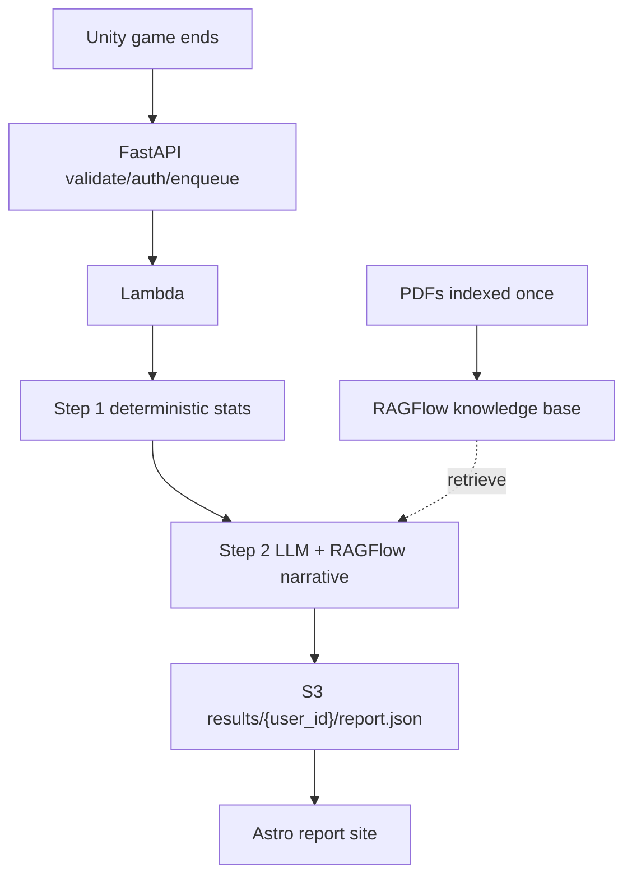
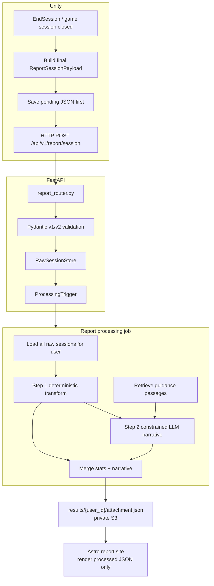

# ADR-030: Post-Session Report Processing And Narrative Generation

- **Status:** Proposed
- **Date:** 2026-06-05
- **Scope:** Closed-session report flow across
  `mewi-unity/app/Assets/Scripts/Report/Session/`,
  `mewi-unity/app/Assets/Scripts/Report/PlanExecution/`,
  `mewi-backend/app/models/report.py`,
  `mewi-backend/app/services/report/`,
  `infra/aws-lambda/`, `infra/s3/`, and
  `mewi-report/src/pages/user/report/[userId].astro`.
- **Builds on:** [ADR-007](ADR-007-attachment-signature-pipeline.md)
  (attachment research framing),
  [ADR-012](ADR-012-mewi-report-raw-to-value-data-contract.md)
  (raw facts vs. value data),
  [ADR-013](ADR-013-mewi-report-auto-pipeline.md)
  (report ingestion pipeline),
  [ADR-014](ADR-014-report-ingestion-service-boundary.md)
  (backend report service boundary), and
  [ADR-029](ADR-029-player-cat-action-fsm-proposal.md)
  (player-cat social events and report capture).
- **Refines:** The AWS future shape in ADR-013/ADR-014 and the report-schema
  requirements in ADR-029.

## Context

The word "report" currently refers to two different layers:

| Layer | Unity type | Transport | Consumer | Purpose |
| --- | --- | --- | --- | --- |
| Live execution feedback | `PlanExecutionReport` / `PlanStepExecutionReport` | Agent WebSocket tick via `SnapshotTicker` / `AgentNetworkHub` | Backend mind loop, prompt context, world state, memory salience | Tells Python what micro-actions the cat actually did after the previous high-level intent. |
| Closed-session analytics | `ReportSessionPayload` / `ReportEvent` | HTTP `POST /api/v1/report/session` via `ReportSessionSender` and optional outbox | Report ingestion service and report processor | Stores player-cat behavioral traces for trust/radar/timeline/attachment report generation. |

These layers should stay separate. Live execution feedback is short-lived
control-loop context. Closed-session analytics is durable research/report data.
ADR-029 can join them later only through explicit ids, for example by copying a
gesture `correlation_id` into both the session events and the live plan-step
reports for the NPC reaction.

The project now has three overlapping report designs:

1. ADR-012/013 define the original raw-to-value report contract:
   Unity records factual sessions, Python derives trust/radar/timeline/copy,
   and the Astro report renders processed JSON.
2. ADR-014 records the current implementation: FastAPI owns the report pipeline,
   `mewi-report` is render-only, local storage is behind ports, and the
   deterministic processor plus optional Claude attachment-analysis skill can
   run from the backend. That implementation is useful as a migration baseline,
   but ADR-030 does **not** accept the current inline request-path processing as
   the final shape.
3. ADR-029 proposes the next player-cat social FSM and correctly warns that
   `mewi.report.raw.v1` cannot preserve deliberate gesture-response loops
   because it lacks explicit event ids, correlation ids, phases, confidence,
   facing, and stimulus/reaction rows.

A separate proposal suggested this closed-session workflow:



The shape is directionally right, but it is not fully aligned with the current
system:

| Area | Current system | Keep / revise |
| --- | --- | --- |
| Unity upload | `ReportSessionSender` uses HTTP `POST /api/v1/report/session`. The live agent tick uses WebSocket separately. | Keep HTTP for closed-session reports. Do not move final report upload onto the live tick WebSocket. |
| Raw schema | `mewi.report.raw.v1` accepts `actor: human | cat`; params include target/distance/speed but no correlation or phase. | Add raw v2 for ADR-029 causal chains. Keep v1 compatibility. |
| Processing owner | FastAPI route delegates to `ReportIngestionService`; report generation now lives in `attachment-report`. | Keep the service boundary: FastAPI stores/enqueues, Lambda processes. |
| Charts/statistics | Lambda `report_processor.py` derives trust arcs, radar, bars, attention, timeline, and attachment profile deterministically. | Keep deterministic Step 1 as the source of chart data. |
| Narrative | Lambda `attachment_analysis.py` can run Claude and falls back to deterministic report output. No RAGFlow integration exists. | Add an optional evidence-retrieval/narrative Step 2. RAGFlow can ground wording, not scoring. |
| Cloud storage | `infra/s3` has eval buckets only. `infra/aws-lambda` has `attachment-report`; `recommendation-report` is scaffolded. | Add report raw/result storage and a report-processing Lambda/queue before claiming the AWS workflow is live. |
| Astro report | Static page reads processed JSON from `src/data/report_{user_id}.json`. | Local static import stays; production may fetch processed JSON via API or presigned URL. |

The critical schema point: report analysis must distinguish **action**,
**behavior recipe**, **motor step**, and **status/phase**. If these collapse into
one string, the LLM can write plausible but unauditable attachment language.

## Decision

Adopt a two-step closed-session report pipeline:

1. **Step 1: deterministic report transform.** Pure Python derives structured
   facts from raw sessions: trust arcs, action counts, radar values, per-cat
   behavioral stats, gesture-response chains, execution-status summaries,
   timeline rows, and attachment feature scores.
2. **Step 2: grounded narrative generation.** An LLM may write narrative
   paragraphs from the Step 1 JSON plus retrieved theory/guidance passages.
   The LLM must not invent scores, trust arcs, counts, or event chains.

FastAPI remains the thin public boundary. The accepted boundary is:

```text
Unity closed session
  -> HTTP POST /api/v1/report/session
  -> FastAPI auth + Pydantic validation
  -> RawSessionStore.put(...)
  -> ProcessingTrigger
       default target: enqueue async job, return quickly
  -> report job writes processed report JSON
```

Reject the legacy shape where the normal FastAPI request path runs
`process_report`, an LLM, or RAG retrieval before responding.

The two-step rule above is the *computation* contract for a single report
(deterministic facts first, grounded narrative second). How that runs in
production — the Lambda/product topology and the orchestration between Lambdas —
is owned by [ADR-031](ADR-031-report-end-to-end-workflow.md). As built there, the
production shape is **two report-product Lambdas** (`attachment-report` and
`recommendation-report`) chained by an S3 `ObjectCreated` notification, with
`recommendation-report` reusing the stored attachment output rather than the raw
sessions.

## Legacy Compatibility, Not Acceptance

ADR-030 treats two existing pieces as compatibility shims:

| Legacy piece | Keep temporarily | Must revise before acceptance |
| --- | --- | --- |
| `mewi.report.raw.v1` | Accept for old proximity-only sessions and demo data. | It cannot support ADR-029 gesture-response analysis; raw v2 is required for player-cat social capture. |
| `InlineProcessingTrigger` | Removed from FastAPI runtime wiring. | Lambda owns report generation; local tests use `queue` or `noop` modes instead of backend inline processing. |

Thin code here means FastAPI owns validation, auth, storage, and job submission.
It does not own scoring, chart derivation, LLM interpretation, RAG retrieval, or
S3 result publication inside the request handler.

## Closed-Session Flow



Unity must save the pending JSON before upload. Quit-time network upload is a
best effort, not the durability boundary.

## Raw Schema V2

Keep `mewi.report.raw.v1` accepted for older proximity-only sessions. Add
`mewi.report.raw.v2` before accepting ADR-029's player-cat social feature.

V2 extends events without changing the raw-facts rule:

```json
{
  "schema_version": "mewi.report.raw.v2",
  "user_id": "vanillasky_01",
  "session": {
    "session_id": "unity-session-01-20260605120000",
    "session_index": 1,
    "timestamp_start": "2026-06-05T12:00:00Z",
    "timestamp_end": "2026-06-05T12:11:00Z",
    "close_reason": "game_session_closed",
    "duration_seconds": 660,
    "events": [
      {
        "event_id": "evt-001",
        "correlation_id": "pcat-42",
        "t": 12.4,
        "actor": "player_cat",
        "actor_id": "player",
        "action": "player_meow",
        "target_id": "mewi",
        "phase": "completed",
        "status": "",
        "params": {
          "behavior_key": "player_meow",
          "motor_action": "vocalize",
          "distance_to_nearest_cat_m": 1.6,
          "facing_dot": 0.82,
          "confidence": 1.0
        }
      },
      {
        "event_id": "evt-002",
        "correlation_id": "pcat-42",
        "t": 12.5,
        "actor": "system",
        "action": "social_stimulus_delivered",
        "target_id": "mewi",
        "phase": "delivered",
        "params": {
          "source_event_id": "evt-001"
        }
      },
      {
        "event_id": "evt-003",
        "correlation_id": "pcat-42",
        "t": 13.8,
        "actor": "cat",
        "cat_id": "mewi",
        "action": "answer_meow",
        "target_id": "player",
        "phase": "completed",
        "status": "completed",
        "trust_before": 21,
        "trust_after": 25,
        "params": {
          "behavior_key": "answer_meow",
          "motor_action": "vocalize",
          "social_act_kind": "answer_meow",
          "source_event_id": "evt-001"
        }
      }
    ]
  }
}
```

Field meaning:

| Field | Owner | Meaning |
| --- | --- | --- |
| `action` | Report schema | Canonical factual event label: `approach`, `player_meow`, `social_stimulus_delivered`, `answer_meow`, etc. |
| `behavior_key` | Unity social FSM | Stable recipe key from ADR-028/ADR-029, such as `settle_close` or `answer_meow`. |
| `motor_action` | Unity motor layer | Low-level micro-action vocabulary from ADR-027, such as `go_to`, `look_at`, `vocalize`, `sit`. |
| `phase` | Event lifecycle | Social event phase: `started`, `committed`, `completed`, `cancelled`, `failed`, `delivered`, `chosen`. |
| `status` | Execution result | Motor/report result only: empty, `completed`, `recovered`, `failed`, or `rejected`. |
| `correlation_id` | Causal chain | Shared by player gesture, delivered stimulus, local reaction directive, NPC motor steps, and report rows. |

The processor treats `player_cat` as the human-controlled actor for charts, but
keeps `system` rows out of radar/action-count metrics. `system` rows exist to
make causal chains auditable.

## Narrative And RAGFlow

RAGFlow, if adopted, is an evidence provider for Step 2:

- PDFs are indexed once outside the session hot path.
- Runtime retrieval receives a compact query built from Step 1 facts, for
  example attachment scores, top gesture-response chains, and confidence flags.
- The LLM output is constrained JSON merged into the processed report:

```json
{
  "narrative": {
    "overall": "...",
    "per_cat": {
      "mewi": {
        "summary": "...",
        "evidence_event_ids": ["evt-001", "evt-003"],
        "retrieval_refs": ["attachment_pdf:p12:secure_base"]
      }
    }
  }
}
```

RAGFlow must not be the only way to produce a report. If retrieval or the LLM is
unavailable, the job still writes deterministic charts and either falls back to
the current deterministic `attachment_analysis` or marks narrative as pending /
unavailable.

## Required Current-System Revisions

Unity:

- Extend `ReportSessionPayload.cs` with raw v2 fields:
  `timestamp_end`, `close_reason`, `event_id`, `correlation_id`, `actor_id`,
  `phase`, `status`, `facing_dot`, `confidence`, `behavior_key`,
  `motor_action`, `social_act_kind`, and `source_event_id`.
- Keep v1 writing available until the backend accepts v2 in production.
- Update `ReportSessionLogger.cs` to record final close metadata and, when
  ADR-029 lands, subscribe to `PlayerCatActionEmitter` /
  `CreatureSocialStimulusBus` so explicit gestures and NPC reactions are
  captured directly instead of inferred from proximity sampling.
- Keep `ReportSessionFileOutbox` as the durability boundary, but add optional
  next-launch / next-Play-Mode replay. Manual send already exists; automatic
  replay is the missing durability convenience.
- Add a `correlationId` field to `IntentMessage` because Unity micro-actions
  originate from intents. Copy that value into `PlanExecutionReport` and
  `PlanStepExecutionReport` when the motor worker completes or reports steps,
  so ADR-029 reaction steps can be joined to report-session rows.
- Extend `ReportActionClassifier.cs` so targeted player-cat social actions keep
  their explicit labels (`player_meow`, `player_nod_yes`, `player_sit_near`)
  instead of being collapsed into broad legacy categories too early.

Backend:

- Update `app/models/report.py` to accept both raw v1 and raw v2. V2 actors are
  `human`, `player_cat`, `cat`, and `system`; v1 remains `human | cat`.
- Normalize v1 and v2 sessions in Lambda `report_processor.py` before deriving charts.
  Legacy charts should keep working, while new feature blocks should expose
  gesture-response chains, per-cat behavior stats, and status summaries.
- Split the processing implementation, not only the concept:
  `process_report` / deterministic Step 1 and narrative Step 2 run in the
  report Lambda, not as the normal FastAPI request path.
- Revise `get_report_ingestion_service()` so the normal deployed mode wires an
  enqueue trigger or no-op local mode; inline backend generation is unsupported.
- Move all LLM/RAG work out of the request path. Deployed FastAPI should enqueue
  and return quickly.
- Add a narrative provider boundary around the existing Claude skill and any
  future RAGFlow client, so scoring does not depend on a specific LLM/RAG
  vendor.
- Add tests that v2 unknown/extra factual fields are preserved, event order is
  enforced, `system` rows do not pollute radar counts, and correlation chains
  derive the same feature output deterministically.

Infra (ingestion side only — processing-side infra is owned by
[ADR-031](ADR-031-report-end-to-end-workflow.md)):

- Add a **raw** report S3 store for ingested sessions:

```text
raw/{user_id}/{session_id}.json
jobs/{job_id}.json
```

- Add `S3RawSessionStore` behind the existing `RawSessionStore` port.
- Add an async trigger (`SqsTrigger` or `EventBridgeTrigger`) behind
  `ProcessingTrigger`, so the normal deployed FastAPI mode enqueues instead of
  generating reports inline.

ADR-031 owns the rest of the cloud build-out: the `results/{user_id}/*.json`
bucket, the report-product Lambdas and the S3 notification that chains them,
their S3 read/write IAM, and the Lambda-only Anthropic/RAGFlow env. ADR-030 does
**not** duplicate those here.

Report site:

- Keep static local rendering from `src/data/report_{user_id}.json`.
- For production, add either a thin FastAPI read route or presigned S3 result
  fetch. The site must still render processed JSON only, never raw sessions.
- Add optional narrative/per-cat interpretation blocks only after the processed
  JSON contract includes them.
- Add a visible-but-nonclinical caveat whenever attachment-language narrative is
  rendered.

## Consequences

**Positive**

- Claude's "Python stats + one LLM narrative pass" idea is preserved without
  keeping the existing inline request-path code as the final architecture.
- Raw facts stay auditable. The LLM cannot silently change chart values,
  attachment scores, or event chains.
- ADR-029's player-cat gestures become analyzable because the schema records
  causal correlation instead of relying on proximity inference.
- The backend API stays thin: storage and enqueue only, with processing moved to
  an explicit job boundary.

**Negative**

- Raw v2 is a real schema migration across Unity, backend validation,
  processor normalization, and tests.
- The processing-side cloud build-out is partly in place (ADR-031 wires the
  results S3 bucket, S3 read/write IAM, and the attachment→recommendation
  trigger), but the **ingestion side** is still missing: raw-session S3 storage
  and the FastAPI enqueue/EventBridge trigger that invokes the first report
  Lambda. The recommendation core also remains a stub.
- Local development needs one more explicit command or worker mode; the old
  "ingest immediately renders everything" path becomes a debug convenience, not
  the default.
- RAGFlow adds another operational dependency. It is justified only for grounded
  narrative language, not for deterministic scoring.
- The processed report JSON contract must grow carefully so Astro stays stable
  for existing reports.

## Acceptance Checks

- A v1 session still ingests and renders the current report.
- A v2 session with `player_cat`, `system`, and correlated `cat` rows ingests,
  stores, and normalizes without losing event ids or correlation ids.
- Step 1 deterministic output is identical for repeated runs over the same raw
  sessions.
- `system` delivery rows never affect radar percentages or human action counts.
- Gesture-response features can cite the exact source `event_id` rows they came
  from.
- FastAPI normal mode returns after storage/enqueue, not after deterministic
  processing, an LLM call, or RAG retrieval.
- `InlineProcessingTrigger` is absent from FastAPI runtime code.
- If LLM/RAGFlow fails, processed chart data still exists and the narrative block
  is marked fallback, pending, or unavailable.
- The Astro report renders from processed JSON only.

## Related

The full end-to-end production workflow — PDF/RAGFlow indexing, the two
report-product Lambdas (`attachment-report` → `recommendation-report`) chained
through an S3 `attachment.json` notification, S3 result storage, and the Astro
fetch — is captured in [ADR-031](ADR-031-report-end-to-end-workflow.md). ADR-030
owns the Unity -> FastAPI closed-session contract (schema, validation, storage,
enqueue boundary) that ADR-031 builds on.
