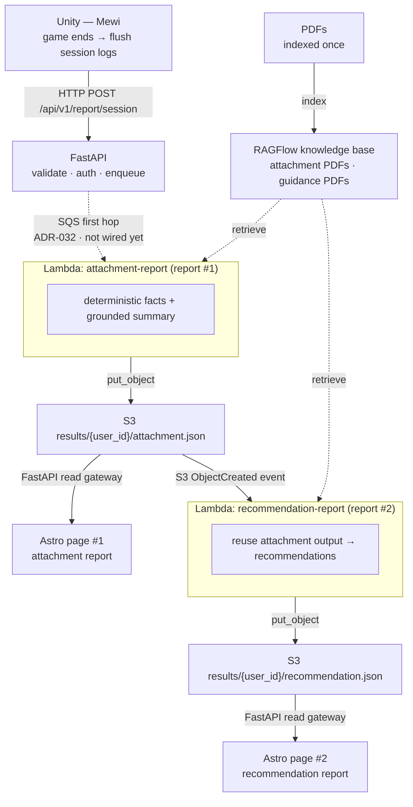

# ADR-031: Report End-To-End Production Workflow

- **Status:** Proposed
- **Date:** 2026-06-06
- **Scope:** Production report pipeline from PDF indexing through the rendered
  site, across
  `mewi-backend/app/services/report/`,
  `infra/aws-lambda/`, `infra/s3/`, an external RAGFlow knowledge base, and
  `mewi-report/src/pages/user/report/[userId].astro`.
- **Builds on:** [ADR-007](ADR-007-attachment-signature-pipeline.md)
  (attachment research framing),
  [ADR-013](ADR-013-mewi-report-auto-pipeline.md)
  (report ingestion pipeline),
  [ADR-014](ADR-014-report-ingestion-service-boundary.md)
  (storage / processing ports), and
  [ADR-030](ADR-030-post-session-report-processing.md)
  (Unity -> FastAPI closed-session contract and the two-step processing decision).

## Context

[ADR-030](ADR-030-post-session-report-processing.md) owns the **Unity -> FastAPI**
half of the closed-session report: the raw v2 causal schema, Pydantic
validation, auth, raw storage, and the thin enqueue boundary. It deliberately
stops at "FastAPI stores and enqueues, then returns."

This ADR owns the other half: what the **out-of-band processing and the rest of
the infrastructure** look like once FastAPI has enqueued. That includes
PDF/RAGFlow indexing, the report Lambdas, S3 result storage, the automatic
trigger that chains the Lambdas, where the secrets live, and how the Astro site
fetches the processed reports. Keeping it separate from ADR-030 means the
ingestion contract can be accepted and shipped independently of the cloud
processing build-out.

A clarifying distinction this ADR makes explicit (it caused real confusion
during design):

- **ADR-030 owns the *computation rule*** — every report is derived as
  deterministic facts first (trust arcs, counts, chains) and a grounded narrative
  second, where the narrative may not invent the numbers. That is an *internal*
  two-phase split *within a single report*.
- **ADR-031 owns the *product topology*** — there are **two report products per
  user**, each its own Lambda: `attachment-report` (report #1) and
  `recommendation-report` (report #2). The Lambda boundary is **per product, not
  per compute phase**. `recommendation-report` does not re-derive from raw
  sessions; it **reuses `attachment-report`'s stored output**, so the attachment
  scoring stays the single source of truth.

## Decision

Adopt the following end-to-end production workflow. FastAPI remains the thin
boundary from ADR-030; everything downstream of the enqueue runs out of band as
**two report-product Lambdas chained through S3**.



Transport note: the closed-session report upload is **HTTP POST
`/api/v1/report/session`**, not the live agent WebSocket. The live tick
WebSocket (ADR-004/023) stays reserved for short-lived execution feedback
(`PlanExecutionReport`); the durable session payload is uploaded over HTTP after
the Unity outbox has persisted it (see ADR-030).

### Backend runtime config (FastAPI)

FastAPI stays thin, but production still needs explicit runtime configuration so
it can store raw sessions and enqueue the first-hop job. The boundary is:

```text
Terraform outputs / AWS resources -> FastAPI environment -> ProcessingQueue
```

In local development, FastAPI may continue to use file-backed storage/queue
modes, but it does not generate reports:

| Env var | Local value | Meaning |
| --- | --- | --- |
| `MEWI_REPORT_PROCESSING_MODE` | unset / `noop` | Store raw sessions without running local processing. |
| `MEWI_REPORT_PROCESSING_MODE` | `queue` | Use `LocalFileProcessingQueue` for no-AWS enqueue tests. |
| `MEWI_REPORT_RAW_SESSION_DIR` | local path | File-backed raw-session store. |
| `MEWI_REPORT_QUEUE_DIR` | local path | File-backed queue output. |

In production, ADR-032 defines the SQS first hop and FastAPI must be configured
with:

| Env var / identity | Production value | Source |
| --- | --- | --- |
| `MEWI_REPORT_PROCESSING_MODE` | `sqs` | Backend deploy config |
| `MEWI_REPORT_SQS_QUEUE_URL` | report-processing queue URL | Terraform output from ADR-032 infra |
| `MEWI_REPORT_RAW_BUCKET` | raw-session bucket name | Terraform output from ADR-032 infra |
| `AWS_REGION` / `AWS_DEFAULT_REGION` | same region as the queue and buckets | `var.aws_region` / backend deploy config |
| AWS credentials | task/instance role, or scoped env credentials off-AWS | Backend runtime identity |

FastAPI does **not** receive `ANTHROPIC_API_KEY`, `RAGFLOW_*`, or `CLAUDE_*`.
Those belong to the Lambda side. For ingestion, FastAPI only needs permission to
write raw session objects and send SQS messages. ADR-033 later adds a separate
FastAPI read-gateway concern: read/list access to the report-results bucket so it
can proxy finished JSON to the frontend without generating reports.

### Stages

1. **PDF indexing (offline, once).** Attachment-theory and guidance PDFs are
   indexed into a RAGFlow knowledge base outside the session hot path. Re-indexed
   only when the source corpus changes.
2. **Unity -> FastAPI (ADR-030).** Game ends, session logs flush to the outbox,
   then upload over HTTP. FastAPI validates, authenticates, stores raw, and
   enqueues a processing job. It does not score, call an LLM, or retrieve.
3. **`attachment-report` Lambda (report #1).** Derives the full website-ready
   attachment report from the raw sessions following the ADR-030 computation rule:
   deterministic facts first (`user`, `meta`, `summary`, `cats`, `radar`,
   `attention_pct`, `attachment_profile`, `timeline`, etc.), grounded narrative /
   `attachment_analysis` second, then one merged `ProcessedAttachmentReport`.
   It writes that full object to `results/{user_id}/attachment.json`. This is the
   attachment scoring and page-data source of truth for everything downstream.
   `process_report`'s `user_info` / `overrides` inputs are sourced per
   [ADR-033 §6](ADR-033-astro-report-frontend-data-source.md) (overrides empty;
   `user_info` from an S3 `config/user_info.json`), not from the SQS message.
4. **The trigger.** Writing `attachment.json` emits an S3 `ObjectCreated` event
   that **automatically invokes `recommendation-report`**. No orchestrator,
   queue, or FastAPI involvement. The notification is filtered to the
   `attachment.json` suffix so recommendation's own output cannot retrigger the
   chain.
5. **`recommendation-report` Lambda (report #2).** Reads
   `results/{user_id}/attachment.json` (resolved from the S3 event key), reuses
   the `attachment_analysis` block — *not* raw sessions — optionally grounds
   wording with RAGFlow, and writes `results/{user_id}/recommendation.json`.
6. **Astro render.** Each page fetches its own product JSON through the FastAPI
   read gateway chosen in ADR-033, which proxies private S3 after auth. Pages
   render processed JSON only, never raw sessions. Each user therefore sees
   **two reports**.

### The trigger (chosen orchestration mechanism)

The two Lambdas are chained by an **S3 bucket notification**, not a queue,
Step Functions, or a direct Lambda-to-Lambda invoke:

- `aws_s3_bucket_notification` on the results bucket fires on
  `s3:ObjectCreated:*` with `filter_prefix = results/` and
  `filter_suffix = attachment.json`, targeting `recommendation-report`.
- `aws_lambda_permission` grants `s3.amazonaws.com` permission to invoke it.
- `recommendation-report`'s handler parses the S3 event, extracts `user_id` from
  the `results/{user_id}/attachment.json` key, and reads the object back.

Why this mechanism: it is the most decoupled "after the object is in S3" trigger.
attachment-report knows nothing about recommendation-report; the only contract is
the stored `attachment.json`. Either report can be re-run or inspected
independently, and the suffix filter structurally prevents an output→output loop.

### Secrets (Lambda-only)

All processing secrets live **only in the Lambda environment**, never in FastAPI
— FastAPI does not need them once processing is out of band:

| Secret | Env var | Source |
| --- | --- | --- |
| Claude API key | `ANTHROPIC_API_KEY` | `TF_VAR_anthropic_api_key` |
| RAGFlow endpoint | `RAGFLOW_ENDPOINT` | `TF_VAR_ragflow_endpoint` |
| RAGFlow API key | `RAGFLOW_API_KEY` | `TF_VAR_ragflow_api_key` |

Each flows root `variables.tf` -> `module "aws_lambda"` -> the Lambda
`environment` block. Empty RAGFlow values mean retrieval is disabled and the
Lambda falls back to deterministic copy. For production hardening these may move
to AWS Secrets Manager (Terraform stores an ARN, the Lambda reads it via IAM) so
plaintext is not in the function config or TF state.

### Generation-mode provenance

A report is never silently degraded. Each product's processed JSON carries a
`generation_mode` so the page can show the reader exactly how it was produced:

| `generation_mode` | Meaning |
| --- | --- |
| `llm+kb` | LLM narrative grounded by the RAGFlow knowledge base. |
| `llm_only` | LLM ran, but retrieval was unavailable — narrative is ungrounded. |
| `deterministic` | Neither retrieval nor the LLM ran — deterministic copy only. |

```jsonc
// results/{user_id}/attachment.json
{
  "user_id": "...",
  "generation_mode": "llm+kb",
  "user": { /* ... */ },
  "meta": { /* ... */ },
  "summary": { /* ... */ },
  "cats": { /* ... */ },
  "radar": { /* ... */ },
  "attention_pct": { /* ... */ },
  "attachment_profile": [ /* ... */ ],
  "attachment_analysis": { /* ... */ }
}
```

`attachment_analysis` is a nested block inside the full attachment report, not a
competing top-level product shape. `recommendation.json` is a separate product
that may reuse `attachment_analysis` from this full attachment output.

The Astro page renders a small provenance label from `generation_mode` (e.g.
"generated with LLM + knowledge base") next to the report, so a fallback report
is visibly distinguishable from a fully grounded one rather than looking
identical.

## What This ADR Adds Over ADR-030

| Concern | ADR-030 | ADR-031 |
| --- | --- | --- |
| Unity -> FastAPI contract | Owns it (schema, auth, validation, storage, enqueue) | Reuses it unchanged |
| Computation rule | Decides deterministic facts + grounded narrative *within* a report | Reuses it; applies it inside each product Lambda |
| Product topology | — | Owns it: two products (`attachment-report`, `recommendation-report`), Lambda boundary per product |
| Chaining | — | Owns it: S3 `ObjectCreated` notification on `attachment.json` triggers report #2 |
| Reuse | Notes ids can be joined later | recommendation reuses attachment's stored output, not raw sessions |
| Secrets | Notes RAGFlow env "only when chosen" | Owns the Lambda-only env wiring for Anthropic + RAGFlow |
| Backend runtime config | Owns local storage/enqueue ports | Owns the production config contract: `MEWI_REPORT_PROCESSING_MODE=sqs`, queue URL, raw bucket, AWS region/identity |
| PDF / RAGFlow indexing | Mentions RAGFlow as optional narrative evidence | Owns the offline indexing stage and runtime retrieval flow |
| Cloud storage | Notes S3 buckets are not yet built | Owns the `results/{user_id}/*.json` contract, bucket, IAM, and fetch |
| Astro fetch | Render-only constraint | Owns the result products that ADR-033's FastAPI read gateway exposes to the frontend |

## Implementation Status (as built)

Scaffolded in Terraform + Python code; deploy still requires applying Terraform
and configuring/deploying the FastAPI runtime env.

| Piece | Status |
| --- | --- |
| `attachment-report` Lambda writes `attachment.json` (gated on results bucket env) | Implemented in code: it runs the deterministic report transform, optionally replaces `attachment_analysis` with the Claude-backed block, adds `generation_mode`, and writes the full `ProcessedAttachmentReport`. Not yet verified by a cloud deploy in this ADR. |
| `recommendation-report` reshaped to reuse attachment output; parses S3 event, inline, or `user_id` | Done |
| `recommendation.py:generate_recommendation` core | **Stub — raises `NotImplementedError`** |
| Report results S3 bucket + public-access block (`infra/s3/s3.tf`) | Done |
| S3 read/write IAM on the shared report-Lambda role | Done |
| S3 `ObjectCreated` notification + `aws_lambda_permission` (`infra/aws-lambda/lambdas.tf`) | Done, gated |
| **FastAPI/raw-session → `attachment-report` first hop** (SQS per ADR-032) | Implemented in code/Terraform: raw bucket, SQS queue/DLQ, event-source mapping, backend `S3RawSessionStore`, backend `SqsQueue`, and attachment Lambda SQS/raw-S3 support. Not yet verified by a cloud deploy in this ADR. |
| FastAPI production runtime config (`MEWI_REPORT_PROCESSING_MODE=sqs`, queue URL, raw bucket, AWS region/identity) | Contract documented; Terraform now outputs queue URL/raw bucket. The backend deploy must set these env vars and AWS identity outside `infra/deploy.sh`. |
| Anthropic + RAGFlow + results-bucket env wiring | Done |
| `recommendation-report` in the deploy roster | **Commented out** until the core is implemented |
| RAGFlow client call inside **both** report Lambdas | Not implemented (env is wired to both; client is a stub) |
| `generation_mode` provenance field + page label (`llm+kb` / `llm_only` / `deterministic`) | Attachment Lambda writes `llm_only` or `deterministic` today and has a `kb_used` hook for future `llm+kb`; RAGFlow client/page label still pending. |
| Astro fetch of the two product JSONs | Not implemented |

The trigger, permission, and IAM are gated on
`contains(local.lambdas, "recommendation-report") && results_bucket != ""`, so
uncommenting the one roster line activates the whole chain. It is left off
because invoking the `NotImplementedError` stub on every session would only
produce CloudWatch errors.

## Consequences

**Positive**

- The closed-session ingestion contract (ADR-030) can be accepted and shipped
  without waiting on the cloud build-out described here.
- Production processing is fully out of band: FastAPI stays thin, and the LLM /
  RAG cost (and its secrets) live in the Lambdas, not the request path.
- recommendation reuses attachment's output, so attachment scoring is the single
  source of truth and the two reports stay decoupled through stored JSON.
- The S3-notification trigger is fully decoupled and structurally loop-safe.

**Negative**

- More moving parts than a single report: two Lambdas, a results bucket, an S3
  notification, and IAM — all of which must exist before the chain runs.
- RAGFlow is an added operational dependency, justified only for grounded
  narrative language.
- S3-notification chaining is implicit; the dependency is the bucket key
  convention, which must be documented or it looks like two unrelated Lambdas.
- Two ADRs (030 + 031) must be read together to see the whole report path.

## Acceptance Checks

- FastAPI normal mode returns after storage/enqueue, not after scoring, an LLM
  call, or RAG retrieval (shared with ADR-030).
- Production FastAPI config uses `MEWI_REPORT_PROCESSING_MODE=sqs`,
  `MEWI_REPORT_SQS_QUEUE_URL`, `MEWI_REPORT_RAW_BUCKET`, and an AWS identity
  scoped to raw-session writes plus SQS sends; Lambda-only secrets are not
  present in FastAPI config.
- `attachment-report` is deterministic for the deterministic-facts portion over
  the same raw sessions and writes a full `ProcessedAttachmentReport` to
  `results/{user_id}/attachment.json`, not only an `attachment_analysis` leaf.
- `recommendation-report` consumes `attachment.json` (the attachment output), not
  raw session logs. It reads the nested `attachment_analysis` block from the full
  attachment output.
- Writing `attachment.json` automatically invokes `recommendation-report`; writing
  `recommendation.json` does **not** (no retrigger loop).
- Each report **always** produces output, and records the **generation mode**
  it was produced with — `llm+kb` (LLM grounded by the RAGFlow knowledge base),
  `llm_only` (LLM, retrieval unavailable), or `deterministic` (neither) — in the
  processed JSON. The Astro page renders this provenance so the reader can see
  how the report was generated.
- The two products are written to `results/{user_id}/attachment.json` and
  `results/{user_id}/recommendation.json`.
- Processing secrets (`ANTHROPIC_API_KEY`, `RAGFLOW_*`) exist only in the Lambda
  env, not in FastAPI config.
- The Astro pages render from the fetched processed JSON only.
