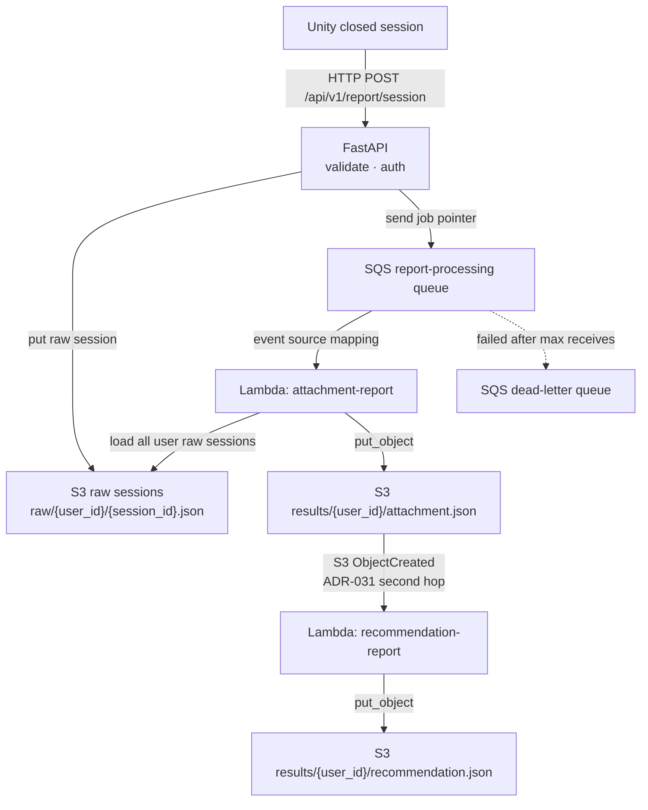

# ADR-032: SQS First Hop For Report Processing

- **Status:** Proposed
- **Date:** 2026-06-06
- **Scope:** Production first-hop orchestration from FastAPI report ingestion to
  `attachment-report`, across `mewi-backend/app/services/report/`,
  `infra/s3/`, `infra/aws-lambda/`, and AWS SQS.
- **Builds on:** [ADR-030](ADR-030-post-session-report-processing.md)
  (FastAPI stores/enqueues only) and
  [ADR-031](ADR-031-report-end-to-end-workflow.md)
  (two report-product Lambdas and the S3 `attachment.json` -> recommendation
  trigger).
- **Refines:** The "FastAPI/raw-session -> `attachment-report` async invoke" row
  that ADR-031 intentionally marks as not implemented.

## Context

ADR-031 wires the **second hop** of the cloud report chain:

```text
attachment-report
  -> put results/{user_id}/attachment.json
  -> S3 ObjectCreated notification
  -> recommendation-report
```

That is correct for product-to-product chaining, but it does not solve the
**first hop**:

```text
FastAPI closed-session ingest
  -> out-of-band job
  -> attachment-report
```

The backend already has the right seam:

- `ProcessingQueue` is a protocol with `enqueue(user_id, session_count)`.
- `QueuedProcessingTrigger` calls that protocol and returns immediately.
- `LocalFileProcessingQueue` already exercises the enqueue path locally.
- `deps.py` already has a queue mode branch.

So SQS fits the code shape. The important correction is that SQS by itself is
not enough. The current `attachment-report` Lambda expects invocation input with
raw `sessions` inline:

```json
{
  "user_id": "...",
  "sessions": [{ "...raw session..." }]
}
```

An SQS message should not carry full raw sessions. SQS has a small-message
contract and is a job pointer, not the durable raw-data store. The production
first hop therefore needs **two pieces**:

1. FastAPI stores raw sessions durably in S3.
2. FastAPI sends a small SQS job that tells `attachment-report` which user is
   ready to process.

## Decision

Use **SQS Standard** as the first-hop processing queue:



The SQS message body is a compact job pointer:

```json
{
  "job_id": "vanillaSky00-20260606123000123456",
  "user_id": "vanillaSky00",
  "session_count": 3,
  "enqueued_at": "2026-06-06T12:30:00Z"
}
```

`attachment-report` resolves this job by reading raw sessions from S3, then runs
the existing attachment analysis over those sessions and publishes
`results/{user_id}/attachment.json`. `recommendation-report` remains unchanged:
ADR-031's S3 notification triggers it from the stored attachment output.

## What ADR-032 Owns

ADR-030 owns the request boundary: Unity -> FastAPI validation, auth, durable
storage, and "enqueue then return."

ADR-031 owns the report products: `attachment-report`,
`recommendation-report`, `results/{user_id}/attachment.json`,
`results/{user_id}/recommendation.json`, Lambda secrets, and the
`attachment.json` S3 notification that triggers report #2.

ADR-032 owns the missing first hop:

| Concern | Decision |
| --- | --- |
| Queue type | SQS Standard queue |
| Failure inspection | SQS DLQ with redrive from the console |
| FastAPI production trigger | `SqsQueue(ProcessingQueue)` behind `QueuedProcessingTrigger` |
| Job message | Small pointer: `job_id`, `user_id`, `session_count`, `enqueued_at` |
| Raw data location | S3 raw-session objects, not SQS message payload |
| Lambda event source | SQS event-source mapping to `attachment-report` |
| Lambda input contract | `attachment-report` accepts SQS event records and loads raw sessions from S3 |
| Second hop | Unchanged: S3 `attachment.json` notification from ADR-031 |

## Open Decisions Before Coding

These are the decisions that must be made explicit before implementing the first
hop. Recommended defaults are included so the implementation can proceed without
re-opening the architecture every time.

| Decision | Recommended default | Why |
| --- | --- | --- |
| Raw-session bucket | Separate bucket: `${project_name}-report-raw-v0` | Keeps durable input separate from published result JSON and avoids any accidental interaction with the results-bucket notification. A `raw/` prefix in the results bucket would also work because ADR-031 filters on `results/`, but separation is cleaner. |
| FastAPI AWS identity | AWS task/instance role when FastAPI runs on AWS; otherwise scoped IAM user credentials from env | FastAPI needs raw-session write/list and SQS send for ingestion, plus results-bucket read/list for ADR-033's safe read gateway. Do not hardcode keys. Terraform resources are pinned to Singapore (`ap-southeast-1`), matching the Terraform state bucket region. Runtime AWS clients must use the same region as the queue/buckets. |
| Backend processing mode | Add explicit `MEWI_REPORT_PROCESSING_MODE=sqs` | Keeps existing `queue` mode as the local file fake and avoids surprising behavior based only on whether `MEWI_REPORT_SQS_QUEUE_URL` is set. |
| Raw payload shape | Store full `ReportSessionPayload` JSON and pass it through to `attachment-report` as read from S3 | The Lambda analyzer already accepts both full payloads and bare session objects. Passing full payloads preserves `schema_version`, `source`, and future metadata. |
| Duplicate jobs / idempotency | Accept idempotent overwrites for launch; add debounce or content-hash dedupe later if token cost becomes noisy | Each session POST can enqueue a job that reprocesses all user sessions, overwrites `attachment.json`, and re-triggers `recommendation-report`. This is simple and correct, but it can create repeated LLM runs as sessions accumulate. |

## Required Implementation

Backend:

- Add `SqsQueue(ProcessingQueue)` in `app/services/report/trigger.py`.
- `SqsQueue.enqueue(...)` sends the compact job JSON to
  `MEWI_REPORT_SQS_QUEUE_URL` using `boto3.client("sqs").send_message(...)`.
- Add `MEWI_REPORT_PROCESSING_MODE=sqs` in `deps.py`.
- Add backend env for `MEWI_REPORT_SQS_QUEUE_URL`,
  `MEWI_REPORT_RAW_BUCKET`, and AWS region/credentials appropriate to the
  runtime identity chosen above.
- Keep `LocalFileProcessingQueue` as the local/test fake; do not remove it.
- Add tests that `QueuedProcessingTrigger` can use both the local file queue and
  an SQS fake without changing `ReportIngestionService`.
- Add `boto3` to the backend dependency set (`pyproject.toml` / lock file), not
  only to Lambda packaging assumptions.

Raw session storage:

- Add an S3-backed raw-session store behind the existing `RawSessionStore` port,
  or an equivalent Lambda-side raw-session reader with the same key contract.
- Store sessions under:

```text
raw/{user_id}/{session_id}.json
```

- Do not put full raw sessions in the SQS message.

`attachment-report` Lambda:

- Keep accepting direct invokes with inline `sessions` for local/manual tests.
- Keep the Lambda package small enough for AWS Lambda deployment. Do **not**
  vendor `claude-agent-sdk` into the Lambda zip: it can include a bundled Claude
  CLI binary that makes the package too large for Lambda direct upload and too
  close to Lambda's unzipped size limit. The Lambda should use the lightweight
  Anthropic Messages SDK path instead.
- Add SQS event parsing:

```json
{
  "Records": [
    {
      "body": "{\"user_id\":\"vanillaSky00\",\"session_count\":3}"
    }
  ]
}
```

- For SQS events, load all raw sessions for `user_id` from S3 before calling
  `analyze_sessions(...)`.
- Loop over SQS `Records`; event-source mappings deliver batches, not a single
  job.
- Return `batchItemFailures` for partial batch failure handling so one bad
  record does not force the whole batch to retry forever.
- Make the handler idempotent: re-running the same job may overwrite
  `results/{user_id}/attachment.json` with the same contract.

Terraform:

- Add `aws_sqs_queue.report_processing`.
- Add `aws_sqs_queue.report_processing_dlq`.
- Add a redrive policy from the main queue to the DLQ.
- Add `aws_lambda_event_source_mapping` from the queue to
  `attachment-report`.
- Set the event-source mapping's
  `function_response_types = ["ReportBatchItemFailures"]`; otherwise the
  Lambda's `{"batchItemFailures": [...]}` response is ignored and one bad
  record retries the whole batch.
- Grant FastAPI's AWS principal `sqs:SendMessage` on the queue.
- Grant FastAPI's AWS principal raw-session S3 write/list access:
  - `s3:PutObject` on `arn:aws:s3:::${project_name}-report-raw-v0/raw/*`.
  - `s3:ListBucket` on `arn:aws:s3:::${project_name}-report-raw-v0`, ideally
    with an `s3:prefix` condition scoped to `raw/*`, because
    `RawSessionStore.count()` lists the user's stored sessions after ingest.
- Grant `attachment-report` enough IAM to consume from the queue:
  `sqs:ReceiveMessage`, `sqs:DeleteMessage`,
  `sqs:GetQueueAttributes`, and optionally `sqs:ChangeMessageVisibility`.
- Grant `attachment-report` S3 read/list access to raw sessions in addition to
  its existing result write access:
  - `s3:GetObject` on `arn:aws:s3:::${project_name}-report-raw-v0/raw/*`.
  - `s3:ListBucket` on `arn:aws:s3:::${project_name}-report-raw-v0`, ideally
    with an `s3:prefix` condition scoped to `raw/*`, because SQS jobs carry only
    `user_id` and the Lambda must list `raw/{user_id}/` before reading objects.
- Set queue visibility timeout longer than the Lambda timeout. With the current
  300s Lambda timeout, use at least 360s; 1800s is safer for slow LLM retries.
- Gate conditional Terraform resources on config-known values such as names, not
  computed ARNs, so `count` / `for_each` are known at plan time.
- Output the queue URL/ARN and raw bucket name so they can be copied into the
  FastAPI runtime environment.

## Proposed Implementation Plan

Implement this in four small slices so each boundary can be verified before the
next one is added.

### 1. Terraform resources and backend hand-off values

- In `infra/s3/s3.tf`, add a separate raw-session bucket:

```text
${project_name}-report-raw-v0
```

- Output `report_raw_bucket` and `report_raw_bucket_arn`.
- Add an SQS queue and DLQ, either in a new `infra/sqs/` module or in the root
  module if the project wants fewer modules for now.
- Output:

```text
report_processing_queue_url
report_processing_queue_arn
report_processing_dlq_url
report_raw_bucket
```

- Pass the raw bucket and queue ARN into `infra/aws-lambda/lambdas.tf`.
- In `infra/aws-lambda/lambdas.tf`, add:
  - `MEWI_REPORT_RAW_BUCKET` env var for `attachment-report`.
  - S3 `GetObject` + `ListBucket` IAM for raw sessions.
  - SQS consume IAM for the Lambda role.
  - `aws_lambda_event_source_mapping` from the SQS queue to
    `attachment-report` with
    `function_response_types = ["ReportBatchItemFailures"]`.
- If the FastAPI AWS principal is managed outside this Terraform, do not create
  a fake principal here. Output the queue URL/raw/results buckets and document the
  required IAM. If the backend role is known to Terraform later, add a variable
  such as `backend_report_sender_role_name` and attach only:

```text
s3:PutObject on arn:aws:s3:::${project_name}-report-raw-v0/raw/*
s3:ListBucket on arn:aws:s3:::${project_name}-report-raw-v0 with s3:prefix raw/*
sqs:SendMessage on the report-processing queue
s3:GetObject on arn:aws:s3:::${project_name}-report-results-v0/results/*
s3:ListBucket on arn:aws:s3:::${project_name}-report-results-v0 with s3:prefix results/*
```

The results-bucket read/list permissions are for ADR-033's FastAPI read gateway
only: proxy finished report JSON from private S3 to authorized frontend callers.
They must not be used to run report generation in FastAPI.

### 2. Backend S3 store and SQS queue adapter

- In `mewi-backend/app/services/report/store.py`, add
  `S3RawSessionStore(RawSessionStore)`.
- `put(...)` writes the full `ReportSessionPayload` JSON under:

```text
raw/{safe_user_id}/{safe_session_id}.json
```

- `count(...)` lists raw objects for the user prefix.
- `load_sessions(...)` may keep returning inner `session` objects so local inline
  processing keeps the same behavior as `LocalFileRawSessionStore`.
- In `mewi-backend/app/services/report/trigger.py`, add
  `SqsQueue(ProcessingQueue)` using `boto3.client("sqs").send_message(...)`.
- In `mewi-backend/app/api/deps.py`, add:

```text
MEWI_REPORT_PROCESSING_MODE=sqs
MEWI_REPORT_SQS_QUEUE_URL=<Terraform output>
MEWI_REPORT_RAW_BUCKET=<Terraform output>
MEWI_REPORT_RESULTS_BUCKET=<Terraform output>
AWS_REGION=<same as Terraform var.aws_region>
```

- The `sqs` branch should compose:

```text
S3RawSessionStore + QueuedProcessingTrigger(SqsQueue)
```

FastAPI still must not receive `ANTHROPIC_API_KEY`, `RAGFLOW_*`, or
`CLAUDE_AGENT_MODEL`.

### 3. Lambda SQS/raw-session support

- Add a small raw-session S3 reader to `attachment-report`.
- Keep the current direct-invoke contract:

```json
{ "user_id": "...", "sessions": [] }
```

- Add SQS event support:
  - loop over `event["Records"]`;
  - parse each record body as the compact job pointer;
  - load all raw sessions for that `user_id` from S3;
  - call `analyze_sessions(...)`;
  - write `results/{user_id}/attachment.json`;
  - return `{"batchItemFailures": [...]}` for records that fail.

This keeps manual Lambda tests easy while making the production event-source
mapping safe for batched delivery and partial retries.

### Deployment warning: oversized Lambda packages

The first deploy attempt failed while creating `mewi-attachment-report` with:

```text
RequestEntityTooLargeException: Request must be smaller than 70167211 bytes for the CreateFunction operation
```

Root cause:

- `attachment-report` originally vendored `claude-agent-sdk`.
- That package can include a bundled Claude CLI binary; in the observed local
  package it made the Lambda directory roughly 258 MB unzipped and the generated
  zip roughly 79 MB.
- `deploy.sh` also installed requirements for every Lambda directory, including
  scaffolded/commented-out Lambdas. That meant inactive folders could still pull
  heavy dependencies into the local build workflow.

Fix:

- `attachment-report` uses the smaller `anthropic` Python SDK and calls the
  Messages API directly with the same skill/system prompt.
- `deploy.sh` vendors dependencies only for active Lambdas listed in
  `local.lambdas`.
- After the fix, the active `attachment-report` package was about 25 MB
  unzipped and about 7 MB zipped.

Keep this as a guardrail for future report Lambdas: before uncommenting a new
Lambda in the roster, check the zipped and unzipped package sizes after
`./deploy.sh` vendors dependencies. Large bundled CLIs or platform-specific
binaries should be removed, replaced with a direct API client, or moved to a
different deployment strategy before `terraform apply`.

### 4. Deploy and verify

- Run `cd infra && ./deploy.sh`.
- Copy Terraform outputs into the backend runtime environment.
- Deploy the FastAPI backend through its normal backend deploy path.
- Post a closed-session payload to `/api/v1/report/session`.
- Verify:
  - raw session object exists in the raw bucket;
  - one SQS message is sent and consumed;
  - `attachment-report` logs show an SQS event;
  - `results/{user_id}/attachment.json` appears in the results bucket;
  - once `recommendation-report` is implemented and uncommented, the S3
    notification creates `recommendation.json`.

### Deployment warning: AWS Console region/account view

After a successful apply, Terraform state and AWS CLI may show resources while
the AWS Console appears empty (`Functions (0)`, `No queues available`, or no log
groups). The usual causes are console scope, not missing infrastructure:

- S3's bucket list is effectively global and shows bucket regions, so seeing the
  S3 buckets does **not** prove the Lambda/SQS/CloudWatch pages are scoped to the
  same region.
- Lambda, SQS, and CloudWatch Logs are regional. Check the console region is the
  Terraform resource region (`ap-southeast-1` for this project unless
  overridden).
- Check the console account matches the AWS identity used by Terraform/AWS CLI:

```bash
aws sts get-caller-identity
```

- CloudWatch log groups may not exist until the Lambda has actually run. An empty
  log-group page immediately after deployment is normal if no invocation has
  happened yet.
- Do not paste raw `aws lambda get-function` output into docs, chats, or issues:
  it can include Lambda environment variables and signed code URLs. Use
  redacted summaries when debugging.

### Deployment warning: Lambda diagram and CloudWatch logs

The Lambda console's workflow diagram is a **trigger diagram**, not a full data
flow diagram. For `attachment-report`, the expected diagram is:

```text
SQS -> mewi-attachment-report
```

The raw/results S3 buckets may not appear in that picture because they are used
inside the Lambda handler:

```text
attachment-report reads raw/{user_id}/*.json from S3
attachment-report writes results/{user_id}/attachment.json to S3
```

That is still correct. S3 appears as a trigger only for Lambdas that are invoked
by S3 notifications, such as the future `recommendation-report` once it is
implemented and uncommented.

CloudWatch log groups are also lazy. `/aws/lambda/mewi-attachment-report` may not
exist immediately after deploy; it is usually created after the first invocation
emits logs. If the SQS queue has zero messages, the Lambda has likely not run yet,
so no log group is expected.

## Cost

SQS is not expected to be the meaningful cost center. As of this ADR's date, AWS
SQS Standard includes 1 million requests per month for free, then charges by API
request after that. A report job uses a small number of SQS actions
(`SendMessage`, receives, deletes, occasional redrive). For this post-session
workflow, queue cost should be near zero compared with:

- Lambda runtime for LLM-bound work.
- Anthropic API token usage.
- RAGFlow hosting / retrieval cost, if enabled.

## Debugging

SQS adds more resources than direct async Lambda invoke, but it improves failure
inspection:

- Queue depth shows whether jobs are backing up.
- In-flight count shows whether Lambda is receiving work.
- DLQ messages show failed jobs and can be replayed.
- The local `LocalFileProcessingQueue` still gives a no-AWS path for tests.

Direct async Lambda invoke is simpler, but failed jobs are less visible unless
Lambda destinations / DLQs are added separately. For this workflow, SQS's DLQ and
queue metrics are worth the extra setup.

## Consequences

**Positive**

- Fits the existing backend `ProcessingQueue` / `QueuedProcessingTrigger` seam.
- Keeps FastAPI thin: validate, store, enqueue, return.
- Avoids putting large raw sessions into SQS messages.
- Makes failed report jobs inspectable and replayable through the DLQ.
- Leaves ADR-031's product chain untouched.

**Negative**

- Requires raw-session S3 storage before the first hop is truly production-ready.
- Requires `attachment-report` to support SQS event records and S3 raw-session
  loading.
- Adds queue, DLQ, event-source mapping, and IAM resources.
- Event-source polling can produce some SQS requests even at low volume, though
  this should still be small for the expected workload.

## Acceptance Checks

- With production processing mode enabled, FastAPI stores the raw session and
  sends one compact SQS job, then returns without scoring or calling an LLM.
- The SQS message body contains only job metadata, not full raw sessions.
- `attachment-report` can process both direct inline-session invokes and SQS
  event records.
- `attachment-report` loads raw sessions from S3 for SQS jobs.
- A successful `attachment-report` run writes
  `results/{user_id}/attachment.json`, which continues to trigger
  `recommendation-report` through ADR-031's S3 notification.
- Failed jobs land in the DLQ after the configured receive limit.
- Partial SQS batch failures are honored by both sides: the handler returns
  `batchItemFailures`, and the event-source mapping enables
  `ReportBatchItemFailures`.
- FastAPI and `attachment-report` both have `s3:ListBucket` on the raw bucket
  with a `raw/*` prefix condition, because both count/list raw session objects.
- FastAPI's report-read identity has `s3:GetObject` on
  `results/{user_id}/{product}.json` and `s3:ListBucket` on the results bucket
  with a `results/*` prefix condition, so ADR-033 can show report cards and fetch
  finished JSON without public S3.
- Local tests still pass using `LocalFileProcessingQueue` without AWS.

## Related

- [ADR-030](ADR-030-post-session-report-processing.md): owns the thin
  closed-session ingest boundary and raw v2 schema.
- [ADR-031](ADR-031-report-end-to-end-workflow.md): owns the two report-product
  Lambdas, result JSON contracts, and S3 notification from attachment to
  recommendation.
