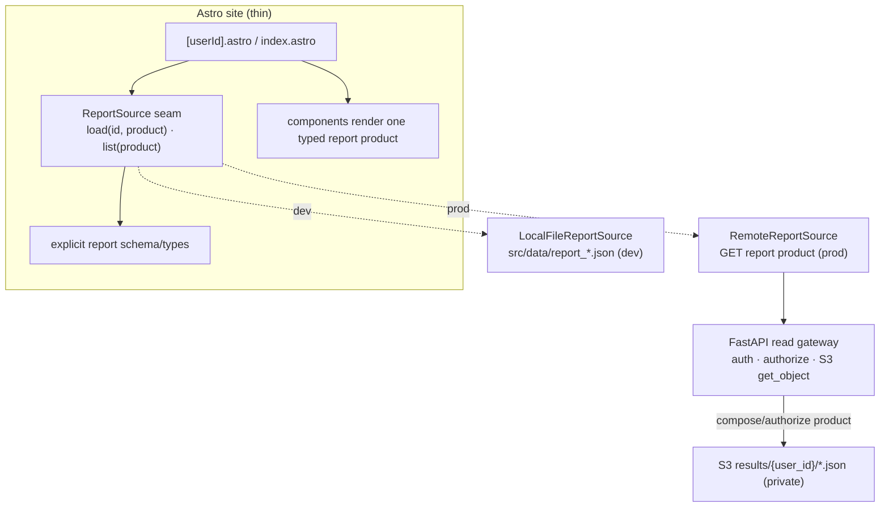
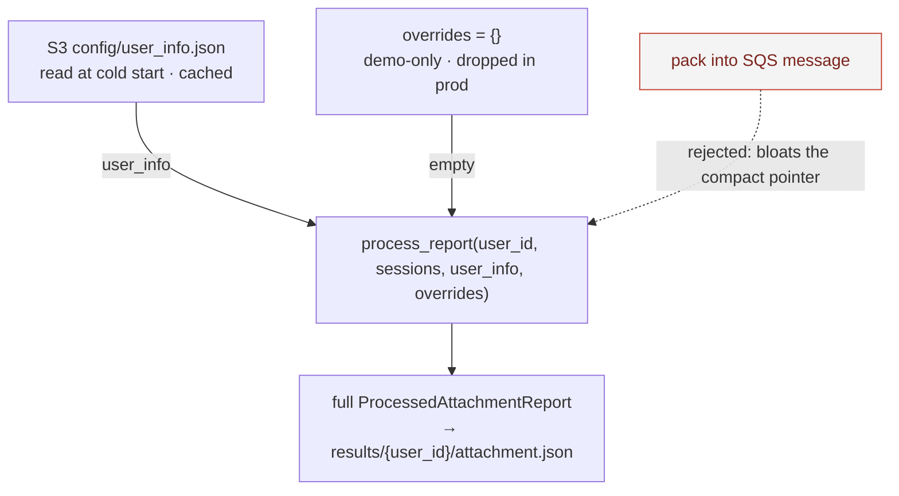

# ADR-033: Astro Report Frontend Data Source

- **Status:** Proposed
- **Date:** 2026-06-06
- **Scope:** How the `mewi-report` Astro site gets report data, across
  `mewi-report/src/pages/user/report/`, `mewi-report/src/utils/reportRoutes.ts`,
  new `mewi-report/src/lib/reportSource.*` and
  `mewi-report/src/lib/reportSchema.ts` modules, and the FastAPI read gateway
  from the ADR-031 private S3 results bucket.
- **Builds on:** [ADR-012](ADR-012-mewi-report-raw-to-value-data-contract.md)
  (raw→value contract), [ADR-013](ADR-013-mewi-report-auto-pipeline.md)
  (render-only site), [ADR-014](ADR-014-report-ingestion-service-boundary.md)
  (port pattern), [ADR-030](ADR-030-post-session-report-processing.md)
  (computation rule + `generation_mode`), and
  [ADR-031](ADR-031-report-end-to-end-workflow.md) (two report products + the
  `results/{user_id}/*.json` contract).

## Context

The backend -> S3 chain (ADR-031/032) now produces report JSON in a **private**
bucket (`results/{user_id}/attachment.json`, `recommendation.json`). That S3
bucket remains the report source of truth. The backend is only the safe read
gateway between the frontend and private S3:

```text
Frontend -> FastAPI read API -> private S3 -> JSON
```

The product topology is two reports per user:

- `attachment.json` / attachment report — the implemented/default product.
- `recommendation.json` / recommendation report — scaffolded, but the core still
  raises `NotImplementedError` and the Lambda is commented out of the Terraform
  roster until the output contract is filled in.

Today the site:

- is `output: 'static'`;
- reads `src/data/report_{id}.json` from the local filesystem at **build time**
  (`[userId].astro` `getStaticPaths` + `readFile`, `reportRoutes.ts` scans
  `src/data/`);
- renders **one website-ready attachment report** (keys: `user`, `meta`,
  `summary`, `cats`,
  `radar`, `attention_pct`, `attachment_profile`, `attachment_analysis`,
  `multi_cat_encounters`, `timeline`).

Four gaps shape the cloud path, and each is a place where a naive fix would add
weight to the frontend:

1. **No fetch path.** The bucket is private; the site has no backend read API for
   finished report products.
2. **Shape contract.** The current local files are full website-ready attachment
   reports. Production must keep `attachment-report` writing that same full
   `ProcessedAttachmentReport` shape to S3 so the site never composes a leaf
   `{ user_id, attachment_analysis }` response into page data.
3. **Freshness.** A static build only reflects reports that existed at build
   time; new post-session reports would need a rebuild.
4. **Implicit schema.** The page currently treats report JSON as
   `Record<string, any>`, so the additive `generation_mode` and future
   `recommendation` fields are not documented where the frontend depends on
   them.

The goal of this ADR is to wire the site **thin**: pages and components should
not learn about S3 paths, bucket names, AWS credentials, merging, or auth.

## Decision

Six decisions, each chosen to keep the frontend thin and swappable.



### 1. One `ReportSource` seam (the core of "thin + flexible")

Introduce a single data-access port the site depends on, mirroring the backend's
ADR-014 store ports:

```ts
export interface ReportSource {
  load(id: string, product?: ReportProduct): Promise<FrontendReport | null>;
  list(product?: ReportProduct): Promise<ReportRoute[]>; // index + optional static paths
}

export type ReportProduct = 'attachment' | 'recommendation';
export type FrontendReport = ProcessedAttachmentReport | RecommendationReport;
```

- `LocalFileReportSource` — today's `src/data/*.json` reader. Stays the **dev /
  demo default**, so local work needs no AWS. Its default product is
  `attachment`, because today's files are attachment-page reports.
- `RemoteReportSource` — fetches one product for a user in production. For now it
  must support `attachment`; it can return `null` / unavailable for
  `recommendation` until that core is implemented. It calls FastAPI, not S3.

`[userId].astro`, `index.astro`, and `reportRoutes.ts` call the seam; they never
touch `fs`, `fetch`, S3, or merge logic directly. Selected by env
(`PUBLIC_REPORT_SOURCE=local|remote`, `REPORT_API_BASE=...`). Swapping the source
is one env change and touches no page or component.

### 2. Each page renders ONE typed product; composition happens upstream

Keep the render contract simple: a page receives exactly one typed report object
and renders it. **Do not merge `attachment.json` + `recommendation.json` in the
browser or in `.astro` pages.** If a future route wants a combined envelope, the
merge is owned **upstream** — either the report job writes a composed
`results/{user_id}/report.json`, or the FastAPI read gateway composes it on read.

The implemented/default product is the current attachment page shape. The
recommendation product is reserved but optional until
`infra/aws-lambda/recommendation-report/recommendation.py` and
`skills/recommendation/SKILL.md` define the exact block. Existing demo files and
components keep working; new sections render only when present.

### 3. Make the frontend schema explicit

Add a shared TypeScript contract in `mewi-report/src/lib/reportSchema.ts` (or
`reportTypes.ts` if no runtime validation is added). At minimum it should encode
the current local file shape emitted by
`infra/aws-lambda/attachment-report/report_processor.py:process_report`, plus
additive fields from ADR-030/031:

```ts
export type GenerationMode = 'llm+kb' | 'llm_only' | 'deterministic';

export type ReportBar = {
  label: string;
  value: number;
  color?: string;
};

export type AttachmentAnalysis = {
  type: string;
  modifier?: string;
  confidence?: string;
  scores?: {
    secure?: number;
    anxious?: number;
    avoidant?: number;
    fearful_avoidant?: number;
  };
  summary?: string;
  evidence?: Array<{ label: string; detail: string }>;
  caveat?: string;
};

export type ProcessedAttachmentReport = {
  user_id: string;
  generation_mode?: GenerationMode;
  user: {
    id: string;
    display_name: string;
    handle: string;
    report_slug?: string;
  };
  meta: { sessions: number; total_events: number; last_seen: string };
  summary: {
    avg_trust_gained: number;
    primary_bond: string;
    avg_reaction_latency_s: number;
    patience_pct: number;
  };
  cats: Record<string, {
    name: string;
    accent: string;
    archetype?: string;
    trait?: string;
    trust_arc: number[];
    delta?: string;
    status?: string;
    bars?: ReportBar[];
    sequence_log?: Array<{ ts: string; actor: 'H' | 'C'; action: string; trigger?: string }>;
    moments?: Array<{ session: string; event: string; highlight?: boolean; milestone?: string | null }>;
  }>;
  radar: Record<string, number>;
  attention_pct: Record<string, number>;
  multi_cat_encounters: Array<{ situation: string; choice: string; freq: string; outcome: string }>;
  attachment_profile: ReportBar[];
  attachment_analysis: AttachmentAnalysis;
  timeline: Array<{ session: string; event: string; highlight?: boolean; milestone?: string | null }>;

  // Reserved for an upstream-composed envelope only. Plain attachment pages do
  // not require this, and current demo files do not have it.
  recommendation?: RecommendationBlock;
};

export type RecommendationBlock = Record<string, unknown>;

export type RecommendationReport = {
  user_id: string;
  generation_mode?: GenerationMode;
  recommendation: RecommendationBlock;
};
```

Runtime validation is optional. If added, keep it at the source boundary
(`LocalFileReportSource` / `RemoteReportSource`) so components still receive a
typed object and do not own parsing.

### 4. The site never touches S3 directly

The bucket stays private. `RemoteReportSource` reads through FastAPI, and FastAPI
proxies the small JSON result from S3. The **user-facing** route resolves identity
from the token — the URL never has to say "give me user X":

```http
GET /api/v1/report/me/{product}        # product = attachment | recommendation
Authorization: Bearer <signed-report-token>
```

The backend reads `user_id` from the token's `sub`, maps it to
`results/{sub}/{product}.json`, and returns the JSON. For **admin / debug** views,
an explicit-id route is allowed, authorized by the same token:

```http
GET /api/v1/report/{user_id}/{product}     # admin, or self (sub == user_id)
```

The rule: **`user_id` in the URL is only a locator; the token is the permission.**
`admin` claim → may read any `user_id`; otherwise `sub` must equal the requested
`user_id`, else `403`.

For the report directory/new-card experience, a list endpoint scopes by the same
claim:

```http
GET /api/v1/report?product=attachment
```

- normal token → returns only the caller's own report/card (its `sub`);
- `admin` token → returns the authorized directory.

The site uses this to show a card once the Lambda pipeline has written
`results/{user_id}/attachment.json`.

The FastAPI read gateway is intentionally small. It only:

- authenticates the caller;
- checks the caller may read `user_id`;
- maps `product` to `results/{user_id}/{product}.json`;
- reads that object from private S3;
- returns JSON / list metadata to the frontend.

Auth stays **thin and standard** — a capability JWT via `PyJWT`:

```python
import jwt  # PyJWT

def _claims(token: str) -> dict:
    return jwt.decode(token, os.environ["MEWI_REPORT_READ_JWT_SECRET"], algorithms=["HS256"])

# user-facing: identity comes from the token, not the URL
def me_user_id(token: str) -> str:
    return _claims(token)["sub"]

# explicit/admin route: admin may read anyone; otherwise sub must match
def authorized_user(token: str, requested_user_id: str) -> str:
    claims = _claims(token)
    if claims.get("admin") or claims.get("sub") == requested_user_id:
        return requested_user_id
    raise HTTPException(403)
```

The token (`sub = user_id`, `exp`; `admin: true` for ops) is minted server-side
when a report is ready and handed to the player as a signed report link. No user
table, no passwords, no session store — just sign and verify. `PyJWT` is the only
new dependency.

It does **not** score reports, call Claude, run RAGFlow, derive facts, or generate
recommendations. Those remain owned by the out-of-band Lambda pipeline. Do not
use public S3 for launch. Do not start with CloudFront unless the report payloads
become high-traffic or media-heavy; these are small JSON reads, so a backend proxy
is the cleanest first version.

### 5. End-to-end user-visible flow

This ADR's read path completes the intended visible loop:

1. The Unity player finishes the game/session.
2. Unity posts the closed-session payload to FastAPI
   (`POST /api/v1/report/session`).
3. FastAPI stores/enqueues only; the AWS Lambda pipeline processes out of band and
   writes `results/{user_id}/attachment.json` (and later
   `recommendation.json`) to private S3.
4. The report frontend asks FastAPI for the report list. Once S3 has the new
   product, the frontend shows a new user/report card or ready notification.
5. The user clicks the card; `RemoteReportSource.load(user_id, 'attachment')`
   calls FastAPI, FastAPI reads private S3, and the page renders the JSON. The
   frontend never reads AWS directly.

### 6. Where the producer gets `user_info` / `overrides`

The full `ProcessedAttachmentReport` is built by
`process_report(user_id, sessions, user_info, overrides, …)` inside the
`attachment-report` Lambda (ADR-031). Two of those inputs exist today only as
local demo/config files (`pipeline/user_info.json`,
`report_overrides/{user}.json`), which do **not** exist in the Lambda sandbox.
This ADR fixes where they come from, because the names/data they supply are what
the frontend ultimately renders.



- **`overrides = {}` permanently.** It is a local demo / manual-tweak
  convenience; production never writes it. Do not carry demo scaffolding into the
  production pipeline.
- **`user_info` from a small S3 config object** (`config/user_info.json`), read
  at Lambda cold start and cached for the container lifetime. S3 stays the single
  source of truth, the Lambda stays stateless, and updating a display name needs
  no redeploy.
- **Rejected: carrying `user_info` / `overrides` in the SQS message.** It bloats
  ADR-032's compact job pointer and couples message shape to report content.

**Ship in two steps (sequences the risk):**

1. Land the producer with `user_info = {}` and `overrides = {}` first — confirm
   the full `ProcessedAttachmentReport` reaches S3 and renders in Astro (display
   names fall back to `user_id`, e.g. `vanillasky_01`).
2. Then add the `config/user_info.json` S3 read so real display names appear.

IAM: `attachment-report` already has results-bucket `GetObject`; place
`config/user_info.json` under a prefix that grant covers (e.g. the results bucket
`config/` prefix) so no new permission is needed.

## Open Decisions (recommended defaults)

| Decision | Recommended default | Why |
| --- | --- | --- |
| Source of truth | Private S3 `results/{user_id}/{product}.json` | Report storage stays in S3; the backend is a safe gateway, not the owner/generator of report content. |
| Composition location | Upstream when needed (report job writes composed `report.json`, or FastAPI read gateway composes) | Keeps the site thin; composition logic lives once, server-side, testable. Plain product pages still fetch one product. |
| Fetch transport | FastAPI backend proxy read endpoint returning one requested report product | S3 stays private, frontend has no AWS credentials, auth stays in one place, and S3 layout can change without touching the frontend. |
| Render mode | Astro `hybrid`: keep static shell, server-render (or client-fetch) the `[userId]` route through the source | New reports appear without a full rebuild; dev still uses local files. |
| Contract evolution | Additive (`generation_mode`, optional recommendation product/envelope slot) | Existing reports/components keep rendering; no breaking migration. |
| Schema ownership | `mewi-report/src/lib/reportSchema.ts` mirrors the Lambda `report_processor.py:process_report` output plus ADR-031 product fields | Makes the frontend contract reviewable instead of hidden in `Record<string, any>`. |
| Recommendation status | Reserve schema/route space, but treat it as unavailable until `recommendation.py` is implemented and the Lambda is uncommented | Avoids designing the site as if report #2 is live. |
| Auth scheme | **Capability JWT via `PyJWT`** (`sub = user_id`, `exp`, `HS256`, secret `MEWI_REPORT_READ_JWT_SECRET`). User-facing route is `GET /report/me/{product}` — identity = token `sub`, URL is never trusted. Admin/debug route `GET /report/{user_id}/{product}` is authorized by `admin` claim **or** `sub == user_id`. No accounts, no session store. | Thin and standard (`/me` + bearer token). A shared `X-API-Key` can't satisfy "a user cannot read another user's report"; a full account system is overkill for personal report links. |
| List semantics | `GET /api/v1/report?product=attachment` scopes by claim: normal token → only the caller's own card (`sub`); `admin` token → the authorized directory | The player experience is personal; the multi-user directory is an admin/ops view. |
| Dev experience | `LocalFileReportSource` remains the default with no AWS | Contributors render the site offline from `src/data/*.json`. |
| Producer reference data | `overrides = {}` permanently; `user_info` from S3 `config/user_info.json` (cached). Empty-both is an acceptable MVP. | Keeps S3 the source of truth, the Lambda stateless, and the SQS message a compact pointer; empty-both renders with `user_id` fallback so the pipeline shape can be validated first. |

## Upstream Dependencies for Remote Production

The frontend-scoped work is ready now: `ReportSource`, `LocalFileReportSource`,
`reportSchema.ts`, and moving current filesystem logic behind the seam can be
implemented without AWS. The production `RemoteReportSource` path is blocked
until these upstream items are resolved:

- **Full attachment product.** ADR-031's `attachment-report` Lambda must write a
  full `ProcessedAttachmentReport` to `results/{user_id}/attachment.json`. This
  is implemented in code by bundling the deterministic processor into the Lambda;
  it still needs cloud deploy verification.
- **FastAPI results-bucket IAM.** ADR-032's FastAPI AWS principal must include
  `s3:GetObject` on `results/*` and `s3:ListBucket` with a `results/*` prefix
  condition so the read gateway can fetch products and build card metadata.
- **Per-user read auth.** A capability JWT via `PyJWT` (`sub = user_id` + `exp`,
  `HS256`, `MEWI_REPORT_READ_JWT_SECRET`): one thin dependency decodes and asserts
  `sub == requested user_id` (or `admin`). `PyJWT` is the only new backend
  dependency; the shared `verify_api_key` is not sufficient for production reads.

## Implementation Notes

- `mewi-report/src/pages/user/report/[userId].astro` is the current attachment
  report page. It reads `fs` directly and consumes the current
  `ProcessedAttachmentReport` shape. This is the first page to move behind
  `ReportSource`.
- `mewi-report/src/pages/user/report/index.astro` and
  `mewi-report/src/utils/reportRoutes.ts` are the current local-file listing
  path. Their logic becomes `LocalFileReportSource.list()`.
- `mewi-backend/app/api/routes/report_router.py` is currently ingest-only
  (`POST /report/session`). Add the read gateway there or in a sibling route:
  the user-facing `GET /report/me/{product}` (identity from token `sub`), the
  admin/self `GET /report/{user_id}/{product}`, and the `GET /report?product=`
  list endpoint for card metadata. Add `PyJWT` to the backend deps.
- The read gateway should depend on a small S3 result-reader port, not on the
  processing trigger. Reading a finished report must not start scoring, Claude,
  RAGFlow, or Lambda work.
- `infra/aws-lambda/recommendation-report/handler.py` already leaves the thin
  boundary for report #2: resolve attachment output, call the recommendation
  core, write `recommendation.json`.
- `infra/aws-lambda/recommendation-report/recommendation.py` and
  `infra/aws-lambda/recommendation-report/skills/recommendation/SKILL.md` are the
  explicit implementation gap. The skill says the exact recommendation output
  contract still needs to be defined.
- `infra/aws-lambda/lambdas.tf` leaves `recommendation-report` commented out and
  gates the `attachment.json -> recommendation-report` trigger on that roster
  entry, so the stub cannot fire in production by accident.

## Closing the Loop: Astro Remote Source + E2E

This is the final slice that makes the website show the **cloud** report.
Everything behind it is in place (Lambda producer → S3 → FastAPI read gateway +
`PyJWT` auth); the site still reads local `src/data/*.json`, so this wires the
remote path and the token-in-link handoff.

### `RemoteReportSource`

The seam's production implementation calls the read gateway with the bearer token
and returns the typed report:

```ts
// src/lib/reportSource.remote.ts
export function createRemoteReportSource(apiBase: string, token: string): ReportSource {
  const headers = { Authorization: `Bearer ${token}` };
  return {
    async load(_id, product = 'attachment') {
      // /me resolves the user from the token; the URL never carries identity
      const res = await fetch(`${apiBase}/api/v1/report/me/${product}`, { headers });
      if (res.status === 404) return null;
      if (!res.ok) throw new Error(`report fetch failed: ${res.status}`);
      return (await res.json()) as FrontendReport;
    },
    async list(product = 'attachment') {
      const res = await fetch(`${apiBase}/api/v1/report/?product=${product}`, { headers });
      return res.ok ? ((await res.json()) as ReportRoute[]) : [];
    },
  };
}
```

### Token in the link (handoff)

The player opens a signed link that carries the capability token:

```
https://report.mewi.app/report?token=<JWT>
```

The route reads `token` from the URL and builds
`createRemoteReportSource(REPORT_API_BASE, token)`. For the **first e2e you mint
the JWT manually** (HS256, `sub = <user_id>`, same `MEWI_REPORT_READ_JWT_SECRET`
the backend uses). A thin backend "mint report link" route is a later
convenience — not required to test.

### Render mode + env

Use Astro `hybrid` (or `server`) for the report route so it fetches at request
time without a rebuild; the rest of the site stays static. Dev keeps
`LocalFileReportSource`. Selected by env:

```
PUBLIC_REPORT_SOURCE=local|remote
REPORT_API_BASE=https://<your-fastapi-host>
```

### Minimum end-to-end test recipe

1. `cd infra && ./deploy.sh` (raw/results buckets, SQS+DLQ, Lambda, IAM).
2. Run FastAPI with: `MEWI_REPORT_PROCESSING_MODE=sqs`, `MEWI_REPORT_RAW_BUCKET`,
   `MEWI_REPORT_SQS_QUEUE_URL`, `MEWI_REPORT_RESULTS_BUCKET`,
   `MEWI_REPORT_READ_JWT_SECRET`, `AWS_REGION=ap-southeast-1`.
3. POST a closed session (Unity or `curl`) → confirm
   `results/{user_id}/attachment.json` lands in S3.
4. Mint a JWT (`sub=<user_id>`, the read secret) → `GET /api/v1/report/me/attachment`
   returns the full report JSON.
5. Run the site with `PUBLIC_REPORT_SOURCE=remote` + `REPORT_API_BASE`; open
   `/report?token=<JWT>` → the report renders from FastAPI (no local file).
   **Loop closed.**

## Consequences

**Positive**

- The site stays thin: pages/components render a typed report product and know
  nothing about S3 paths, bucket names, AWS credentials, merging, or auth.
- Flexible: local-file and remote sources are swappable by env; report products
  are selected through the seam; S3 layout can change behind FastAPI without
  touching the site.
- Maintainable: one seam, explicit report schemas, and upstream composition when
  composition is needed; dev stays offline.
- `generation_mode` (ADR-030) can surface a provenance label with no special
  plumbing.

**Negative**

- Production freshness needs `hybrid`/SSR or client-side fetch, i.e. an Astro
  adapter or a small client loader — more than pure static hosting.
- A FastAPI read endpoint must exist; it owns auth, authorization, and private-S3
  read access and is new work.
- The processed-report contract must be kept additive so the site stays stable.
- The attachment Lambda now owns deterministic report-shape logic; frontend
  schema updates must track Lambda processor changes.
- Recommendation UI/schema is intentionally incomplete until the recommendation
  skill defines its output block.

## Acceptance Checks

- Pages and components import only the `ReportSource` seam and a typed
  report schema; no `fs`, `fetch`, S3, or merge code lives in `.astro` files.
- `mewi-report/src/lib/reportSchema.ts` (or `reportTypes.ts`) defines the current
  `ProcessedAttachmentReport`, `RecommendationReport`, and optional
  `generation_mode`.
- `LocalFileReportSource` renders the site from `src/data/*.json` with no AWS.
- Existing `src/data/report_*.json` files render even though they have no
  `generation_mode` and no `recommendation`.
- `RemoteReportSource` renders a user's attachment report fetched in production
  without a site rebuild.
- `RemoteReportSource.list('attachment')` can show a newly finished user's report
  card after the Lambda pipeline writes `results/{user_id}/attachment.json`.
- The production read path returns a full object matching
  `ProcessedAttachmentReport`; it does not hand the current page only
  `{ user_id, attachment_analysis }`.
- If a combined report/envelope is introduced, the site receives one composed
  object; it never merges `attachment.json` + `recommendation.json` itself.
- The site never holds S3 credentials or reads the bucket directly.
- FastAPI read routes only authenticate, authorize, read private S3, and return
  JSON; they do not score, call Claude, run RAGFlow, or generate reports.
- Public S3 is not used for launch.
- A report missing `recommendation` / `generation_mode` still renders (additive
  contract).
- `recommendation` remains absent/unavailable until
  `recommendation.py:generate_recommendation` stops raising `NotImplementedError`
  and the recommendation Lambda is in the Terraform roster.
- A user cannot read another user's report through the read path.
- `GET /report/me/{product}` resolves the user from the token `sub`; the URL
  `user_id` is never trusted as permission.
- An `admin: true` token may read any `user_id` and list the directory; a normal
  token reading another `user_id` (or listing all) gets `403` / its own card only.
- `attachment-report` builds the full report with `overrides={}` and `user_info`
  from S3 `config/user_info.json` (or empty in the MVP step) — never from SQS
  message fields.
- Updating `config/user_info.json` changes report display names without
  redeploying the Lambda.

- With `PUBLIC_REPORT_SOURCE=remote`, the site renders a report fetched from
  FastAPI (no `src/data` file), authorized only by the token in the link.
- Opening `/report?token=<JWT>` renders the token subject's report; the URL cannot
  be used to coerce another user's report (the gateway authorizes by token).

## Related

- [ADR-031](ADR-031-report-end-to-end-workflow.md): owns the two report products
  and the `results/{user_id}/*.json` contract this site consumes.
- [ADR-030](ADR-030-post-session-report-processing.md): owns `generation_mode`
  and the deterministic-vs-narrative computation rule.
