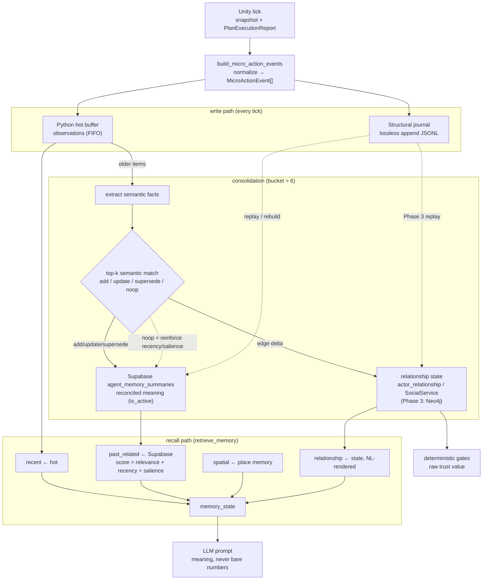

# ADR-034: Live Micro-Action Memory Pipeline

- **Status:** Proposed — Phase 1 **implemented**; Phase 2 **implemented**;
  Phase 3 **deferred** (gated). The code now matches the hot/journal/summary
  pipeline plus Phase 2 Supabase reconciliation, vector-ready retrieval,
  recency/salience reinforcement, simple relationship state, and qualitative
  prompt rendering. Neo4j remains intentionally out of scope until Phase 3 gates
  pass.
- **Date:** 2026-06-06
- **Scope:** `mewi-backend/app/agent/memory/`, `app/agent/behavior_graph.py`
  (`persist_memory` / `retrieve_memory`), `app/repositories/` (Supabase summary
  store, `MicroActionJournalStore`, optional mem0/Neo4j), `app/agent/prompts/`
  (relationship rendering), `app/core/supabase/migration.sql`, the existing
  `RawCatJournal`, and Unity's live `PlanExecutionReport` / `action_result`.
- **Builds on:** [ADR-020](ADR-020-memory-layer-simplification.md) (manager owns
  meaning, stores do IO), [ADR-023](ADR-023-shared-unity-agent-websocket.md)
  (`creature_id + requestId` routing),
  [ADR-027](ADR-027-malbers-action-vocabulary-and-micro-action-matching.md)
  (action vocabulary), [ADR-029](ADR-029-player-cat-action-fsm-proposal.md)
  (player-cat stimulus/reaction lane).
- **Distinct from:** [ADR-030](ADR-030-post-session-report-processing.md) — that
  owns the closed-session report (`mewi.report.raw.v2`); this owns *live, in-tick
  agent memory*. Shared field names, separate contracts and stores.

## Context

Today the backend folds Unity's whole live report into one opaque
`event_type="planning_turn"` row (`previous_action_result` blob in
[`build_turn_memory_write`](../../mewi-backend/app/agent/memory/memory_consolidate.py)).
That answers "did the last plan work?" but not the unit ADR-027/028/029 care
about: the concrete micro-action loop (gesture → stimulus → reaction; phase /
status; `behavior_key` vs `motor_action` vs `action`). Buried in a blob, none of
it is queryable.

The current durable memory also **accumulates**: `SupabaseMemoryStore` writes a
new row per turn/summary. Over 16 cats and long sessions that becomes a pile of
overlapping "the player is gentle" rows, retrieved by `ilike` keyword match.

What we want instead is the real mem0 lesson: **memory is extracted and
reconciled, not accumulated.** Each tier holds a distinct *truth type*, which is
what removes redundancy between them.

## Decision

Normalize Unity live reports into typed `MicroActionEvent`s and route them
through four tiers, each with one job:

| Tier | Truth type | Holds | Durable? | LLM reads? |
|---|---|---|---|---|
| Python hot | observations ("what just happened") | recent `MicroActionEvent`s / perceptions / working state, FIFO | no | yes, verbatim |
| Structural journal | exact facts (lossless) | every normalized event, append-only | yes | no (audit / rebuild only) |
| Supabase | meaning ("what I've come to understand") | reconciled semantic facts | yes | yes, as sentences |
| Neo4j (Phase 3) | relationship **state** + structure | current edge state, traversable graph | yes | only after NL rendering |

**The placement test** (resolves almost every "where does X go"):
computed/compared (threshold, traversal) → relationship-state tier;
read as a sentence by the LLM → Supabase; happened this tick → hot.
Spatial preference ("likes the windowsill") already has its own tier
(`agent_place_memories`) — keep it there, not in semantic facts.

### 0. Workflow at a glance



### 1. Typed micro-action event

```jsonc
{ "event_id":"evt-1","correlation_id":"pcat-42","request_id":"tick-1002","tick":1002,
  "actor_type":"cat","actor_id":"mewi","target_type":"cat","target_id":"haru",
  "direction":"cat_to_cat","action":"approach","behavior_key":"","motor_action":"",
  "phase":"","status":"completed","source_event_id":"","trust_delta":null,"evidence":{} }
```

`MicroActionEvent` is a dataclass in `memory_models.py`, carried on
`TurnMemoryWrite` alongside `raw_event` / `aspect_memories`. `event_id` links a
chain; `correlation_id` groups one interaction loop; `source_event_id` is the
causal parent; `trust_delta` is the relationship effect (not before/after — trust
is relationship state, the event records the *effect*); `evidence` is the
open-ended rest.

### 2. Phase 1 normalizer mapping (`build_micro_action_events`)

Unity's live `PlanExecutionReport` sends `agent_id, requestId, planId,
correlationId, status, startedAt, completedAt, steps[]`; each step sends
`commandId, requestId, correlationId, action, target, status, reason, startedAt,
endedAt`. Phase 1 maps **only those fields** — one event per step:

| Field | Source / rule |
|---|---|
| `creature_id` / `tick` | graph state (never inferred from target) |
| `request_id` / `correlation_id` | step → report → raw, first non-empty |
| `event_id` | step `commandId`, else `{creature_id}:{request_id}:{step_index}:{action}:{target}` |
| `actor_type` / `actor_id` | `cat` / report `agent_id` → `creature_id` |
| `target_type` / `target_id` | `cat` if target matches a known creature id, else empty; clean string |
| `direction` | from actor/target types (`cat_to_cat`, `cat_to_player_cat`, or empty) |
| `action` / `status` | step `action` / `status` (ADR-027 label; unknown kept, not dropped) |
| `behavior_key`, `motor_action`, `phase`, `source_event_id` | **empty** — not in current Unity report |
| `trust_delta` | **null** — backend does not own trust deltas in Phase 1 |
| `evidence` | `plan_id`, `report_status`, `reason`, step/report timing, `step_index`, `raw_step` |

Guardrails: never collapse actors into `human`; never infer `trust_delta` from
prose/status/latency; keep unknown actions with
`evidence.normalization_status="unknown_action"`; emit
`micro_action_normalizer.{missing_field,unknown_action,empty_steps}` counters.

### 3. Write path

One seam, `MemoryStore.record_turn(write)`, fanned by `CompositeMemoryStore`;
each store owns its tier:

- **Hot** — `persist_turn` records the turn + newest micro-actions in-process
  (synchronous), then writes durably in the background so the tick never blocks.
- **Journal** — `MicroActionJournalStore` appends every event to the existing
  `RawCatJournal` (`live_micro_actions.jsonl`, `schema_version
  mewi.live_micro_action.v1`, per-creature, append-only). Never a recall source
  (`search` returns `[]`). This is the lossless backstop that makes the Supabase
  tier safe to reconcile/lose.
- **Supabase** — written only on consolidation (see §4), not every turn.
- **Neo4j** — Phase 3 only.

### 4. Supabase = reconciled meaning (the Phase 2 change)

Consolidation runs over older hot items (`consolidate_aspect_llm`, default:
bucket > 6 items, keep newest 2). **Phase 1 appends** the summary; **Phase 2
reconciles** instead:

1. Extract discrete semantic facts from the older hot items.
2. For each fact, **semantically** retrieve top-k existing facts for this
   `creature_id` (vector search — see prerequisite below).
3. Decide **ADD** (new), **UPDATE/SUPERSEDE** (evolve an existing belief), or
   **NOOP** (redundant). This bounds growth and keeps beliefs current instead of
   writing "the player is gentle" forty times.

Schema (`agent_memory_summaries`, additive/idempotent in `migration.sql`):

```sql
CREATE TABLE IF NOT EXISTS agent_memory_summaries (
  id            uuid DEFAULT gen_random_uuid() PRIMARY KEY,
  creature_id   text NOT NULL,
  aspect        text NOT NULL DEFAULT 'general',
  memory_kind   text NOT NULL DEFAULT 'summary',
  text          text NOT NULL,
  tick_start    integer NOT NULL,
  tick_end      integer NOT NULL,
  source_count  integer NOT NULL DEFAULT 0,
  salience      float DEFAULT 0.0,
  evidence      jsonb NOT NULL DEFAULT '{}',
  is_active        boolean NOT NULL DEFAULT true,  -- Phase 2: reconcile
  superseded_by    uuid,                           -- Phase 2: points to the newer fact
  embedding        vector,                          -- Phase 2: semantic retrieval (pgvector)
  last_active_tick integer,                         -- Phase 2: recency decay + reinforcement (§7)
  updated_at       timestamptz DEFAULT now() NOT NULL,
  created_at       timestamptz DEFAULT now() NOT NULL
);
CREATE INDEX IF NOT EXISTS idx_agent_memory_summaries_active
  ON agent_memory_summaries(creature_id, is_active, tick_end DESC);
```

Phase 2 writes `is_active` rows only, stores `embedding` when the embedding
provider is available, and tries the `match_agent_memory_summaries` vector RPC
before falling back to active-row keyword/recency search. Reconcile sets
`is_active=false` + `superseded_by` on the old row rather than deleting.

### 5. Recall composition (`retrieve_memory`)

`retrieve_memory` builds `_recall_query(structured, raw)` (current zone +
relevant actors) and composes `memory_state` mem0-style from these sources:

| `memory_state` slot | Query | Returns |
|---|---|---|
| `recent` / `working` / `episodic` | `remember(last_n=5)` (hot deques) | recent perceptions / raw events / micro-actions |
| `recent.longterm` | `recall_longterm(query, creature_id, 5)` → composite → `SupabaseMemoryStore.search`: `eq(creature_id).eq(is_active,true).ilike(text)` (Phase 2: vector), `order(tick_end desc).limit(5)` | reconciled semantic facts (`list[dict]`) |
| `spatial` | `_retrieve_place_memory` → `agent_place_memories` | place coverage / familiarity |
| `relationship` | `_retrieve_relationship_context` → `SocialService.observe_turn` + Unity `mood.trust` (Phase 3: Neo4j) | who-relates-to-whom + current state |

`recall_longterm` returns a **merged `list[dict]`** across durable stores;
the journal contributes nothing. Each source degrades independently — cold start
(empty hot), pre-consolidation (empty Supabase), or graph-off all still return
the other slots — which is why the hybrid is more reliable than any single store.

**Rule: meaning, never bare numbers.** Relationship/graph values enter the prompt
as language ("growing comfortable with the player"); raw values like `trust=0.71`
go only to deterministic gates.

This rule is enforced in `app/agent/prompts/sections.py` and
`app/agent/prompts/__init__.py`: relationship/trust values render as qualitative
phrases for the LLM, while raw floats remain available to deterministic gates.

### 6. Per-cat isolation

Every tier is scoped by the memory-subject `creature_id`: one `CreatureRuntime`
(hence one `MemoryManager`) per cat; every Supabase/journal row carries
`creature_id` and is filtered on read/write; mem0 uses `user_id=creature_id`;
Phase 3 Neo4j keys/constrains every node and edge by `creature_id` and includes
it in every Cypher read. Memory is subjective: Mewi's "player pushed Haru" is not
Haru's memory unless Haru's own stream recorded it.

### 7. Temporal weighting — recency decay + reinforcement

mem0-style memory is time-aware: it does not treat all facts equally over time,
and recall is not pure recency *ordering*. ADR-034 adopts a
Generative-Agents-style retrieval *score*:

```
score = w_rel · semantic_relevance
      + w_rec · recency_decay(now_tick − last_active_tick)
      + w_sal · salience
```

- **Recency decay** — an exponential decay on `now_tick − last_active_tick` so
  stale facts sink unless reused. Phase 1 approximates this with `ORDER BY
  tick_end`; Phase 2 makes it a real scored blend with vector relevance.
- **Reinforcement (the "timing reward")** — when reconcile would NOOP (the belief
  is already known) or when a fact is recalled, *bump* its `last_active_tick` and
  `salience` instead of doing nothing. Repeatedly confirmed beliefs stay strong;
  one-off noise decays out. This is what keeps the store both small and current.
- **Forgetting** — facts whose decayed score falls below a floor may be dropped or
  set `is_active=false`. Safe because the journal is the lossless record.

This needs the `last_active_tick` column added in §4 (`salience` already exists).
Hot memory needs no decay — it is a short FIFO window. Phase 3 `:TRUSTS` edges
carry `updated_tick`, so relationship state ages the same way.

## Why phases (and why Phase 1 must exist before Phase 2/3)

The phases are not bureaucracy — each ships a usable cat, isolates a different
kind of risk, and has different dependencies:

- **Phase 1 — capture & survive (implemented).** Normalize live reports; keep
  hot; journal everything losslessly; write coarse Supabase summaries; keep trust
  as Unity's signal. *Why first:* it has **zero external dependencies** (no Unity
  schema change, no graph DB, no vector infra) and it establishes the **lossless
  journal**. Phase 2's reconcile is allowed to be lossy *only because* the Phase 1
  journal can rebuild — so Phase 1 is the precondition that makes Phase 2 safe.

- **Phase 2 — understand & reconcile (adopt now).** Vector retrieval + reconcile
  (add/update/supersede) on the Supabase meaning tier; relationship **state** as a
  simple `actor_relationship(creature_id, target_id, trust, last_tick)` table (or
  `SocialService`); enforce "meaning, not numbers" in the prompt. *Why a separate
  phase:* it's pure backend **quality** work — no Unity dependency — and it's
  where "the cat feels socially alive" actually comes from. It carries real risk
  (reconcile can corrupt a belief; it costs an LLM judgment per fact, which
  multiplies across 16 cats), so it is staged and budgeted, not bolted onto the
  mechanical Phase 1.

- **Phase 3 — traverse (deferred, gated).** Promote relationship state to Neo4j
  for cross-cat traversal ("who else does the player approach?", "cats Haru
  avoids") and `:CAUSED` chains. *Why last and gated:* a graph DB only earns its
  keep when you need **traversal**, and the causal input does not exist yet —
  Unity's live report has no `source_event_id` and no player-cat/stimulus lane, so
  Neo4j would be an edgeless graph. Phase 3 starts only when **(a)** Unity emits
  those fields, **(b)** a backend trust owner is named, and **(c)** a real
  traversal consumer exists. Until then the relationship tier stays a flat table
  and nothing is lost — Phase 3 rebuilds from the journal.

The clean responsibility split holds across all three; only the storage engine
for the relationship tier changes (table → Neo4j) at the traversal boundary.

## Consequences

- **Gains:** the micro-action loop becomes analyzable; durable memory stays small
  and current (reconcile) instead of a growing keyword pile; raw facts stay
  auditable in the journal; the LLM consumes meaning, not numbers; each cat is
  isolated; every phase is independently shippable.
- **Costs / risks:** reconcile needs vector retrieval for best quality and adds an
  LLM judgment per fact when fact extraction is expanded — the dominant cost at 16×,
  so batch/budget it; reconcile
  can mis-merge or wrongly supersede a belief — mitigated by the lossless journal;
  the normalizer degrades silently if Unity's report shape drifts (counters
  mitigate).
- **Rejected alternatives:** Supabase as the property graph or low-level ledger
  (SQL traversal is too much bespoke infra; low-level rows aren't recall-worthy);
  append-only summaries (accumulates redundancy — the defect this ADR fixes);
  mem0 as graph owner (`mem0ai==2.0.4` drops Neo4j `graph_store`); `trust_before`
  /`trust_after` per event (duplicates relationship state); building Neo4j in
  Phase 1/2 (no causal input, no traversal consumer yet).

## Follow-ups

**Phase 1 (done):** normalizer + `MicroActionEvent` + journal + summary store +
consolidation are implemented.

**Phase 2 (done for this ADR):** `is_active` / `superseded_by` / `embedding` /
`last_active_tick` columns; vector RPC target; active-row reconciliation
(add/supersede/noop); time-weighted recall score; reinforcement-on-NOOP/recall;
legacy short-term-memory read fallback removed; qualitative prompt rendering; and
`actor_relationship` schema plus existing `SocialService` relationship state are
implemented. Future improvement: expand summary recaps into multiple discrete
facts before reconciliation when cost/batching is settled.

**Phase 3 (gated):** Unity emits `event_id` + `source_event_id` + the ADR-029
live lane; name a backend trust owner; add a direct `Neo4jMicroActionGraphStore`
(decoupled from mem0/pgvector) with journal replay and a defined read contract;
extend `retrieve_memory` to merge graph recall (NL-rendered) into `relationship`.
