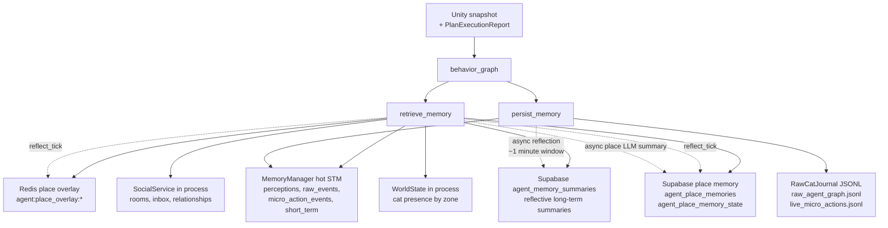
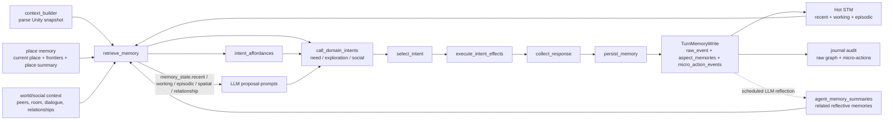

# ADR-034: Live Micro-Action Memory Pipeline

- **Status:** Accepted / implemented for the current hot memory, JSONL journal,
  Supabase reflective summary memory, Supabase place memory, and in-process
  social relationship memory. Neo4j traversal remains deferred.
- **Date:** 2026-06-06
- **Last revised:** 2026-06-07
- **Scope:** Unity `PlanExecutionReport`, backend `behavior_graph`, `MemoryManager`,
  `memory_consolidate`, `PlaceMemoryService`, `SupabaseMemoryStore`,
  `PlaceMemoryRepository`, `MicroActionJournalStore`, `RawCatJournal`,
  `SocialService`, and `app/core/supabase/migration.sql`.
- **Distinct from:** ADR-030, which owns closed-session report ingestion. This
  ADR owns live agent memory used during the tick loop.

## Context

The agent needs more than the latest Unity snapshot. It needs:

- exact recent events for immediate continuity;
- durable audit/replay records for debugging and rebuilding;
- slower reflective memories that shape future decisions;
- place-specific memory so exploration is not just random wandering;
- social context about who is nearby, who spoke, and relationship state.

The current design keeps those as separate truth types. Low-level events should
not become prompt clutter, and reflective summaries should not pretend to be
lossless facts.

## Decision

Use five memory tiers:

| Tier | Store | Holds | Used by graph? | Main purpose |
|---|---|---|---|---|
| Hot STM | `MemoryManager` deques | recent perceptions, raw turn events, micro-actions, short-term action/social notes | yes | immediate continuity and source material for reflection |
| Structural journal | `RawCatJournal` JSONL | `raw_agent_graph.jsonl`, `live_micro_actions.jsonl` | no direct recall | lossless audit/replay/debug record |
| Reflective summary | Supabase `agent_memory_summaries` | LLM reflective action/social summaries with salience, evidence, embeddings, active/superseded state | yes | long-term meaning for decisions |
| Place memory | Redis cache + Supabase `agent_place_memories` / `agent_place_memory_state` | zone coverage, familiarity, last visit/seen, per-place LLM summary | yes | exploration targeting and place recall |
| Social relationship | `SocialService` in-process stores; Supabase `actor_relationship` is declared but not yet the active writer | rooms, inbox, dialogue, relationship deltas/state | yes | social prompt context and social intent effects |

Neo4j is still deferred until we have a real traversal consumer and a stable
causal graph contract.

## Current Flow



## Agent Graph Usage



`retrieve_memory` is the read/composition node. It builds:

- `memory_state.recent`: recent perceptions, short-term lines, and recalled
  `agent_memory_summaries`;
- `memory_state.working`: current hot short-term action/social buckets;
- `memory_state.episodic`: recent raw turn events;
- `memory_state.spatial`: place memory overlay and exploration frontier;
- `memory_state.relationship`: world presence and social context.

`persist_memory` is the write node. It builds one `TurnMemoryWrite`, records hot
memory immediately, writes durable stores in the background, and schedules slower
LLM reflection.

## What Each Store Contains

### `MemoryManager` hot STM

Not a database. One runtime owns one hot memory manager per creature.

It keeps:

- `perception_history`: recent parsed Unity perceptions;
- `spatial_log`: recent positions;
- `raw_events`: recent authoritative backend turn payloads;
- `micro_action_events`: normalized live `PlanExecutionReport.steps[]` and
  `PlanExecutionReport.events[]`;
- `short_term`: action/social `AspectMemory` notes.

Used by `retrieve_memory` for immediate prompt continuity and by consolidation
as source material for long-term reflective memory.

### `RawCatJournal` JSONL

Durable local append-only files, per creature:

- `raw_agent_graph.jsonl`: job metadata, Unity payload, selected graph state,
  Unity result;
- `live_micro_actions.jsonl`: normalized `MicroActionEvent` rows.

The journal is not a prompt recall source. It is the lossless audit trail and
the rebuild source if a compact memory tier needs to be regenerated.

### Supabase `agent_memory_summaries`

Reflective long-term memory. These rows are written only from LLM consolidation,
not every tick.

Important fields:

- `creature_id`: subjective owner of the memory;
- `aspect`: usually `action` or `social`;
- `memory_kind`: `summary`;
- `text`: the reflective memory sentence(s);
- `tick_start`, `tick_end`, `source_count`: source window;
- `salience`, `last_active_tick`: recall weighting and reinforcement;
- `evidence`: consolidation metadata, including `summary_style=reflective`;
- `embedding`: optional pgvector embedding for semantic search;
- `is_active`, `superseded_by`: reconcile active memory instead of accumulating
  duplicates.

Consolidation cadence is intentionally slower than the Unity snapshot cadence:
`threshold=12`, `keep_recent=2`, `min_tick_span=10`. With a 6-second Unity
snapshot, this creates roughly one-minute reflection windows while keeping the
newest two short-term memories verbatim in hot STM.

Used by `retrieve_memory` through `MemoryManager.recall_longterm(...)` and
rendered into prompt related memory.

### Redis place overlay

Hot cache for place memory, keyed by creature. It mirrors place coverage so the
agent can read familiar/recent places quickly.

Used by `PlaceMemoryService.load_overlay(...)` before falling back to Supabase.
Redis is an optimization, not the durable source of truth.

### Supabase `agent_place_memories`

Durable per-creature place memory.

Important fields:

- `creature_id`, `zone_id`;
- `visit_count`, `last_visited_at`, `last_seen_at`, `familiarity`;
- `last_arrival_request_id`;
- `summary`: async LLM summary of what happened in that place;
- `summary_evidence`, `summary_updated_at`.

Used by `retrieve_memory` through `PlaceMemoryService.reflect_tick(...)` to build
current-place prompt lines, exploration frontiers, and place summaries. It also
feeds `intent_affordances` so exploration can prefer new or stale places.

### Supabase `agent_place_memory_state`

Small state table for place counting:

- `creature_id`;
- `last_zone_id`;
- `last_observed_at`;
- `last_request_id`.

Used by `PlaceMemoryRepository.record_visit(...)` so standing in the same zone
does not increment `visit_count` every tick.

### Social relationship memory

Current code uses in-process social stores owned by `SocialService`:

- `RoomRegistry`: who is in a social room;
- `InboxStore`: delivered utterances waiting for each cat;
- `SocialBidStore`: social feedback;
- `RelationshipStore`: pairwise trust/affinity/encounter state;
- `TranscriptStore`: room transcript history.

Supabase `actor_relationship` is declared in the migration as the durable target,
but the current active writer is still the in-process `RelationshipStore`.

Used by `retrieve_memory` through `SocialService.observe_turn(...)` and later by
`execute_intent_effects` / `SocialService.publish_turn(...)` when a social intent
speaks or acts.

## Normalized Micro-Action Event

Unity sends `PlanExecutionReport.steps[]` for executed body steps and
`PlanExecutionReport.events[]` for live causal/social events. Backend normalizes
both into `MicroActionEvent`.

```jsonc
{
  "event_id": "evt-1",
  "correlation_id": "loop-42",
  "request_id": "tick-1002",
  "tick": 1002,
  "actor_type": "player_cat",
  "actor_id": "player_cat",
  "target_type": "cat",
  "target_id": "mewi",
  "direction": "player_cat_to_cat",
  "action": "player_scratch",
  "behavior_key": "scratch",
  "motor_action": "",
  "phase": "committed",
  "status": "",
  "source_event_id": "",
  "trust_delta": null,
  "evidence": {}
}
```

Rules:

- do not infer trust deltas from prose/status;
- keep unknown actions with diagnostic evidence instead of dropping them;
- preserve actor/target identity from Unity live events;
- low-level events go to hot STM and journal, not directly to Supabase summaries.

## Consequences

- Prompt memory is thinner and more intentional: recent facts stay hot, durable
  summaries are reflective, and raw micro-actions stay out of Supabase.
- Place memory now answers both "where has this cat been?" and "what happened in
  this place?"
- `agent_memory_summaries` grows slowly and reconciles similar rows instead of
  becoming an append-only pile.
- Relationship memory is useful in the graph today, but durable relationship
  storage is still a follow-up because the active code path is in-process.

## Follow-ups

- Wire `actor_relationship` to a real repository if relationship state must
  survive backend restart.
- Add a graph store only when a traversal consumer exists.
- Add journal replay tooling that can rebuild `agent_memory_summaries` and place
  summaries from JSONL evidence.
