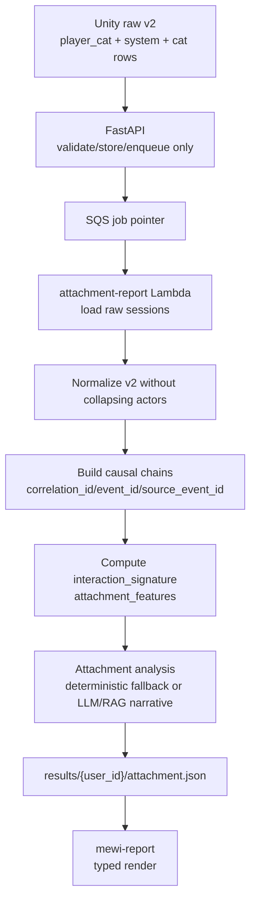

# ADR-035: Player Action Attachment Analysis

- **Status:** Proposed
- **Date:** 2026-06-06
- **Scope:** Revision of the post-session attachment-analysis layer now that the
  player can perform a full player-cat action vocabulary. Applies across
  `mewi-unity/app/Assets/Scripts/Player/Cat/`,
  `mewi-unity/app/Assets/Scripts/Report/Session/`,
  `mewi-backend/app/models/report.py`,
  `mewi-backend/app/services/report/`,
  `infra/aws-lambda/attachment-report/`,
  `infra/aws-lambda/attachment-report/skills/attachment-analysis/SKILL.md`,
  and `mewi-report/src/`.
- **Builds on:** [ADR-029](ADR-029-player-cat-action-fsm-proposal.md)
  (explicit player-cat action events and target-cat stimuli),
  [ADR-030](ADR-030-post-session-report-processing.md) (raw v2 closed-session
  schema and deterministic-first processing),
  [ADR-031](ADR-031-report-end-to-end-workflow.md) (attachment-report Lambda as
  report #1 producer),
  [ADR-032](ADR-032-sqs-first-hop-report-ingestion.md) (FastAPI -> SQS ->
  Lambda first hop),
  [ADR-033](ADR-033-astro-report-frontend-data-source.md) (thin report frontend
  source seam), and
  [ADR-034](ADR-034-live-micro-action-memory-pipeline.md) (micro-action causal
  vocabulary for live memory).
- **Refines:** The deterministic chart/scoring layer in ADR-030 and the
  attachment-analysis skill contract used by ADR-031.

## Context

ADR-030 successfully moved the closed-session report contract to raw v2:
Unity can send `player_cat`, `system`, and `cat` rows with `event_id`,
`correlation_id`, lifecycle `phase`, `behavior_key`, `motor_action`, target
identity, facing, confidence, and source-event links.

The topology is also now mostly aligned:

```text
Unity ReportSessionPayload
  -> POST /api/v1/report/session
  -> FastAPI Pydantic validation + storage + queue
  -> SQS
  -> attachment-report Lambda
  -> results/{user_id}/attachment.json
  -> FastAPI read gateway
  -> mewi-report ReportSource / ReportView
```

The remaining problem is not transport. It is interpretation.

The current deterministic processor still treats the human-controlled actor as a
legacy six-action report:

```text
Approach / Retreat / Offer item / Wait-dwell / Call out / Pet attempt
```

That was enough when raw sessions were mostly proximity-derived rows. It is no
longer enough. The player-cat input layer now serializes 24 non-attack
body/social actions, plus `player_attack` as a special safety event. The
important player choices include `player_meow`, `player_nod_yes`,
`player_groom`, `player_smell`, `player_push`, `player_alert`,
`player_flinch`, `player_startle`, `player_eat`, and many others.

The old six-axis report can therefore produce misleading output such as:

```text
Approach 0%
Retreat 60%
Offer item 0%
Wait / dwell 40%
Call out 0%
Pet attempt 0%
```

That result does not mean the player only retreated and waited. It means the
processor ignored or collapsed most explicit `player_*` events, then only the
legacy proximity-derived rows remained visible. This is especially risky for
attachment language: a report may infer avoidance, anxiety, or patience from a
thin projection while the raw trace contains richer evidence.

There is a second bug-shaped assumption in the current Lambda prompt path:
`attachment_analysis.py` describes the human-controlled cat as the cat whose
`cat_id` equals the report slug. That is wrong for raw v2. The report user key
is stable report identity (`user_id`, for example `vanillasky_01`); the player
body has its own in-world creature id (for example `vanillaSky00`). Player
behavior is represented by `actor: "player_cat"` rows, not by a `cat_id` stream
whose id equals the report slug.

## Decision

Keep the raw v2 schema and production topology. Replace the legacy six-axis
attachment-analysis surface with a deterministic **player micro-interaction
feature layer**.

The Lambda must no longer score attachment directly from:

- six legacy radar percentages;
- a collapsed `actor == "human"` stream;
- an inferred player `cat_id == user_id`;
- uncorrelated "next cat event after a human event" latency.

It must score from explicit raw v2 facts:

- `actor == "player_cat"` events;
- `player_*` action vocabulary;
- `event_id` / `correlation_id`;
- `system` delivery rows as causal links;
- target-cat reaction rows;
- trust deltas and status/phase;
- distance, facing, confidence, and target coverage.

Legacy v1 sessions still work. For v1, the processor may keep the old six-axis
fallback. For v2 sessions that contain explicit `player_cat` rows, those rows
are the primary evidence and proximity-derived rows are secondary context.

Unity event ids and correlation ids are session-local. `ReportSessionLogger`
resets its event counter at the start of each session, so Lambda processing must
deduplicate action phases and match stimulus/reaction chains inside a single
session namespace, not across a flattened multi-session event list.

## Attachment-Theory Basis

This report is **Strange-Situation-inspired game telemetry**, not a clinical or
developmental assessment. The theory gives us observable dimensions; it does not
let us diagnose a real player from a game.

Research anchors used for this design:

| Source | URL | Design use |
| --- | --- | --- |
| APA Dictionary: attachment theory | https://dictionary.apa.org/attachment-theory | Attachment behavior is about proximity/bonding and later emotional stability; supports treating proximity/contact bids as attachment-relevant signals. |
| SAGE Encyclopedia: Strange Situation | https://sk.sagepub.com/ency/edvol/embed/humanrelationships/chpt/strange-situation | Strange Situation observes exploration, separation/reunion, secure-base and safe-haven behavior; supports using episodes, distance, re-engagement, and cat response chains. |
| Links Between Attachment and Social Information Processing (PMC) | https://pmc.ncbi.nlm.nih.gov/articles/PMC9361220/ | Separations/reunions reveal whether the attachment figure is used as safe haven / secure base; supports repair and return-after-distance features. |
| Cultural Attachment: From Behavior to Computational Neuroscience (PMC) | https://pmc.ncbi.nlm.nih.gov/articles/PMC6596443/ | Secure-base schemas concern accessibility/responsiveness; supports response contingency and target-cat availability features. |
| Adult attachment measures review | https://www.sciencedirect.com/science/article/pii/S0022399909003304 | Adult attachment can be represented by anxiety and avoidance dimensions; supports computing separate pursuit/anxiety and distance/avoidance scores before choosing a label. |
| Universality and Normativity of Attachment Theory (PMC) | https://pmc.ncbi.nlm.nih.gov/articles/PMC8198184/ | Summarizes adult secure/dismissing/preoccupied/fearful styles and anxiety/avoidance dimensions; supports four-leaning output. |
| Solomon/Duschinsky/Schuengel on disorganized attachment | https://journals.sagepub.com/doi/10.1177/1359104517721959 | Disorganized/conflict behavior includes fear, contradictory behavior, freezing/stilling, apprehension; supports treating startle/shutdown/threat patterns separately from ordinary avoidance. |

The game translation:

| Theory construct | Game observable |
| --- | --- |
| Secure base / exploration | Player explores or waits calmly while keeping a target available; cats can re-engage without threat. |
| Safe haven / comfort after stress | After a cat withdraws, freezes, or loses trust, the player slows, waits, or uses a soft bid; the cat returns or trust repairs. |
| Proximity/contact seeking | Targeted `player_*` bids such as meow, nod, groom, sit-near, play-invite. |
| Attachment anxiety / hyperactivation | Repeated bids toward the same cat after rejection or non-response; short withdrawal tolerance; pursuit pressure. |
| Attachment avoidance / deactivation | Few targeted bids, high non-social exploration or retreat, low repair attempts after distance. |
| Fearful/disorganized conflict | Startle, flinch, stun, attack/push/contact, or contradictory approach-avoidance chains around the same target. |

Because the player is a cat, the analyzer should not import human parent/child
roles literally. It should compute **game attachment leanings** from how the
player-cat handles availability, distance, repair, exploration, and threat under
the controlled stimulus of NPC cats.

## Schema Authority

Unity is the authority for raw v2 and the player action vocabulary. Python and
Astro must mirror Unity; they must not invent a smaller or incompatible schema.

| Layer | Schema responsibility |
| --- | --- |
| Unity | Emits `mewi.report.raw.v2`, `actor: "player_cat"`, the 24 non-attack `player_*` actions plus `player_attack`, event ids, correlation ids, phases, status, target ids, facing, confidence, and source links. |
| FastAPI | Validates and stores the raw shape without scoring or dropping extra factual fields. |
| Python / Lambda | Mirrors the Unity action vocabulary, maps each action to an analysis family, builds `interaction_signature`, `gesture_response_chains`, and `attachment_features`, then writes processed JSON. |
| Astro | Types and renders those processed fields; falls back to legacy `radar` / `attachment_profile` only for old reports. |

Processed report schema v2 adds:

```ts
type PlayerCatAction =
  | 'player_play_invite' | 'player_meow' | 'player_nod_yes'
  | 'player_shake_no' | 'player_sit_near' | 'player_groom'
  | 'player_poop' | 'player_pee' | 'player_scratch'
  | 'player_lie' | 'player_sleep' | 'player_smell'
  | 'player_look_around' | 'player_alert' | 'player_push'
  | 'player_shake' | 'player_dig' | 'player_crawl'
  | 'player_drink' | 'player_flinch' | 'player_startle'
  | 'player_stun' | 'player_open_chest' | 'player_eat'
  | 'player_attack';

type PlayerActionFamily =
  | 'affiliative_bid'
  | 'calm_presence'
  | 'cautious_investigation'
  | 'exploration_resource'
  | 'boundary_refusal'
  | 'intrusion_threat'
  | 'fear_startle_shutdown'
  | 'unknown';
```

If Unity adds or removes a player action, update the Unity binding, Lambda
mapping, frontend type, tests, and this ADR together.

## Player Action Vocabulary

The current Unity scene serializes the following action set in
`PlayerCatSocialInputRouter`. Treat the 24 non-attack actions as the ordinary
player-cat vocabulary, and treat `player_attack` as a separate safety/threat
event because it is emitted without playing a body action through
`PlayerCatMalbersActionDriver`.

| Action | Motor action | Analysis family | Theory signal |
| --- | --- | --- | --- |
| `player_play_invite` | `scratch` | `affiliative_bid` | contact/play bid |
| `player_meow` | `vocalize` | `affiliative_bid` | proximity/contact bid |
| `player_nod_yes` | `nod_head` | `affiliative_bid` | reassurance / soft signal |
| `player_shake_no` | `no` | `boundary_refusal` | refusal / distance boundary |
| `player_sit_near` | `sit` | `calm_presence` | quiet proximity / secure-base availability |
| `player_groom` | `groom` | `affiliative_bid` | comfort / affiliation |
| `player_poop` | `poop` | `exploration_resource` | body/resource context |
| `player_pee` | `pee` | `exploration_resource` | body/resource context |
| `player_scratch` | `scratch` | `exploration_resource` | play/exploration |
| `player_lie` | `lie` | `calm_presence` | non-demanding presence |
| `player_sleep` | `sleep` | `calm_presence` | vulnerable non-demanding presence |
| `player_smell` | `smell` | `cautious_investigation` | cautious approach / checking |
| `player_look_around` | `look_around` | `cautious_investigation` | scanning / regulation |
| `player_alert` | `alert` | `boundary_refusal` | vigilance / boundary |
| `player_push` | `push` | `intrusion_threat` | pressure / intrusion |
| `player_shake` | `shake` | `fear_startle_shutdown` | arousal discharge |
| `player_dig` | `dig` | `exploration_resource` | exploration |
| `player_crawl` | `crawl` | `cautious_investigation` | cautious approach |
| `player_drink` | `drink` | `exploration_resource` | resource context |
| `player_flinch` | `flinch` | `fear_startle_shutdown` | fear response |
| `player_startle` | `startle` | `fear_startle_shutdown` | fear response |
| `player_stun` | `stun` | `fear_startle_shutdown` | shutdown / disorientation |
| `player_open_chest` | `open_chest` | `exploration_resource` | object exploration |
| `player_eat` | `eat` | `exploration_resource` | resource context |
| `player_attack` | none | `intrusion_threat` | safety/threat special case |

This mapping is not the final psychological model. It is the deterministic
normalization layer: every raw action gets a stable family before any attachment
feature is computed. The family assignment can be tuned later, but the processor
must never drop unknown `player_*` actions silently. Unknown actions go into
`action_family: "unknown"` and are exposed in diagnostics.

## Feature Model

`attachment-report` must add a deterministic feature block before narrative
generation.

Recommended output:

```json
{
  "interaction_signature": {
    "action_counts": {
      "player_meow": 4,
      "player_groom": 2,
      "player_push": 1
    },
    "action_family_pct": {
      "affiliative_bid": 38,
      "calm_presence": 22,
      "cautious_investigation": 14,
      "exploration_resource": 12,
      "boundary_threat": 7,
      "fear_startle": 7
    },
    "target_distribution": {
      "mewi": 50,
      "miso": 25,
      "haru": 25
    },
    "ignored_actions": []
  },
  "gesture_response_chains": [
    {
      "correlation_id": "pcat-42",
      "source_event_id": "pcat-evt-000001",
      "player_action": "player_meow",
      "target_id": "mewi",
      "delivered": true,
      "cat_reaction": "answer_meow",
      "reaction_latency_s": 1.3,
      "trust_delta": 4,
      "phase": "completed",
      "status": "completed"
    }
  ],
  "attachment_features": [
    {
      "label": "Attuned soft bids",
      "value": 72,
      "evidence_event_ids": ["pcat-evt-000001", "evt-000003"]
    },
    {
      "label": "Respect for distance",
      "value": 65,
      "evidence_event_ids": []
    },
    {
      "label": "Repair after rupture",
      "value": 58,
      "evidence_event_ids": []
    },
    {
      "label": "Pursuit pressure",
      "value": 18,
      "evidence_event_ids": []
    },
    {
      "label": "Threat / intrusion pressure",
      "value": 5,
      "evidence_event_ids": []
    },
    {
      "label": "Exploration over reassurance",
      "value": 42,
      "evidence_event_ids": []
    }
  ]
}
```

Field ownership:

| Field | Owner | Meaning |
| --- | --- | --- |
| `interaction_signature` | deterministic Lambda processor | What the player actually did, grouped by action and family. |
| `gesture_response_chains` | deterministic Lambda processor | Correlated player action -> stimulus -> cat response rows. |
| `attachment_features` | deterministic Lambda processor | Attachment-relevant 0-100 feature bars with evidence ids. |
| `attachment_analysis` | deterministic fallback or LLM narrative | Interprets `attachment_features`; must not invent counts, chains, or scores. |

`attachment_profile` may stay as a backwards-compatible alias while the frontend
migrates, but new reports should prefer `attachment_features`.

## Attachment-Type Interpretation

The attachment type should be derived from feature scores, not from the old
radar. Suggested first-pass deterministic scoring:

| Attachment leaning | High-signal evidence |
| --- | --- |
| Secure-leaning | Many soft bids that get neutral/positive reactions, high respect for distance, low intrusion, recoveries after negative reactions. |
| Anxious-preoccupied leaning | Repeated bids toward the same target after withdrawal, short withdrawal tolerance, high pursuit pressure, elevated call/meow/reapproach under uncertainty. |
| Dismissive-avoidant leaning | Low bids and low repair, high observation/retreat, few targeted interactions even when cats are available. |
| Fearful-avoidant leaning | Mixed approach/retreat, startle/shutdown/threat actions around closeness, high trust volatility, inconsistent repair. |

The report remains non-clinical. The label is a game-trace reading, not a
diagnosis. The LLM/RAG narrative may explain the label, but it receives the
deterministic features as facts and must cite evidence ids or feature values.

## Revised Processing Flow



FastAPI does not change its runtime responsibility. It still validates, stores,
and enqueues only. The feature extraction belongs inside `attachment-report`.

## Required Implementation

Unity:

- Keep sending `schema_version = "mewi.report.raw.v2"` for report sessions.
- Keep the route as `POST /api/v1/report/session`.
- Keep `user_id` as the report identity key (for example `vanillasky_01`), not
  the player creature id.
- Preserve player-body identity separately in `actor_id` (for example
  `vanillaSky00`).
- Continue logging `player_cat` rows from `PlayerCatActionEmitter`, `system`
  rows from `CreatureSocialStimulusBus`, and `cat` reaction rows from
  `CreatureSocialStimulusPolicy` / cat-state sampling.
- Keep proximity-derived `approach`, `retreat`, and `wait` rows, but mark them
  as `params.initiated_by = "derived_proximity"` so the Lambda can treat them as
  context, not the primary player action when explicit `player_*` rows exist.

Backend:

- Keep accepting both raw v1 and raw v2 in `app/models/report.py`.
- Do not add scoring or attachment interpretation to `report_router.py`.
- Preserve unknown extra raw v2 fields; they may become feature evidence later.
- Tests should assert that `player_cat`, `system`, and correlated `cat` rows
  validate and are stored unchanged.

Lambda deterministic processor:

- Replace the current early conversion of `actor == "player_cat"` to
  `actor == "human"` with a normalizer that preserves `actor_type` and, if
  needed for legacy blocks, emits a separate compatibility view.
- Count all `player_*` actions by exact action and by action family.
- Use `correlation_id`, `event_id`, and `params.source_event_id` to construct
  `gesture_response_chains`.
- Compute reaction latency from chains, not from the next arbitrary cat row.
- Exclude `system` rows from action percentages, but use them to prove delivery.
- Treat `player_attack`, `player_push`, `player_contact`,
  `player_approach_fast`, low-confidence actions, and poor-facing actions as
  boundary/threat/intrusion evidence.
- Keep legacy six-axis `radar` only as a v1/backwards-compatible field. For v2,
  add the richer fields above.
- Add deterministic tests using at least one session that includes:
  `player_meow`, `player_groom`, `player_push`, a delivered stimulus, a cat
  reaction, a trust delta, and a proximity-derived retreat row.

Attachment-analysis skill:

- Update the Lambda skill prompt to consume `interaction_signature`,
  `gesture_response_chains`, and `attachment_features`, not the old six profile
  alone.
- Remove the assumption that the player stream is the cat whose `cat_id` equals
  `report_slug`.
- Keep the output contract as `attachment_analysis` with `type`, `modifier`,
  `summary`, `evidence`, `scores`, `confidence`, and `caveat`.
- Evidence cards must cite deterministic feature values and/or event ids.

Frontend:

- Extend `mewi-report/src/utils/reportSchema.ts` with:
  `interaction_signature`, `gesture_response_chains`, and
  `attachment_features`.
- Replace or generalize `RadarChart.astro`; it must not hard-code the six legacy
  labels for v2 reports.
- Keep old reports rendering by falling back to `radar` and
  `attachment_profile` when the new fields are absent.
- Show the new action-family or attachment-feature bars in `ReportView.astro`.
- Preserve ADR-033's source seam: pages/components still render processed JSON
  only and do not fetch raw sessions or S3 directly.

## Implementation Status From This Check

As of 2026-06-06:

| Piece | Status |
| --- | --- |
| Unity DTO default raw schema | `ReportSessionPayload.cs` defaults to `mewi.report.raw.v2`. |
| Unity sender route | `ApiRoutes.ReportSession` is `/api/v1/report/session`. |
| Unity player action capture | `ReportSessionLogger` subscribes to player action, stimulus delivery, and NPC reaction events. |
| Unity action vocabulary | Scene has 24 non-attack action bindings plus `player_attack`. |
| Unity report user key | Corrected during this check to `vanillasky_01` in script default, scene logger, scene user config, and outbox fallback. In-world player id remains `vanillaSky00`. |
| FastAPI receive model | Accepts raw v1/v2 and actors `human`, `player_cat`, `cat`, `system`. |
| FastAPI trigger | Stores/enqueues only; no inline processor in normal mode. |
| Lambda first hop | SQS/raw-S3 support is implemented in code, pending cloud verification. |
| Lambda deterministic analysis | Updated in code to preserve `actor_type`, mirror the Unity action vocabulary, emit `interaction_signature`, `gesture_response_chains`, and `attachment_features`, scope event/correlation matching per session, and derive fallback `attachment_analysis` from v2 features when player-cat actions exist. Legacy `radar` / `attachment_profile` remain for v1 compatibility; feature tuning is still expected after real sessions. |
| Lambda skill digest | Updated in code to treat `actor: "player_cat"` / `player_*` rows as the player stream instead of assuming `cat_id == report_slug`. |
| Frontend remote source | `ReportSource` / remote `/report?token=` path exists. |
| Frontend schema | `reportSchema.ts` now mirrors the processed v2 fields and Unity player-action vocabulary. |
| Frontend render | `ReportView.astro` now renders the v2 player-cat action signature, gesture-response chains, and `attachment_features`; old `radar` / `attachment_profile` data remains a fallback for older reports. |
| Local E2E smoke | `mewi-report/pipeline/scripts/e2e_unity_report.py` can post or load Unity raw session JSON, run the attachment Lambda locally in deterministic mode, write `processed_data` / `src/data`, and print the Astro report route. |
| Static vanillaSky00 fixtures | The two local Unity session files were migrated from raw v1 to raw v2 identity/actor fields, removing the duplicate player-as-cat row and converting legacy proximity rows into v2 `player_cat` actions with migration notes. |

## Consequences

Positive:

- Attachment language becomes auditable against the actual 24-action player
  vocabulary and correlated cat responses.
- The report can distinguish soft bids, calm presence, exploration, fear/startle,
  and intrusion instead of reducing everything to approach/retreat/wait.
- Legacy v1 reports still render.
- FastAPI remains thin; all interpretation stays in the Lambda/report product.
- The frontend remains a typed renderer of processed JSON.

Costs and risks:

- The processed report JSON grows new fields and the frontend must render them
  carefully.
- Deterministic scoring needs more tests because attachment labels now depend on
  causal chains, not just action counts.
- Action-family mapping is a product/research decision and will need tuning
  after real sessions.
- `player_attack` and threat/intrusion actions are sensitive signals; copy must
  stay nonjudgmental and non-clinical.

## Acceptance Checks

- A raw v2 session containing `player_meow`, `player_groom`, `player_push`,
  `system/social_stimulus_delivered`, and a correlated cat reaction produces:
  `interaction_signature`, `gesture_response_chains`, and
  `attachment_features`.
- The same v2 session does not report `Approach 0% / Retreat 60% / Wait 40%` as
  the primary behavior summary when explicit player actions are present.
- `system` rows never inflate action counts, but a chain records whether the
  stimulus was delivered.
- Reaction latency is computed within the same `correlation_id`.
- Two sessions that reuse Unity-local `evt-000001` / `pcat-*` identifiers do not
  collapse action counts or match reactions across session boundaries.
- The LLM prompt receives deterministic features/chains, not raw boilerplate and
  not a fake player-cat stream inferred from `cat_id == user_id`.
- `attachment_analysis.evidence[]` cites feature values and/or event ids.
- Existing local `report_*.json` files that only have `radar` and
  `attachment_profile` still render.
- The remote `/report?token=<JWT>` path renders the new fields from FastAPI
  without reading S3 or raw sessions directly.
- FastAPI ingest still returns after store/enqueue and never calls scoring,
  Claude, RAGFlow, or the deterministic processor.

## Related

- [ADR-029](ADR-029-player-cat-action-fsm-proposal.md): player-cat events and
  target-cat reaction lane.
- [ADR-030](ADR-030-post-session-report-processing.md): raw v2 and
  deterministic-first processing.
- [ADR-031](ADR-031-report-end-to-end-workflow.md): attachment-report Lambda as
  the producer of `attachment.json`.
- [ADR-033](ADR-033-astro-report-frontend-data-source.md): frontend source seam
  and typed render contract.
- [ADR-034](ADR-034-live-micro-action-memory-pipeline.md): parallel live-memory
  micro-action normalization.
