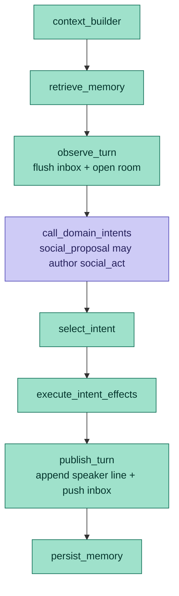
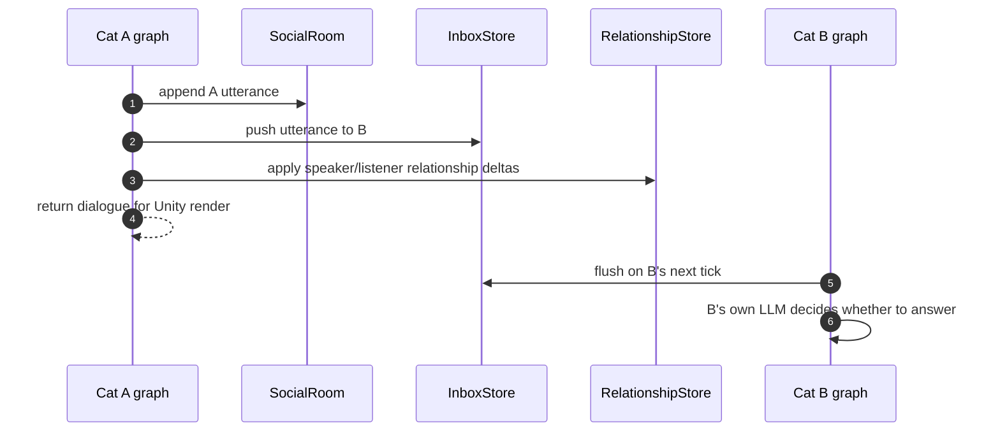

# ADR-038: Subjective LLM Social Rooms

## Status

Proposed

## Date

2026-06-07

## Scope

Backend social rooms, `SocialService`, `Moderator`, `RoomRegistry`,
`InboxStore`, `TranscriptStore`, `RelationshipStore`, `behavior_graph`,
`social_proposal`, `intent_arbitrator`, `intent_effects`, social prompt
context, dialogue rendering payloads, and social memory writes.

This ADR refines ADR-010 and ADR-011. ADR-010 decides that cat-cat social
exchange is backend-owned. ADR-011 records the current as-built room/inbox
runtime. This ADR decides how LLM-authored speech should work inside that
runtime.

## Context

The current social architecture is the right spine:

- backend owns the shared room, room key, transcript, inbox, and relationship
  state;
- Unity renders dialogue but does not interpret it cognitively;
- `observe_turn` runs before the agent minds so a cat can hear pending peer
  utterances;
- `publish_turn` runs after intent selection so the cat can route a chosen
  `social_act`;
- `social_proposal` already asks the cat's own prompt to decide whether a
  nearby peer should pull the cat into `SOCIALIZE`.

The open question is authorship.

If a room-level backend moderator writes the whole exchange, the transcript is
technically correct but psychologically wrong: one narrator is speaking for
both cats. The desired simulation is different. Each cat should be an embodied
agent with its own persona, memory, body state, current needs, and social
history. When two cats are in the same room, cat A's LLM should decide what cat
A says. Cat B should see that message in the same room and, on cat B's own
turn, cat B's LLM should decide whether and how to answer.

The room should feel like a chat room, but it must not become an unbounded
LLM-to-LLM loop. Unity remains the cadence authority, and backend prompt hygiene
from ADR-037 still applies.

## Decision

Adopt a subjective speaker model for social rooms:

1. A cat's LLM may author only that cat's own `social_act`.
2. A speaker must never decide another cat's reply, hidden feelings, or future
   action.
3. `SocialRoom` owns delivery, transcript order, membership, cooldowns, and
   relationship bookkeeping.
4. Other cats see a message through their inbox and room transcript on their
   own tick.
5. No synchronous recursive chat loop is allowed. One cat tick may publish at
   most one authored social act.
6. The deterministic moderator remains a guardrail and fallback, not the
   primary author of personality.
7. Unity receives dialogue as render-only output. Backend memory and
   relationships have already consumed the social event before the plan is
   returned.
8. Social utterances are prompt-visible world events, not backend telemetry.

The implementation should use the existing graph shape:



`social_proposal` is the v1 speaker LLM. We should not add a separate room
dialogue LLM until the existing proposal path proves insufficient.

## Core Model

### Social Turn Frame

Before a cat's social proposal prompt runs, the graph builds a subjective frame:

```jsonc
{
  "speaker_id": "cat_mewi",
  "room": {
    "room_key": "cat_mewi,cat_milo",
    "zone_id": "House_2",
    "members": ["cat_mewi", "cat_milo"],
    "recent_transcript": [
      {
        "from": "cat_milo",
        "text": "milo gives a tiny questioning chirp",
        "tone": "curious",
        "target": "cat_mewi"
      }
    ]
  },
  "delivered_inbox": [
    {
      "from": "cat_milo",
      "text": "milo gives a tiny questioning chirp",
      "tone": "curious",
      "target": "cat_mewi"
    }
  ],
  "relationships": [
    {
      "peer_id": "cat_milo",
      "trust": 0.64,
      "affinity": 0.71,
      "last_note": "Milo usually responds softly to Mewi."
    }
  ],
  "body": {
    "energy": 0.72,
    "fear": 0.10,
    "social": 0.65
  }
}
```

The frame is subjective. It says what this cat can currently perceive, what it
heard, and what it remembers. It does not reveal another cat's private prompt,
hidden reasoning, or backend execution state.

### Social Act

The cat's LLM may return a small social act with its social intent proposal:

```jsonc
{
  "intent": "SOCIALIZE",
  "target_id": "cat_milo",
  "mood": "warm and alert",
  "style": "soft approach, tail relaxed",
  "social_act": {
    "kind": "reply",
    "say": "mewi answers with a small bright chirp",
    "tone": "friendly",
    "expects_reply": true
  },
  "reasoning": "Milo just greeted Mewi and the relationship is warm."
}
```

Rules:

- `target_id` must be a current room member, current nearby peer, or empty for
  a group-facing act.
- `say` should be short, embodied, and renderable.
- `kind` should be one of `greeting`, `invite`, `reply`, `check_in`,
  `message`, or a future explicit body-language kind.
- The act is only published if final arbitration selects `SOCIALIZE`.
- If a higher-priority need wins, the message is not published; the observed
  bid can still be resolved as ignored, deferred, or acknowledged by
  relationship feedback.

### Room Publication

Publishing a social act is deterministic:



The room never asks B's LLM during A's tick. A reply is a later subjective
decision by B.

## Moderator Role

The moderator should become a room controller, not a shared author.

Allowed moderator responsibilities:

- open or reuse the room;
- enforce membership and valid targets;
- enforce per-cat and per-room cooldowns;
- cap transcript length visible in prompts;
- prevent repeated one-line loops;
- apply deterministic relationship deltas for delivered, answered, ignored, or
  declined bids;
- emit silence or neutral ambient observations when no cat authors a line.

Disallowed moderator responsibilities:

- write a personalized line as if it came from a cat when that cat's LLM did
  not choose it;
- decide the listener's reply during the speaker's tick;
- reveal private thoughts from one cat to another;
- continue a conversation without a Unity/backend tick.

The existing `DeterministicModerator` can remain as a compatibility fallback
for tests and non-LLM smoke runs. Once subjective speaker LLMs are active, its
fallback should prefer silence or non-dialogue observable beats over
personality-bearing speech.

## Prompt Contract

The social proposal prompt should be tightened around authorship:

- "You are deciding only what this cat intends to do or say."
- "Do not write another cat's reply."
- "Do not invent a peer, room member, or utterance."
- "If replying, reply only to a delivered inbox item or recent transcript line."
- "If body needs override the social pull, return `IDLE` or a non-social
  proposal with no `social_act`."
- "Keep utterances short enough for a speech bubble."
- "Use only in-world language; never mention backend, prompts, tools, room
  internals, or Unity execution states."

This contract extends ADR-037. Debug tokens such as `backend`, `adapter_refused`,
`PlanExecutionReport`, and raw report statuses must not appear in social
utterances, transcripts rendered to prompts, or social memory summaries.

## Memory Contract

Social room data has three different meanings and should not be collapsed:

| Data | Store | Prompt role |
|---|---|---|
| Transcript line | `TranscriptStore` / future durable store | What was said in the room |
| Inbox delivery | `InboxStore` | What this cat heard since last tick |
| Relationship delta | `RelationshipStore` | How the interaction changed the bond |

Memory writes should record a compact social event:

```jsonc
{
  "aspect": "social",
  "kind": "utterance",
  "speaker_id": "cat_mewi",
  "target_id": "cat_milo",
  "room_key": "cat_mewi,cat_milo",
  "text": "mewi answers with a small bright chirp",
  "tone": "friendly",
  "tick": 42,
  "salience": 0.45
}
```

Long-term reflection may summarize repeated social patterns, but should cite
utterance or bid evidence internally. Reflections should describe relationship
meaning, not raw chat-room mechanics.

## Turn And Cost Controls

The subjective speaker model needs hard limits:

- one authored social act per cat tick;
- no immediate recursive calls to other cats;
- per-cat cooldown after speaking in the same room;
- per-room maximum visible transcript window in prompts;
- per-room maximum exchange count before the room becomes quiet until movement,
  a new member, a new delivered bid, or a meaningful world change;
- optional `wake_targets` are hints to schedule attention, not permission to
  run an unbounded chat loop;
- social proposal may be skipped or cheap-gated when there is no nearby peer,
  inbox item, social feedback, or relationship cue.

This keeps the fantasy "two LLM cats in one room" without letting the room run
away from the Unity cadence.

## Effect On Existing ADRs

| ADR | Effect |
|---|---|
| ADR-010 | Refines `SocialRoom`: backend still owns the room, but personality-bearing lines come from each cat's own prompt. |
| ADR-011 | Refines `Moderator`: LLM-pluggable does not mean "one moderator authors the whole chat." The primary LLM speaker is the cat's social proposal path. |
| ADR-034 | Social utterances and relationship deltas become source events for the live memory pipeline. |
| ADR-037 | Social prompt and transcript rendering must obey prompt/memory hygiene and avoid backend telemetry leakage. |

## Migration Plan

1. Keep the current `observe_turn` / `publish_turn` split.
2. Tighten `SOCIAL_PROPOSAL_PROMPT` with the authorship rules above.
3. Ensure `execute_intent_effects` publishes only the selected cat's own
   `social_act` and never a peer reaction.
4. Reduce moderator-authored dialogue in LLM-enabled runs to silence or neutral
   observable beats.
5. Add room cooldown and visible transcript window limits if they are not
   already enforced by tests.
6. Persist compact social utterance events into hot memory and journal records.
7. Add prompt lint tests for authorship leakage and ADR-037 banned tokens.
8. Add integration tests for two cats in one room, including delayed reply
   delivery through inbox.

## Acceptance Criteria

- When cat A and cat B are co-located, both see the same `room_key` and recent
  transcript.
- Cat A's tick can publish at most one line authored by cat A's prompt.
- Cat B receives cat A's line through `delivered_inbox` on cat B's next tick.
- Cat B's reply, if any, is authored only by cat B's prompt.
- The speaker prompt cannot invent a listener reply or private listener state.
- Unity receives `dialogue` lines for rendering, but no cognitive
  interpretation is delegated to Unity.
- If final arbitration does not select `SOCIALIZE`, no social utterance is
  published even if the social domain proposed one.
- Social transcripts and social memory summaries contain in-world language only.
- Tests cover same-room delivery, target validation, no recursive chat loop,
  cooldown behavior, and prompt banned-token linting.

## Alternatives Considered

### Single room LLM writes the whole conversation

Rejected. It is easy to implement, but it makes one narrator speak for every
cat. That breaks the premise that each cat has its own mind, memory, and
subjective relationship to the room.

### Synchronous LLM-to-LLM conversation until a stop condition

Rejected for v1. It fights Unity-as-cadence-authority, creates unpredictable
cost, and makes social exchange continue while bodies are not ticking.

### Deterministic social only

Rejected as the long-term behavior. It is useful for smoke tests and fallback
but too flat for personality-rich cats.

### Unity-owned chat

Rejected. Unity should render utterances and body language, but backend owns
memory, relationships, and agent cognition.

## Consequences

The simulation gets the intended feel: cat with LLM talks to cat with LLM, both
inside the same backend room, and each sees the shared transcript through its
own subjective prompt.

The cost is delayed reciprocity. A reply happens on the listener's next tick,
not inside the speaker's tick. That is acceptable for v1 because it preserves
ordering, keeps cost bounded, and makes the social transcript line up with
embodied time.
