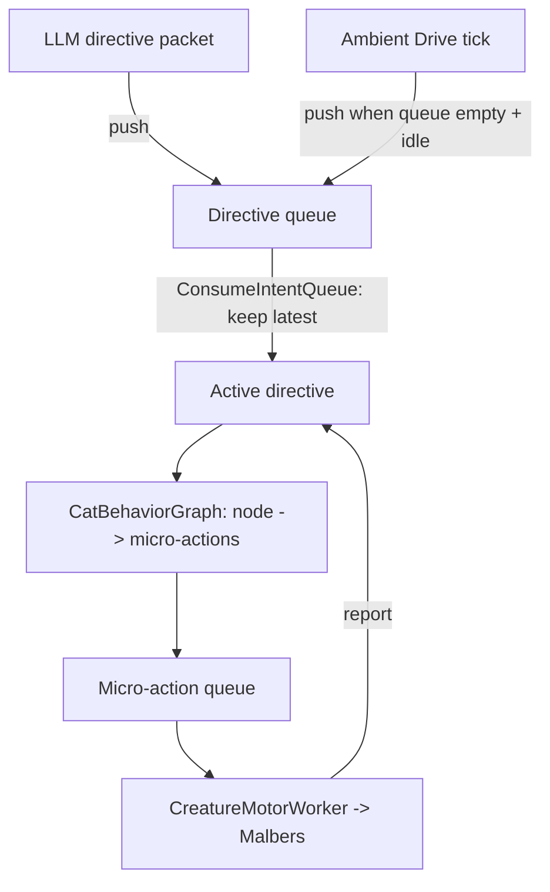
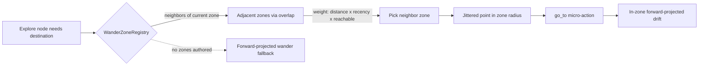

# ADR-041: Ambient Drive + Exploration Zones (Cat Is Never Idle)

## Status

Proposed

## Date

2026-06-07

## Scope

The Unity local behavior loop:

- `mewi-unity/app/Assets/Scripts/Creature/Motor/ActionFSM/CreatureIntentWorker.cs`
  — currently returns early when no LLM directive is active.
- `mewi-unity/app/Assets/Scripts/Creature/Motor/ActionFSM/CatBehaviorGraph.cs`
  — already scores fallback behavior nodes, but only when a directive exists.
- `mewi-unity/app/Assets/Scripts/Creature/Motor/ActionDoer/MalbersAnimalAdapter.cs`
  — `ExecuteWander()` uses `Random.insideUnitSphere`, which causes circling.
- `mewi-unity/app/Assets/Scripts/Creature/Core/CreatureBlackBoard.cs`
  — the directive queue + micro-action queue both intents flow through.
- New: a `WanderZone` component + `WanderZoneRegistry` for authored exploration
  anchors, optionally seeded from the ADR-026 prop catalog / affordance scanner.

## Builds on

- ADR-022 (Dispatcher + Intent/Motor Workers) — keeps the single execution path
  `IntentMessage → CreatureMotorWorker → MotorCommand → MalbersAnimalAdapter`.
- ADR-025 (World-Authored Interaction FSM) — wander zones are authored scene
  objects, like interaction recipes.
- ADR-005 (Movement Reliability — Watchdog + Warp) — every wander/go_to still
  terminates through the existing watchdog.
- ADR-027 (Malbers Action Vocabulary) — reuses `wander`, `go_to`, `look_around`,
  `smell`, `sit`, `idle`, `sleep`; adds no new motor primitives.

## Context

The cat has two visible failures when the backend is quiet or thinking:

1. **It stands still.** `CreatureIntentWorker.Tick()` consumes the directive
   queue, but if no LLM directive is active it returns at the
   `if (!_board.HasActiveMindDirective) return;` guard
   (`CreatureIntentWorker.cs:55`). The fallback scorer in
   `CatBehaviorGraph.Pick()` (Idle / Explore / Rest / Investigate / … weighted by
   live needs) already exists — but it is only reached *after* a directive maps to
   a node. With no directive, the local animal brain is never switched on. The
   cat is alive on paper and frozen on screen.

2. **When it does move, it circles.** `ExecuteWander()` picks
   `Random.insideUnitSphere * wanderRadius + origin` — a uniform point centered on
   the cat's *current* position (`MalbersAnimalAdapter.cs:386`). Successive picks
   are uncorrelated and frequently land *behind* the cat, so it doubles back,
   never travels far, and reads as pacing/circling rather than wandering. This is
   exactly the "naive random steering" that Reynolds' *wander* behavior was
   designed to replace: keep the randomness but constrain it to a circle
   **projected ahead** of the facing direction so heading changes are small and
   forward-biased. (See Sources.) Random-point-in-radius also can't produce
   *large-area* exploration — to spread a cat across a big map you need
   destinations that are not centered on the agent: points of interest / patrol
   nodes.

The design owner's instinct — scatter scene objects on the ground and let the cat
pick one within a radius to walk to — is the recognized POI/patrol-node pattern
and is the right macro-scale fix. The missing pieces are: (a) something to *drive*
the cat locally when the LLM is silent, (b) a *forward-biased* micro-wander to
kill the circling, and (c) a rhythm so movement looks like an animal — walk, stop,
look/think, rest — not a NavMesh agent grinding between waypoints.

Crucially, the owner wants the LLM to **stay in control when it speaks**: the
local drive and the LLM directive are *both* intents, and both should land in the
**same queue**, with the LLM able to preempt. The architecture already has that
queue (`CreatureBlackboard` directive queue → `ConsumeIntentQueue` keeps the
latest). We just need to feed it a local source.

## Decision

Three changes, smallest blast radius first. No new executor; everything routes
through the existing `IntentMessage`/motor path.

### 1. Ambient Drive — a local intent source on the same queue

Add an **Ambient Drive** to `CreatureIntentWorker`. When the directive queue is
empty and no LLM directive is active, the worker synthesizes a local directive
from the existing `CatBehaviorGraph` fallback scorer and runs it as a normal
bounded goal. It is *not* a second behavior system — it reuses `Pick()` →
`ActionFor()` → micro-action queue verbatim.



Rules that keep the LLM authoritative:

- **LLM preempts ambient.** Ambient directives carry `LayerSource.Mind` with an
  `ambient` source tag and the *lowest* priority. When an LLM directive arrives,
  `ConsumeIntentQueue` (which already keeps the latest popped directive) replaces
  the ambient goal at the next action boundary. Ambient never overwrites an
  in-flight LLM goal.
- **Ambient only fills gaps.** It is generated *only* when
  `!HasActiveMindDirective && directive queue empty && motor idle`. The instant an
  LLM packet lands, ambient stops being produced.
- **Both are "just intents."** This is the model the owner asked for: local and
  remote intent share one queue and one execution path; the difference is
  priority and TTL, not mechanism.
- **TTL/decay (ties to the critic plan, Phase 1).** An ambient goal lives a few
  seconds, then re-picks; an LLM directive keeps its `duration_seconds` and decays
  back to ambient when it expires — so the cat never gets stranded in a stale LLM
  intent.

### 2. Walk–stop–think–rest rhythm (the "alive" look)

The Explore/Idle/Rest nodes in `CatBehaviorGraph.ActionFor()` are reshaped into a
short, readable loop instead of `wander → look_around → done`:

```text
Explore goal (no LLM focus):
  phase 0: go_to(wanderZonePoint)      # walk
  phase 1: arrive → look_around        # stop + look
  phase 2: smell  (p≈0.5) | sit (p≈0.3)# think / settle
  phase 3: idle dwell (1–3 s)          # pause
  complete → re-pick a new zone
```

- A **dwell timer** (designer range, e.g. 1–3 s) is inserted between goals so the
  cat pauses instead of immediately re-pathing — this is what produces "stop and
  walk and think."

**Cadence — the cat must NOT keep walking.** Continuous zone-to-zone movement
looks like a patrol bot, not an animal. Ambient enforces *spacing* between
movements with two timers on `CreatureIntentWorker`:

- **Dwell gap** — after any `go_to`/`wander` goal completes, ambient inserts an
  enforced `idle`/`look_around` pause (`ambientDwellMin..ambientDwellMax`, e.g.
  1.5–4 s) before it is even *allowed* to synthesize the next movement goal. The
  cat physically stops, settles, looks, then decides again.
- **Move cooldown** — a minimum interval between *movement* goals
  (`ambientMoveCooldown`, e.g. ≥ the dwell) so a short walk can't immediately
  chain into the next walk. During cooldown the only ambient actions allowed are
  stationary ones (`idle`, `look_around`, `groom`, `sit`).

So a typical ambient minute is: walk to a zone → stop → look/think → pause →
*(cooldown)* groom or sit in place → pause → walk to a new zone. Walking is the
exception punctuating stillness, not the default state. An arriving LLM directive
ignores these timers (the LLM is authoritative and may want immediate movement);
the gaps apply to *ambient* self-driven movement only.
- **Energy gates rest.** Low `mood.energy` raises the `Rest` node weight (already
  in `Pick()`); Rest emits `sit`/`lie`/`sleep`. So the cat periodically stops to
  sleep on its own — no LLM required.
- All actions remain in the ADR-027 vocabulary; no new motor commands.

### 3. Two-tier wander — fix circling, enable large explore

**Micro tier — forward-projected wander (fixes the bug).** Replace the
`insideUnitSphere` math in `ExecuteWander()` with a Reynolds-style projected
target: a point a fixed distance **ahead of the cat's facing/velocity**, offset by
a *small jittered angle* that persists between ticks (the wander angle does a
bounded random walk, not a fresh uniform draw). Result: smooth, forward-biased
drift, no doubling back.

```csharp
// sketch — replaces MalbersAnimalAdapter.cs:386
_wanderAngle += Random.Range(-wanderJitter, wanderJitter);          // bounded random walk
Vector3 ahead   = AnimalPosition + animal.transform.forward * wanderProjection;
Vector3 offset  = Quaternion.Euler(0f, _wanderAngle, 0f) * Vector3.forward * wanderRadius;
Vector3 candidate = ahead + offset;
candidate.y = AnimalPosition.y;
if (NavMesh.SamplePosition(candidate, out var hit, wanderRadius, NavMesh.AllAreas))
    return NavigateTo(hit.position);
```

**Macro tier — overlapping exploration zones as a connected web (the owner's
idea, refined).** Add a `WanderZone` MonoBehaviour: a position + radius (the "2D
circle on the ground") authored in the scene. Zones are placed **overlapping** so
their union paints the walkable roaming region — and, critically, the overlap
defines a **neighbor graph**: two zones whose circles intersect (or are within a
small slack) are adjacent. A `WanderZoneRegistry` collects the zones and computes
adjacency once.

When the Explore node needs a destination it does **not** pick a random far zone
(that teleport-paths across the map and looks unnatural). It picks among the
**current zone's neighbors**, weighted:

- **distance** — prefer adjacent zones (the web keeps movement continuous);
- **recency** — down-weight the last N visited zones so the cat *flows onward*
  instead of bouncing back into the zone it just left;
- **reachability** — `NavMesh.SamplePosition` the chosen point before committing;
  reject and re-pick if unreachable.

The cat then `go_to`s a jittered point *inside* the chosen neighbor's radius, and
once there does its forward-projected in-zone drift. Because the destinations
follow the overlapping web rather than being centered on the cat, this produces
flowing, large-area exploration that stays inside the hand-painted region (no
wandering onto a dock edge or into water). If the cat starts outside all zones, it
snaps to the nearest one first.



**v1 recommendation: hand-placed overlapping zones.** Author overlapping
`WanderZone` circles to paint the walkable region; the overlap gives both the
clean roaming silhouette and the neighbor graph for free. This is the version that
reads as natural in reference projects, and it does not depend on having tagged
props everywhere.

**Later: seed zones from props.** The registry can additionally be seeded from the
ADR-026 prop catalog and the existing affordance scanner
(`Assets/Scripts/Affordance/ReachableAffordanceScanner.cs`) so interactable props
(crates, pots, perches) double as exploration anchors — added for variety once the
hand-authored web reads well. Pure forward-wander remains the zero-author
fallback.

## Consequences

What we gain:

- The cat is **never frozen**: with the backend silent it wanders zones, pauses,
  looks around, and sleeps when tired — driven entirely by the local scorer.
- **No more circling**: forward-biased micro-wander + spread-out macro zones.
- The LLM is **still the boss**: it preempts ambient instantly and keeps full
  control while a directive is live; ambient only fills the gaps. One queue, one
  execution path — the "both are just intents" model.
- Reuses the existing scorer, queue, vocabulary, and watchdog — **no new executor
  and no new motor primitives** (honors ADR-022/ADR-005).

What we accept:

- **Tuning surface grows**: zone weights, recency window, dwell range, wander
  jitter/projection. Mitigated by clamps + designer defaults and the critic plan's
  debug panel (chosen node, score table, picked zone, dwell).
- **Authoring cost** for zones — mitigated by seeding from props/affordances; pure
  forward-wander is the zero-author fallback.
- Ambient activity adds **background NavMesh/path load** even when no player is
  watching that cat; gate ambient ticks behind a coarse activation distance / LOD
  if profiling shows cost with many cats.
- This is **local behavior only** — it deliberately does not change what the LLM
  reasons about. It pairs with, and does not replace, the affordance/weights
  directive work sketched in `critic.md` (those remain follow-on phases).

## Alternatives considered

- **Pure random-point-in-radius wander.** The current approach; rejected — it is
  the cause of the circling and cannot spread the cat across a large map.
- **Pure Reynolds wander, no zones.** Fixes circling and needs zero authoring, but
  drifts aimlessly and won't reliably visit interesting places. Kept only as the
  fallback when no zones exist.
- **LLM as the only driver (critic.md Option C).** Rejected as the *base* loop:
  network jitter freezes the cat between packets. Ambient Drive is precisely the
  local fallback that makes an LLM tick safe.
- **A separate ambient behavior tree parallel to the graph.** Rejected — it would
  create a second action system and violate the single-executor rule. Ambient
  reuses the existing scorer and queue instead.

## Sources

- Craig Reynolds, *Wander* steering behavior — projected circle + constrained
  jitter: <https://www.red3d.com/cwr/steer/Wander.html>
- *The Nature of Code*, Autonomous Agents (wander as random walk on a projected
  circle): <https://natureofcode.com/autonomous-agents/>
- Unity Discussions, random NavMesh wander via `Random.insideUnitSphere` +
  `SetDestination` (and its limitations):
  <https://discussions.unity.com/t/solved-random-wander-ai-using-navmesh/581895>
- Unity Manual, agent patrol between a set of points (POI/patrol-node pattern):
  <https://docs.unity3d.com/Packages/com.unity.ai.navigation@1.1/manual/NavAgentPatrol.html>
