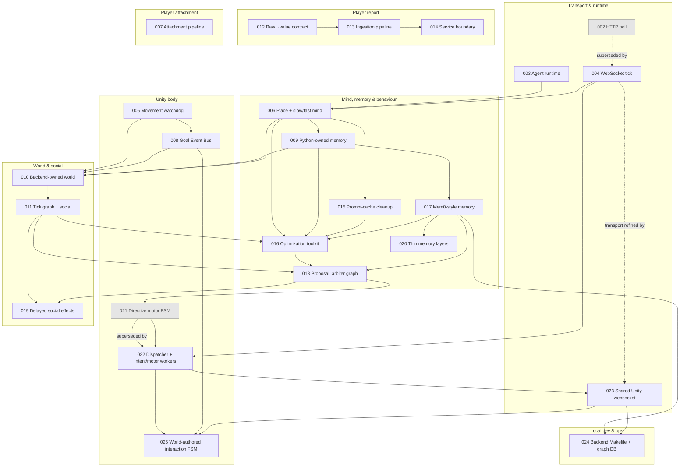

# Architecture Decision Records

This directory holds the **Architecture Decision Records (ADRs)** for the Mewi
project — one file per significant decision, in the order it was made. Each ADR
captures the *context* (what forced the choice), the *decision*, and the
*consequences* (what we accept by choosing it).

The codebase is three apps:

- `mewi-backend/` — FastAPI + LangGraph agent runtime (the cat's mind).
- `mewi-unity/` — Unity client (the cat's body and the game stage).
- `mewi-report/` — Astro site + Python pipeline (the player attachment report).

## How to read these

- ADRs are **append-only**: once filed, a decision is not rewritten — it is
  *superseded* or *refined* by a later ADR. The Status line tells you which.
- Numbers are stable IDs, not timestamps. (ADR-015 was renumbered from a
  duplicate `ADR-007`; its content predates ADR-012–014.)
- Most ADRs include Mermaid diagrams. View them in any Markdown renderer with
  Mermaid support (GitHub renders them inline).

**Status legend:** `Accepted` (in force) · `Proposed` (agreed direction, not
fully built) · `Superseded` (replaced — kept for history).

## Index

| ADR | Title | Status | One-line |
|---|---|---|---|
| [001](ADR-001-supabase-schema.md) | Supabase Schema + Unity Data Adapter | Accepted | Schema-as-code migrations + a PascalCase→snake_case buffer layer. |
| [002](ADR-002-unity-backend-tick-protocol.md) | Unity↔Backend Tick Protocol (HTTP submit+poll) | Superseded by [004](ADR-004-websocket-nested-plan-execution.md) | Async job + Redis queue + poll, so Unity never blocks on the LLM. |
| [003](ADR-003-agent-runtime-architecture.md) | Agent Runtime Architecture | Accepted (foundational) | Perception / memory / actions / LLM-provider split, one shared compiled graph. |
| [004](ADR-004-websocket-nested-plan-execution.md) | WebSocket Nested Plan Execution | Accepted | One per-cat WS; `tick {snapshot, report}` in, `plan {actions}` out; Unity owns cadence. |
| [005](ADR-005-movement-reliability-watchdog.md) | Movement Reliability — Watchdog + Warp | Accepted | Repath-then-warp so every navigation command terminates. Reliability > naturalism. |
| [006](ADR-006-place-memory-reflect-loop.md) | Place Memory + Slow/Fast Mind | Accepted | Backend place-memory overlay; Slow Mind picks intent, Fast Mind builds steps. |
| [007](ADR-007-attachment-signature-pipeline.md) | Attachment Signature Pipeline | Accepted | Raw events → features → transparent ATF rule estimate of *player* attachment. |
| [008](ADR-008-goal-event-bus-plan-step-feedback.md) | Goal Event Bus | Accepted (gating later demoted by [010](ADR-010-backend-owned-world-and-social-chat.md)) | The world *confirms* `eat`/`go_to`; the worker stops asserting success. |
| [009](ADR-009-python-owned-cat-memory.md) | Python-Owned Cat Memory | Accepted | Cat cognition/memory leaves Unity; Python owns raw + short-term memory. |
| [010](ADR-010-backend-owned-world-and-social-chat.md) | Backend-Owned World + Social Chat | Accepted (as-built in [011](ADR-011-tick-graph-and-social-service.md)) | Move the world model to Python; multi-cat life as per-tick group chat. |
| [011](ADR-011-tick-graph-and-social-service.md) | Tick Graph + Social Service | Accepted (descriptive) | The as-built 8-node graph; exactly where the LLM fires vs. pure code. |
| [012](ADR-012-mewi-report-raw-to-value-data-contract.md) | Report Raw→Value Data Contract | Proposed | Unity exports raw facts; Python owns derived report values. |
| [013](ADR-013-mewi-report-auto-pipeline.md) | Report Ingestion + Processing Pipeline | Proposed | `POST /report/session` → immutable per-session files → Python processor → site. |
| [014](ADR-014-report-ingestion-service-boundary.md) | Report Ingestion Service Boundary | Proposed | Thin service + storage port so local-disk → S3/Lambda swaps behind the route. |
| [015](ADR-015-place-memory-and-prompt-cache-cleanup.md) | Place Memory + Prompt-Cache Cleanup | Accepted | Static/dynamic Slow Mind prompt split for Anthropic cache (~900 → ~340+60 tokens). |
| [016](ADR-016-agent-behavioral-optimization-toolkit.md) | Agent Behavioral-Optimization Toolkit | Proposed (not yet wired) | Opt-in helpers (CoT, query-expansion, multi-intent, plan-diversity, life-balance) to widen behaviour. |
| [017](ADR-017-mem0-style-memory-add-retrieve-graph.md) | Mem0-Style Memory (ADD/Retrieve/Graph) | Proposed | Append-only writes; hybrid recall (recent + pgvector); property-graph edges in Postgres — no new infra. |
| [018](ADR-018-proposal-arbiter-tick-graph.md) | Proposal–Arbiter Tick Graph | Proposed | Reshape the linear graph into propose→select→plan; wires the 016 toolkit + 017 memory; same two LLM calls. |
| [019](ADR-019-delayed-social-intent-effects.md) | Delayed Social Intent Effects | Accepted | Selected social intent can affect backend social state without deciding the receiver's reaction. |
| [020](ADR-020-memory-layer-simplification.md) | Thin Agent Memory Layers | Accepted | MemoryManager owns meaning; repositories/stores do IO only. |
| [021](ADR-021-directive-driven-motor-fsm.md) | Directive-Driven Motor FSM | Superseded by [022](ADR-022-dispatcher-intent-motor-workers.md) | First Unity directive wiring; replaced by explicit dispatcher + intent/motor workers split. |
| [022](ADR-022-dispatcher-intent-motor-workers.md) | Dispatcher + Intent/Motor Workers | Accepted | Network transport, message dispatch, snapshot heartbeat, graph policy, and body execution are separate. |
| [023](ADR-023-shared-unity-agent-websocket.md) | Shared Unity Agent WebSocket | Accepted | One Unity websocket carries many per-cat ticks, routed by `creature_id + requestId`. |
| [024](ADR-024-backend-makefile-and-graph-db-workflow.md) | Backend Makefile + Graph DB Workflow | Accepted | Backend Make targets for full Docker stack, Redis, Neo4j graph memory, testing, and app URLs. |
| [025](ADR-025-world-authored-interaction-fsm.md) | World-Authored Interaction FSM | Proposed | Scene objects own local interaction recipes; the graph coordinates and the motor executes. |

## How the decisions relate

Read top-to-bottom by theme:

- **Transport & runtime** — how a tick travels (002 → 004) and how the agent is
  decomposed (003).
- **Unity body** — keep the body honest: it always finishes (005) and the world,
  not the worker, confirms outcomes (008).
- **Mind, memory & behaviour** — the cat's cognition (006), where its memory
  lives (009), the prompt-cost discipline (015), and the staged behaviour-variety
  toolkit (016).
- **World & social** — the backend owns the world model and multi-cat dialogue
  (010), documented as-built (011).
- **Player report** & **attachment** — the research/reporting side, mostly
  independent of the cat loop (007, 012–014).

## Writing a new ADR

1. Copy the header block from a recent ADR (`Status` / `Date` / `Scope`, plus
   `Builds on` / `Supersedes` links where relevant).
2. Use the next free integer; never reuse a retired number.
3. Structure: **Context → Decision → Consequences**. Add Mermaid for any
   non-trivial flow, state machine, or ownership boundary.
4. Prefer real `mewi-backend/…` / `mewi-unity/…` / `mewi-report/…` paths and
   keep them current — stale paths are the main way these rot.
5. Add a row to the index table and a node to the relationship graph above.
