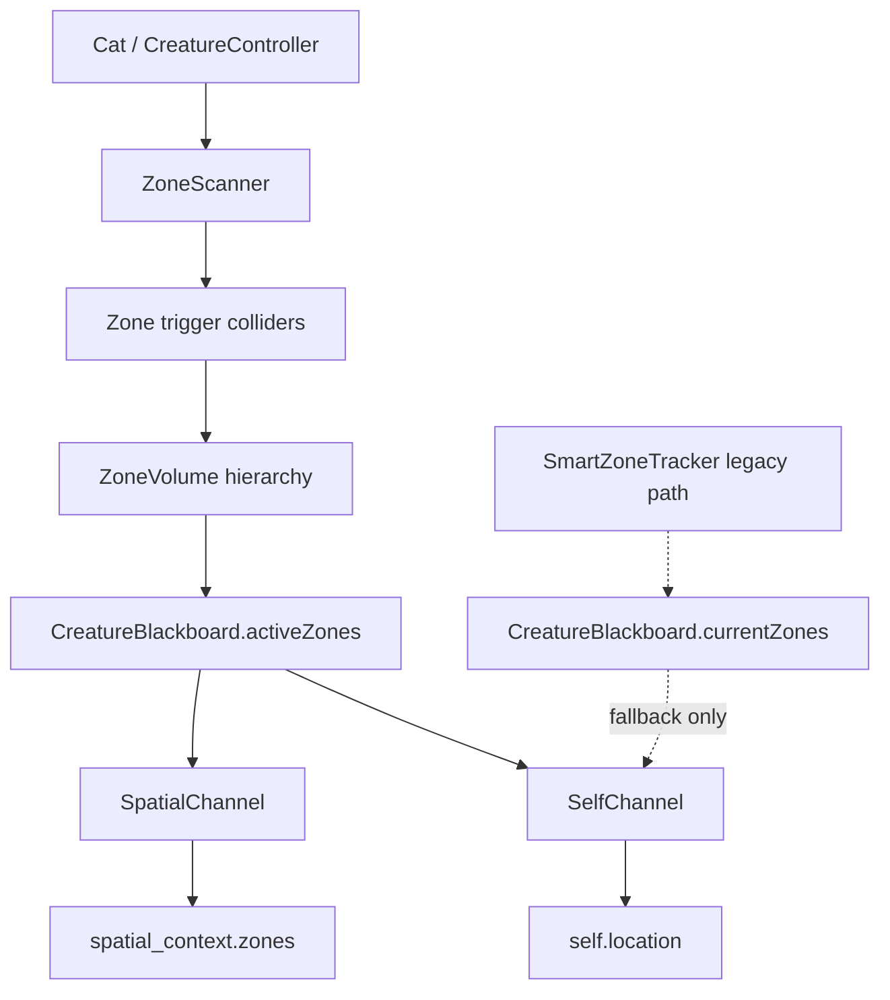
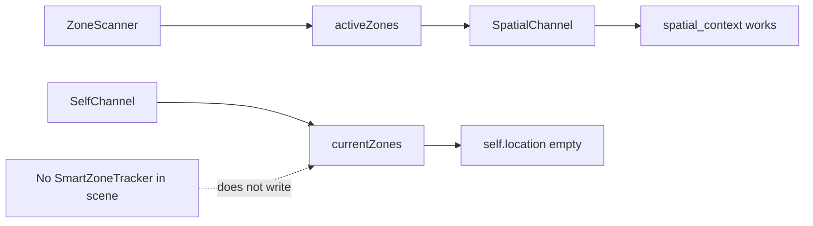
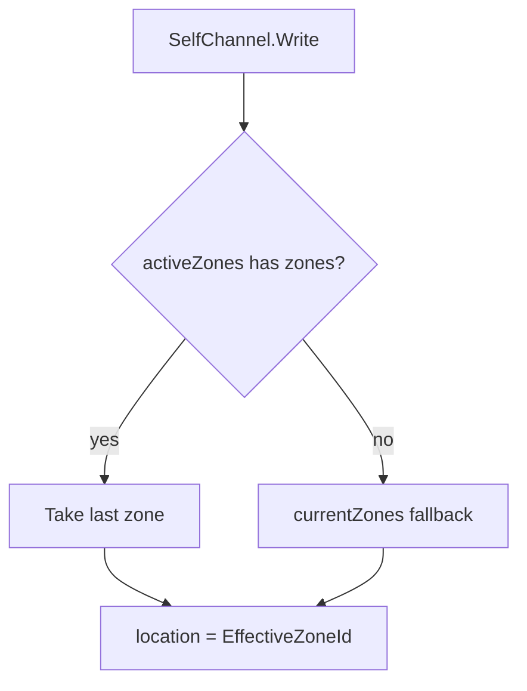
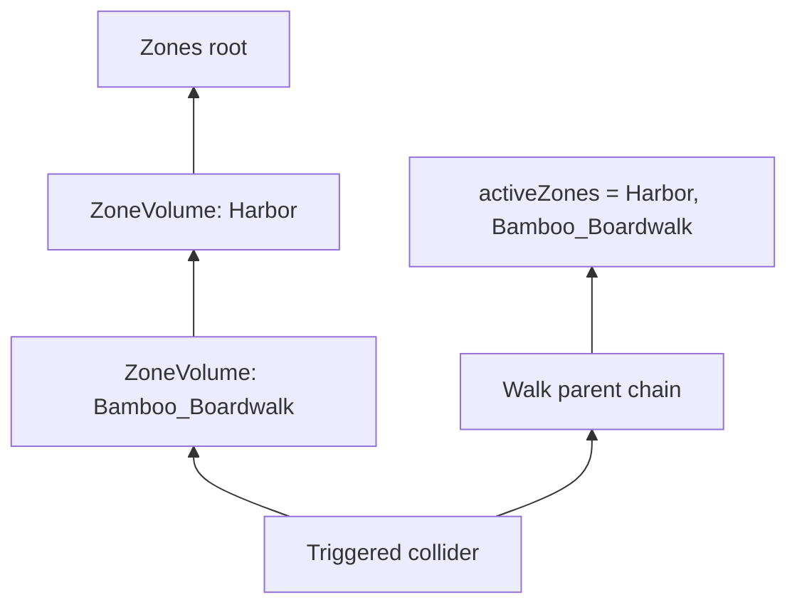
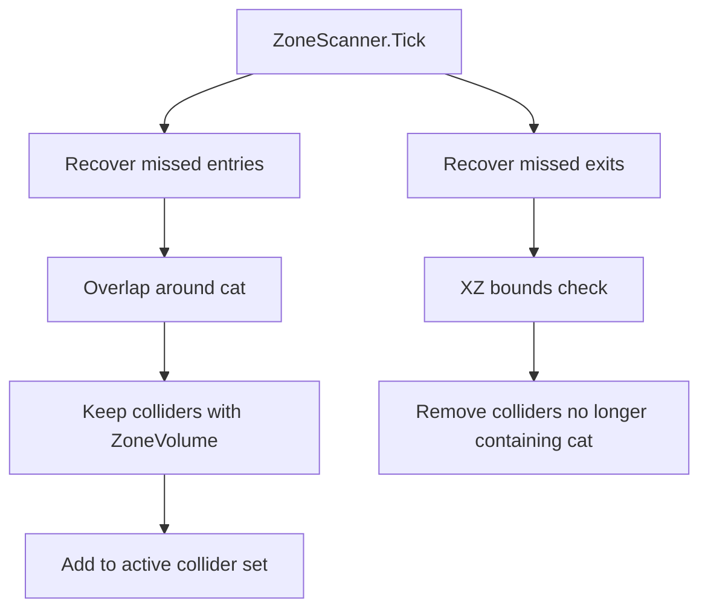

# Spatial Location Debug Note

## What Was Confusing

The project had two different zone systems that looked similar but wrote to
different blackboard fields.

- `SmartZoneTracker` writes flat tag names into `CreatureBlackboard.currentZones`.
- `ZoneScanner` writes real `ZoneVolume` objects into `CreatureBlackboard.activeZones`.

The active scene is using `ZoneScanner`, but `SelfChannel.location` was still
reading `currentZones`. That means the detailed `spatial_context.zones` payload
could be correct while `self.location` stayed empty.

## Current Source Of Truth

Use `ZoneScanner.activeZones` as the main spatial source of truth.

`currentZones` is now only a legacy fallback for old scenes that still use
`SmartZoneTracker`.



## Why The Bug Happened

Before the fix:



So the LLM could receive:

```json
{
  "self": {
    "location": ""
  },
  "spatial_context": {
    "zones": [
      { "id": "Harbor", "type": "district" },
      { "id": "Bamboo_Boardwalk", "type": "path", "surface": "Wood" }
    ]
  }
}
```

That is inconsistent: `spatial_context` says where the cat is, but
`self.location` says nothing.

## What Changed

`SelfChannel` now reads:

1. `board.activeZones`
2. most-specific zone: `activeZones[activeZones.Count - 1]`
3. `ZoneVolume.EffectiveZoneId`
4. fallback to `board.currentZones` only if `activeZones` is empty



Example after the fix:

```json
{
  "self": {
    "location": "Bamboo_Boardwalk"
  },
  "spatial_context": {
    "zones": [
      { "id": "Harbor", "type": "district" },
      { "id": "Bamboo_Boardwalk", "type": "path", "surface": "Wood" }
    ]
  }
}
```

## ZoneScanner Behavior

`ZoneScanner` tracks colliders, not zones directly. This is intentional.

When the cat is inside a child zone collider, `ZoneScanner` walks up the parent
chain and collects every `ZoneVolume` it finds. That allows broad container
zones like `Harbor` to be included automatically when the cat enters a more
specific child zone.



The order is broadest to most-specific:

```text
activeZones[0]  = Harbor
activeZones[-1] = Bamboo_Boardwalk
```

So:

- `spatial_context.zones` sends the full hierarchy.
- `self.location` sends the most-specific current place.

## Recovery Logic

Unity trigger enter/exit can be missed when:

- the cat starts already inside a zone,
- the cat teleports,
- colliders resize,
- objects are enabled late,
- zone layers are authored inconsistently.

`ZoneScanner` now has two safety paths:



The broad fallback scan filters by `ZoneVolume`, so it can still detect zone
colliders even if some are on `Default` or `SemanticProp` instead of
`SemanticZone`.

## Practical Rule

For new spatial work:

- Use `ZoneVolume` for authored places.
- Use `ZoneScanner` on the cat.
- Read `CreatureBlackboard.activeZones`.
- Treat `CreatureBlackboard.currentZones` as old compatibility data.

For LLM snapshots:

- `self.location` = the most-specific active zone.
- `spatial_context.zones` = full broad-to-specific zone hierarchy.
