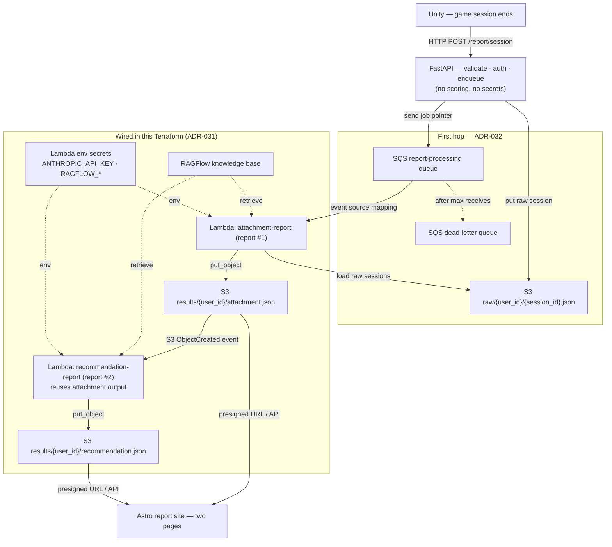

# `infra/` — Terraform for Mewi's cloud

The AWS infrastructure for the **post-session report pipeline** (ADR-030 /
ADR-031 / ADR-032). Root config wires three child modules — `s3/` (buckets),
`sqs/` (the first-hop processing queue), and `aws-lambda/` (the report Lambdas)
— and the report runs entirely out-of-band from FastAPI: each finished game
session becomes two stored reports per user.

The pipeline is **two chains**:

- **First hop (ADR-032 — wired in Terraform/Python):** FastAPI stores the raw
  session in S3 and sends a compact SQS job; an event-source mapping runs
  `attachment-report`, which loads the raw sessions back from S3.
- **Second hop (ADR-031 — wired):** `attachment-report` writes `attachment.json`,
  whose S3 `ObjectCreated` event auto-invokes `recommendation-report`.

## How it works



Solid edges are wired in Terraform/Python. The `RF`/`SECRETS` dotted edges are
config (retrieval + env), not missing wiring. What is wired today: the raw bucket,
SQS queue/DLQ, SQS event-source mapping to `attachment-report`, report-results
bucket, Lambda S3/SQS IAM, Lambda env, and the second-hop
`attachment.json → recommendation-report` notification (suffix-filtered so report
#2's own output can't retrigger the chain). FastAPI's AWS sender role is optional
because the backend host is not defined here: set
`TF_VAR_backend_report_sender_role_name` if Terraform should attach its
write/send policy. Processing secrets live **only** in the Lambda env — FastAPI
never needs them.

## Layout

```
infra/
  deploy.sh            # one command: load secrets, vendor deps, init/plan/apply
  secrets.env.example  # copy to secrets.env (gitignored), fill in your keys
  main.tf              # root: wires the s3 + aws-lambda modules together
  variables.tf         # the inputs you configure (region, project, secrets, model)
  provider.tf          # AWS provider + region
  backend.tf           # remote Terraform state (S3, created manually)
  s3/                  # data buckets, incl. report raw + results buckets
  sqs/                 # report-processing queue + DLQ
  aws-lambda/          # the report Lambdas + their registry (see its README)
```

## Use

```bash
cd infra
cp secrets.env.example secrets.env   # first time only — then fill in your keys
./deploy.sh                          # loads secrets, vendors Lambda deps, plan + apply
```

`deploy.sh` sources `secrets.env` (gitignored), so secrets are never committed.
It also `pip install`s each Lambda's deps into its folder before `apply` (the
`archive_file` zips the dir as-is). After apply, copy the Terraform outputs into
the backend runtime:

```bash
MEWI_REPORT_PROCESSING_MODE=sqs
MEWI_REPORT_RAW_BUCKET=<terraform output report_raw_bucket>
MEWI_REPORT_SQS_QUEUE_URL=<terraform output report_processing_queue_url>
AWS_REGION=ap-southeast-1
```

See [`aws-lambda/README.md`](aws-lambda/README.md) for the report-Lambda details
and how to activate `recommendation-report`.
