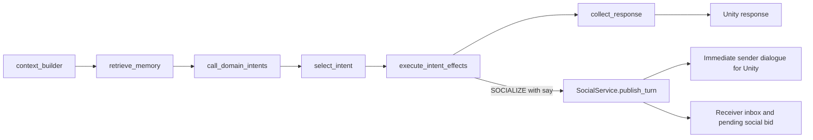
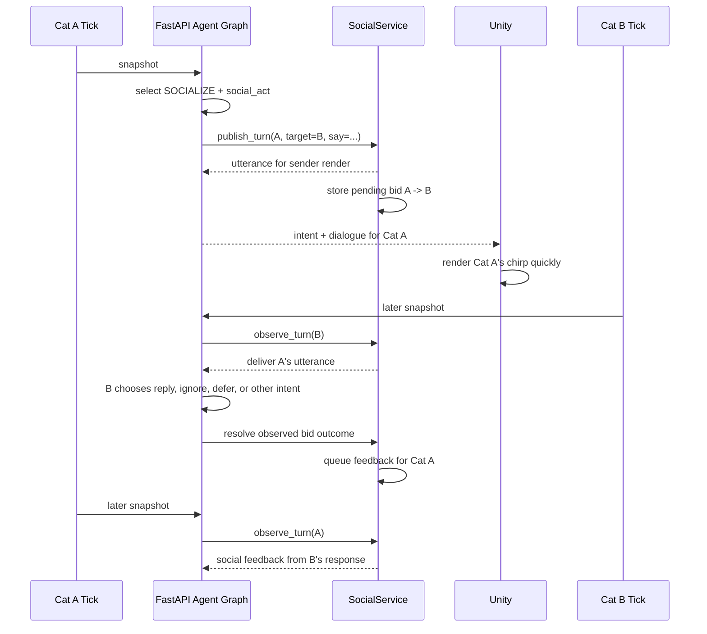

# ADR-011: Delayed Social Intent Effects

Status: Accepted

Date: 2026-06-01

## Context

The backend now asks three domain prompts for one intent proposal each. Unity owns the tick cadence and the ActionFSM, while the backend owns relationship state, social rooms, inboxes, and memory context.

Social actions need two properties at the same time:

- Low latency for the cat that speaks, so Unity can render the chirp, subtitle, bubble, or gesture in the same tick response.
- Delayed autonomy for the receiving cat, so the receiver can reply, ignore, avoid, or defer on its own next tick.

The sender should express its social intention, but it must not decide the receiver's reaction.

## Decision

Add two nodes after domain proposals:

1. `select_intent`: deterministically collapse domain proposals into one thin ActionFSM directive.
2. `execute_intent_effects`: run backend-owned side effects for the selected intent.

Only intents that require backend-owned state enter the effect path. For now that is `SOCIALIZE`, which may publish a social utterance through `SocialService`.

The selected intent may include an optional `social_act`:

```json
{
  "intent": "SOCIALIZE",
  "target_id": "yuzu",
  "mood": "curious",
  "style": "soft chirp, slow blink",
  "social_act": {
    "kind": "invite",
    "say": "Come look at this.",
    "tone": "curious",
    "expects_reply": true
  }
}
```

`execute_intent_effects` publishes that utterance immediately for the sender's Unity response, and stores a pending social bid for the receiver. The receiver hears the utterance on its own next tick. If the receiver replies, acknowledges, ignores, or defers, the bid outcome becomes feedback for the original sender on a later tick.

## Graph



## Social Timing



## Unity Contract

Unity receives behavior-first data:

```json
{
  "intent": {
    "intent": "SOCIALIZE",
    "target_id": "yuzu",
    "mood": "curious",
    "style": "soft chirp, slow blink"
  },
  "dialogue": [
    {
      "from": "miso",
      "target": "yuzu",
      "text": "Come look at this.",
      "tone": "curious",
      "render_hint": "speech_bubble",
      "ttl_seconds": 2.5
    }
  ],
  "wake_targets": ["yuzu"]
}
```

Unity does not need to show a chat UI. It can render dialogue as an optional speech bubble, subtitle, bark/chirp audio cue, or debug overlay. `wake_targets` is only a scheduling hint: Unity may tick the receiver sooner, but the receiver is not forced to reply.

## Consequences

- Sender-side speech renders with small latency.
- Receiver-side reaction remains independent and delayed.
- Ignored or answered social bids become relationship/memory evidence later.
- The graph stays thin: deterministic selection, deterministic effect routing, no second LLM call for tools.
- New backend effects can be added with a small intent-to-effect mapping when they own state outside Unity.
