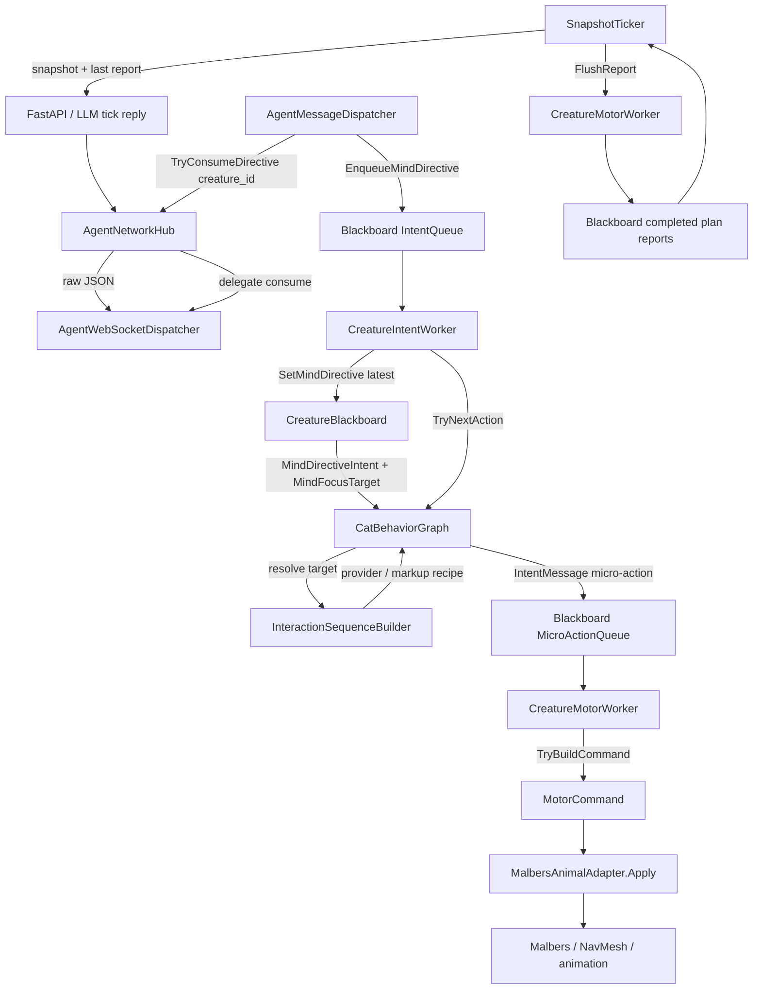

# Cat Behavior Graph

This documents the Unity-side graph stack:

- `AgentNetworkHub` owns the websocket transport.
- `AgentWebSocketDispatcher` parses shared websocket replies and buffers
  directives by creature id.
- `AgentMessageDispatcher` is the thin per-cat delivery step.
- `SnapshotTicker` sends snapshots and prior execution reports.
- `CreatureIntentWorker` consumes high-level `MindDirective`s, owns the active
  goal lifecycle, and asks `CatBehaviorGraph` for the next micro-action only
  when the motor is no longer executing.
- `InteractionSequenceBuilder` asks resolved targets for object-authored
  interaction recipes through `IInteractionProvider` / `AuthoredInteractionProvider`,
  then falls back to existing markup such as `EdibleObject`, `SmartObject`,
  `ZoneVolume`, and `CatNavigationPoint`.
- `CreatureMotorWorker` consumes the micro-action queue and applies body commands.

## Runtime Flow

The backend reply carries one high-level intent (`SOCIALIZE`, `EXPLORE`, ...)
plus a target id chosen from Unity's affordance snapshot. It does not send body
actions. The dispatcher places that intent on the blackboard's high-level intent
queue. The intent worker consumes that queue, starts a bounded Unity goal, and
uses `CatBehaviorGraph` to emit one micro-action only when the micro-action queue
is empty and `CreatureMotorWorker` is not executing an active command. If the
target has an interaction provider, or existing markup implies one, that finite
recipe is used before the graph's built-in fallback sequence.

## Queues

| Queue | Producer | Consumer | Payload |
| --- | --- | --- | --- |
| IntentQueue | `AgentMessageDispatcher` | `CreatureIntentWorker` | `MindDirective` (`Intent`, `FocusTarget`, mood/style/social render hints) |
| MicroActionQueue | `CreatureIntentWorker` or tests | `CreatureMotorWorker` | `IntentMessage` body actions |
| ReportQueue | `CreatureMotorWorker` | `SnapshotTicker` | `PlanExecutionReport` |

The names matter: a high-level intent is a policy choice, not something the body
can execute. A micro-action is the body-level vocabulary handled by
`CreatureMotorWorker.TryBuildCommand`.

## Goal Lifecycle

A high-level directive is complete when:

1. the graph/provider reaches a terminal state and returns no next required
   goal-owned micro-action;
2. the goal-owned `MicroActionQueue` is empty;
3. `CreatureMotorWorker` is no longer executing the active goal-owned
   micro-action;
4. the previous goal-owned micro-action did not report `failed` or `rejected`.

At that point `CreatureIntentWorker` clears `MindDirectiveIntent` /
`MindFocusTarget`. The next backend tick can then choose a new high-level intent
from a fresh snapshot and prior execution report.

If any micro-action reports `failed` or `rejected`, the intent worker aborts the
active directive instead of emitting the next phase. This matters most for
movement: if `go_to(target)` cannot resolve or complete, the graph does not
continue into `smell(target)` / `eat(target)`. The failure is included in the
next `PlanExecutionReport` so the backend can choose again.

World-confirmed micro-actions (`go_to`, `eat`) keep their `GoalEventBus`
declaration alive for a short confirmation window before reporting failure. This
prevents same-frame ordering bugs where the motor declares `eat(food)` and the
food trigger has not yet run `OnTriggerStay`.

This prevents the graph from keeping the cat busy forever. For example:

| Directive | Focus target | Micro-action sequence |
| --- | --- | --- |
| `EXPLORE` | zone/place id | `go_to(target)` -> `look_around` -> `smell(target)` |
| `INVESTIGATE` | object/place id | `go_to(target)` -> `smell(target)` -> `look_at(target)` |
| `SEEK_FOOD` | food id | `go_to(food)` -> `smell(food)` -> `eat(food)` when food markup/provider confirms it is edible |
| `SOCIALIZE` | cat/player id | `go_to(target)` -> `vocalize(target)` -> `sit` |
| `REST` | none | `sit`/`lie`/`sleep` -> optional `groom`/`idle` |

## Graph Pick

When a directive starts, `CatBehaviorGraph.ResetGoal` maps the directive to a
behavior node, tries to build a target-authored interaction sequence, and resets
that node's phase counter:

| Intent | Node |
| --- | --- |
| `SOCIALIZE`, `SEEK_PLAYER` | Socialize |
| `INVESTIGATE` | Investigate |
| `EXPLORE` | Explore |
| `SEEK_FOOD` | SeekFood |
| `REST` | Rest |
| `SAFETY` | Safety |
| `IDLE` | Idle |

When there is no active directive, the intent worker does not ask the graph for
more actions. If the directive is unknown, the graph falls back to weighted
scoring for that one bounded goal:

1. Read `CreatureBlackboard.MindWeights`, or `defaultWeights` if none are set.
2. Read live needs from mood, health, and perception.
3. Score every behavior node.
4. Add `stateInertia` to the current node.
5. Apply small random noise.
6. Weighted-pick one node.
7. Reset `_phase` if the selected node, directive, or target changed.
8. Emit the next body-level `IntentMessage`.

## Action Mapping

`CatBehaviorGraph` does not receive backend plan steps. It translates one
high-level directive into a small finite sequence of Unity micro-actions. It
first asks `InteractionSequenceBuilder` for an explicit provider or markup-based
recipe. If none exists, the graph falls back to its built-in node sequence. If
the same node/target remains active, the provider cursor or `_phase` advances.
If a new directive or target arrives, progress resets to `0`.

Current graph-emitted intent names:

- `idle`
- `wander`
- `smell`
- `look_around`
- `go_to`
- `investigate`
- `look_at`
- `eat`
- `vocalize`
- `sit`
- `sleep`
- `lie`
- `groom`
- `flee`
- `alert`

`CreatureMotorWorker` remains the only translator from intent strings to
`MotorCommand`, and `MalbersAnimalAdapter` remains the only body executor.

## Movement And Affordances

Movement targets should come from Unity-authored affordances. Zone/place
affordances are filtered through `ReachableAffordanceScanner`, which evaluates
NavMesh route safety before they are sent to the backend.

For movement-capable targets, Unity includes both compatibility `status` and
explicit `path_status` / `path_length` fields in the target contract. `safe`
means the scanner found a complete route at snapshot time. `risky` means the
target may still be usable but should be treated as lower confidence. `blocked`
targets should not be offered to the backend as selectable targets.

That affordance is a snapshot-level promise: "this target was reachable when the
snapshot was built." Runtime execution still validates movement in
`CreatureMotorWorker` and `MalbersAnimalAdapter` because cats, props, blockers,
and NavMesh state can change before the backend response arrives. Failed
movement is reported back through `PlanExecutionReport` so the backend can pick a
different high-level intent next tick. Repeated failures for afforded targets are
a scanner or target-id bug, not a reason for the LLM to invent non-afforded
destinations.
