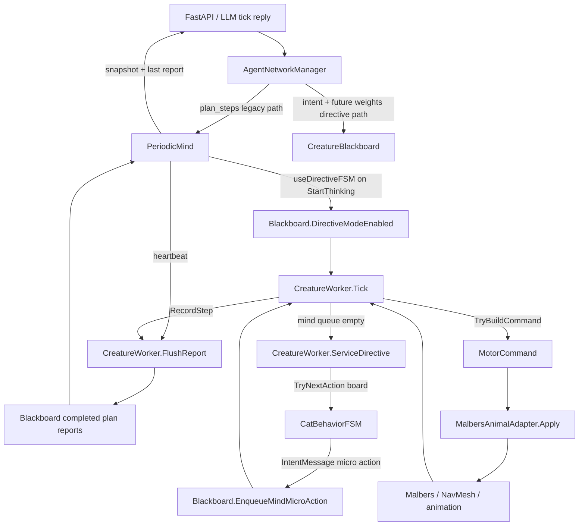
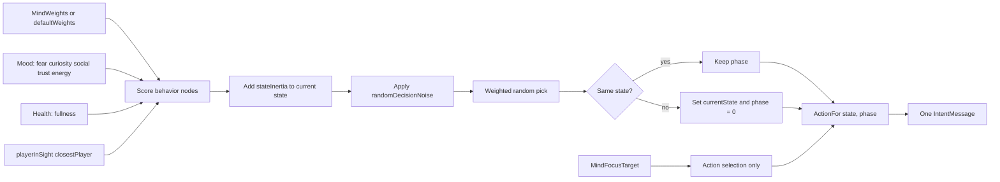
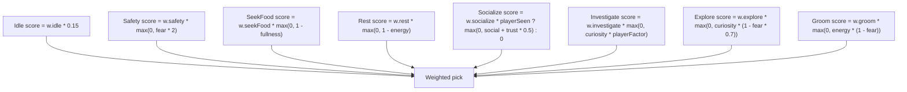
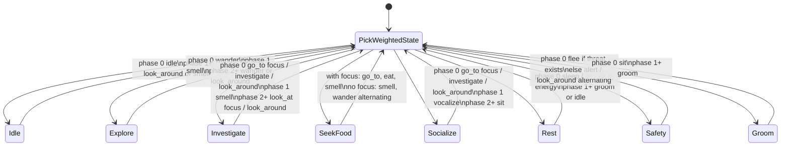
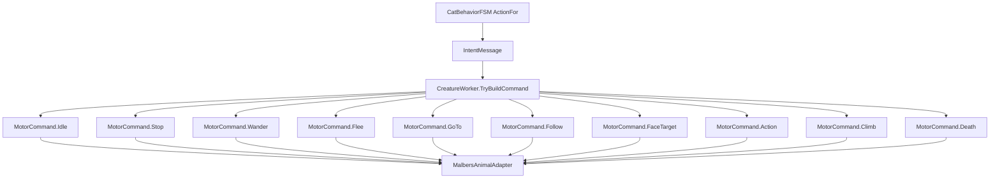

# Cat Motor FSM

This documents the current one-cat behavior FSM in `ActionFSM/CatBehaviorFSM.cs`
and how it is driven through the Motor stack.

## Runtime Flow

## Weighted State Pick

Each call to `CatBehaviorFSM.TryNextAction` does one fresh decision:

1. Read `CreatureBlackboard.MindWeights`, or `defaultWeights` if no LLM weights exist.
2. Read live needs from mood, health, and perception.
3. Score every behavior node.
4. Add `stateInertia` to the current node.
5. Apply small random noise.
6. Weighted-pick one state.
7. Reset `_phase` only if the selected state changed.
8. Emit one low-level `IntentMessage`.

## State Utility Formula

`playerFactor` is `1.2` when the player is visible and `0.65` otherwise.

## State To Action Phases

The FSM does not build a long plan. It emits one action per worker opportunity.
If the same state wins again, `_phase` advances. If another state wins, `_phase`
resets to `0`.

## Action Mapping

Current FSM-emitted intent names:

- `idle`
- `wander`
- `smell`
- `look_around`
- `go_to`
- `investigate`
- `look_at`
- `eat`
- `vocalize`
- `sit`
- `sleep`
- `lie`
- `groom`
- `flee`
- `alert`

## Notes For Iteration

- The LLM should primarily edit `CatBehaviorWeights` and optional
  `MindFocusTarget`.
- The FSM owns moment-to-moment action choice.
- `CreatureWorker` remains the only translator from intent strings to
  `MotorCommand`.
- `MalbersAnimalAdapter` remains the only body executor.
- In directive mode, reports are not flushed whenever the queue empties; they
  are flushed by `PeriodicMind` heartbeat through `CreatureWorker.FlushReport`.
