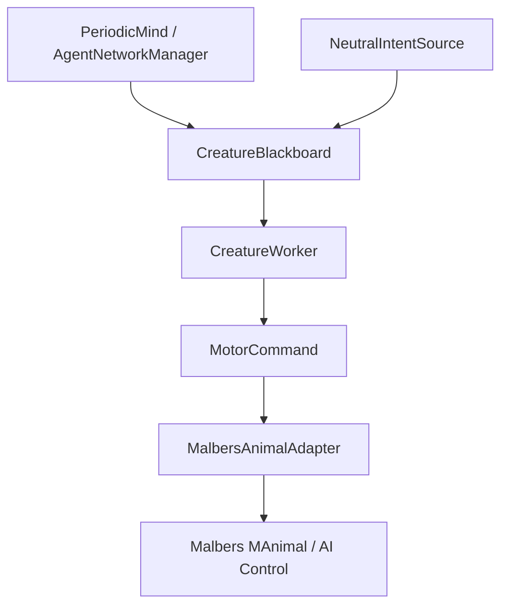
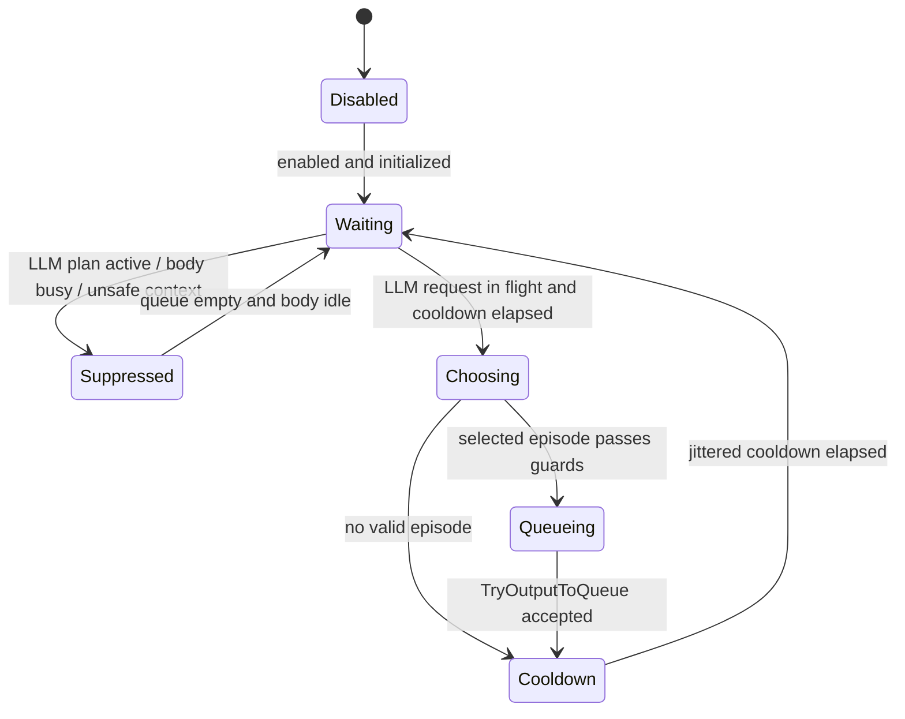

# Neutral Intent Source Proposal

## Problem

When `PeriodicMind` is in LLM mode, the cat often has no queued intent while
the backend is thinking. In Unity this makes the cat look like it is simply
idle, even though the animal could be doing small neutral things: walking a few
steps to inspect the area, sniffing, looking around, grooming, sitting, taking a
different pace, or crossing a nearby traversal feature.

The important constraint is that neutral behavior must not become a second body
controller. The existing motor path is already clean:

- `CreatureWorker` reads queued `IntentMessage`s from `CreatureBlackboard`.
- `CreatureWorker` translates intents into `MotorCommand`s.
- `MalbersAnimalAdapter` is the only class that talks to Malbers.

Neutral behavior should use that path too.

## Recommendation

Add a new neutral intent source whose only job is to produce short,
low-priority neutral intent plans when the normal mind queue is empty and the
LLM is currently working.

It should not call `MalbersAnimalAdapter` directly.
It should not execute anything.
It should not relocate the cat to a different semantic place.
`CreatureWorker` remains the single body executor.



The neutral source should be active mainly while an LLM request is in flight.
That prevents a local neutral loop from starving the next snapshot request.

## Why A Source, Not A Worker

`CreatureWorker` should remain deterministic and boring: if there is an intent,
execute it. If there is no intent, do nothing. That makes plan execution and
reporting predictable.

The neutral intent source can own the fuzzy part:

- probability selection
- cooldowns
- mood and context weighting
- short episode generation
- interruption rules
- debug tuning in the Inspector

This keeps the motor layer maintainable while still letting the cat feel alive.
The project still has one execution path: `IntentMessage` -> `CreatureWorker` ->
`MotorCommand` -> `MalbersAnimalAdapter`.

## Source Shape

The smallest version can be a single `NeutralIntentSource` component called by
`PeriodicMind.TickLLM()`. It is a source node, not a worker.

```csharp
public sealed class NeutralIntentSource : MonoBehaviour
{
    public bool TryOutputToQueue(
        CreatureBlackboard board,
        CreatureWorker worker,
        AgentNetworkManager bridge);

    bool TryMapNodeToCreatureIntent(
        NeutralActionNode node,
        out string creatureIntent);
}
```

V1 does not need a full source registry or another executor. `PeriodicMind` can
hold one serialized neutral source reference and call `TryOutputToQueue` only in
the exact gap where the backend request is in flight, the queue is empty, and
the body is idle.

Longer term, the same source shape could support:

- LLM source
- neutral source
- scripted scene source
- debug/test source
- reflex source

## Internal Nodes To Worker Intents

The neutral source should be free to use internal names that make sense for the
probabilistic FSM. Those names do not need to match `CreatureWorker` exactly.

Example internal nodes:

```csharp
public enum NeutralActionNode
{
    ScanArea,
    WalkProbe,
    SniffGround,
    SitGroom,
    AlertPause,
    VocalCheck,
    RestShift,
    LocalTraversalProbe,
}
```

Only one mapper should translate those nodes into the string names that
`CreatureWorker` already understands:

```csharp
bool TryMapNodeToCreatureIntent(
    NeutralActionNode node,
    out string creatureIntent)
{
    creatureIntent = node switch
    {
        NeutralActionNode.ScanArea           => "look_around",
        NeutralActionNode.WalkProbe          => "go_to",
        NeutralActionNode.SniffGround        => "smell",
        NeutralActionNode.SitGroom           => "groom",
        NeutralActionNode.AlertPause         => "alert",
        NeutralActionNode.VocalCheck         => "vocalize",
        NeutralActionNode.RestShift          => "lie",
        NeutralActionNode.LocalTraversalProbe => "go_to",
        _ => "",
    };

    return !string.IsNullOrWhiteSpace(creatureIntent);
}
```

This gives us readable neutral behavior authoring while keeping the executable
contract small. `CreatureWorker` still only needs to understand its existing
intent strings such as `go_to`, `smell`, `look_around`, `sit`, `lie`, `groom`,
`alert`, and `vocalize`.

The public output function should be the only place that writes to the queue:

```csharp
public bool TryOutputToQueue(
    CreatureBlackboard board,
    CreatureWorker worker,
    AgentNetworkManager bridge)
{
    if (!CanOutputNeutral(board, worker, bridge)) return false;
    if (!TryChooseEpisode(out NeutralActionNode[] nodes)) return false;
    if (!TryBuildIntentMessages(nodes, out List<IntentMessage> intents)) return false;

    return board.TryEnqueueNeutralPlan(intents);
}
```

Everything else stays private inside the source:

- FSM state
- weighted episode selection
- cooldowns
- internal node names
- same-place destination sampling
- node-to-string mapping

## Same-Place Motion Constraint

Neutral movement is allowed to make the cat feel alive, but it must not change
where the cat is in the world. It should never choose a named target in another
area, route to a different zone, or make the backend believe the cat decided to
go somewhere new while the LLM was thinking.

The neutral source may still map an internal node like `WalkProbe` to the
existing `go_to` intent because that is the movement primitive
`CreatureWorker` already understands. The destination must be local:

- no `targetKey`
- `DirectionHint` is a sampled nearby point
- pace is `Walk` or another low-energy local pace
- distance is small, for example 0.75m to 3m by default
- destination is inside the current most-specific `ZoneVolume` when available
- destination is rejected if it would move into another semantic place
- if no safe local point is found, output a non-moving action instead

Recommended profile fields:

```csharp
public float localWalkMinRadius = 0.75f;
public float localWalkMaxRadius = 3.0f;
public bool requireSameZone = true;
public bool fallbackToNonMovingAction = true;
```

Destination sampling should use the current place as a leash:

```text
currentPlace = board.activeZones.LastOrDefault()
candidate = random NavMesh point near cat within localWalkMaxRadius
accept only if candidate is still inside currentPlace
otherwise retry or choose look_around / smell / groom
```

This means neutral movement can be a tiny sniffing step, a turn, a slow circle,
or a short walk across the same dock/room/boardwalk, but not a new `go_to`
decision.

## Queue Rules

Neutral behavior should be queued, not executed directly.

Recommended blackboard API:

```csharp
public bool TryEnqueueNeutralPlan(IEnumerable<IntentMessage> intents);
public bool HasOnlyNeutralPlan { get; }
```

Rules:

- Queue neutral intents only when `CreatureBlackboard.HasMindPlan` is false.
- Queue neutral intents only when `CreatureWorker.IsBusy` is false.
- Queue neutral intents only when `AgentNetworkManager.RequestInFlight` is true,
  or during an explicitly configured idle grace window.
- Mark neutral intents with `LayerSource.Neutral`.
- Use command ids like `neutral:scan_area:0001`.
- Use an empty `requestId` so local behavior is not confused with backend work.
- For local movement, use `DirectionHint` only and keep `TargetKey` empty.
- When an LLM plan arrives, `PeriodicMind.ApplyLLMPlan` may replace any queued
  neutral intents immediately.
- If a neutral intent is already in flight, let it finish unless the incoming
  backend plan is urgent or `interruptNeutralOnLLMPlan` is enabled.

Current `ReplaceMindPlan` already clears the queue, so queued neutral work can
be replaced by a new LLM plan. If V1 only queues neutral plans when the queue is
empty, it can use the same blackboard queue and avoid any duplicate executor
logic.

## Reporting Rules

Do not send neutral-only episodes as backend plan execution reports.

Reason: `CreatureWorker` currently builds a `PlanExecutionReport` for every
queue it drains. If neutral episodes are reported as if they came from the LLM,
`PeriodicMind` may send confusing `previousReport` data back to the backend.

Recommended behavior:

- `CreatureWorker` still records debug information for neutral intents.
- `CreatureWorker` does not enqueue `PlanExecutionReport` for plans where every
  step has `Source == LayerSource.Neutral`.
- Mixed plans should be avoided. If they happen, report only the LLM/mind steps
  or split plan accounting by source.

## State Machine

`NeutralIntentSource` should be small but explicit.



### Eligibility

`CanQueueNeutral` should require:

- board exists
- worker exists
- no queued mind plan
- body is not busy
- LLM request is in flight, or `allowAmbientWhenNoRequest` is true
- no recent neutral episode within cooldown
- any movement node can sample a valid same-place destination
- creature is not in high fear, death, active flee, or other unsafe states

### Probability Selection

Use a weighted selector over neutral episodes.

Each episode entry should have:

- id
- base weight
- cooldown
- max steps
- allowed mood range
- allowed zone tags or surface types
- required nearby target type, optional
- internal neutral node sequence

Example profile:

| Episode | Base Weight | Internal Nodes | Worker Intents |
| --- | ---: | --- | --- |
| `scan_area` | 30 | `ScanArea`, `WalkProbe`, `SniffGround` | `look_around`, local `go_to`, `smell` |
| `sniff_ground` | 20 | `SniffGround`, `WalkProbe`, `ScanArea` | `smell`, local `go_to`, `look_around` |
| `short_patrol` | 15 | `WalkProbe`, `WalkProbe`, `ScanArea` | local `go_to`, local `go_to`, `look_around` |
| `groom_break` | 15 | `RestShift`, `SitGroom` | `lie`, `groom` |
| `alert_pause` | 10 | `AlertPause`, `ScanArea` | `alert`, `look_around` |
| `vocal_check` | 5 | `ScanArea`, `VocalCheck` | `look_around`, `vocalize` |
| `rest_shift` | 5 | `RestShift`, `ScanArea` | `lie`, `look_around` |

Weights should be adjusted by context. For example:

- curiosity raises `scan_area`, `sniff_ground`, and `short_patrol`
- low energy raises `groom_break`, `rest_shift`, `sit`, and `lie`
- strong nearby feelings raise `smell`
- player in sight raises `look_around` or `alert_pause`
- fear suppresses neutral behavior or switches to existing `flee`

## Malbers Vocabulary To Leverage

The current cat package already contains useful neutral animation vocabulary:

- Actions: `Cat_Smell`, `Cat_Alert`, `Cat_Sit_01`, `Cat_Sit_02`,
  `Cat_Sit_Lick_Paw_L`, `Cat_Sit_Lick_Paw_R`, `Cat_Sit_Lick_Chest`,
  `Cat_Lie_01`, `Cat_Lie_02`, `Cat_Lie_Licking`, `Cat_Rolling`,
  `Cat_Wiggle`, `Cat_Shake_Water`, `Cat_Meow`, `Cat_Meow_Sit`,
  `Cat_Meow_Lie`, `Cat_Drink1`, `Cat_Drink2`, `Cat_Eat 1`,
  `Cat_Eat 2`, `Cat_Dig`, `Cat_PickUp`, and push variants.
- Locomotion: walk, trot, canter, run, sprint, backward, turn left, turn right.
- Jump: in-place, walk, trot, canter, run, sprint jumps and matching landings.
- States: idle, locomotion, jump, climb, fall, ledge grab, swim, death.

V1 should use the already-supported intent names first:

- `look_around`
- `smell`
- `alert`
- `vocalize`
- `scratch`
- `sit`
- `lie`
- `groom`
- `wander`
- `go_to`
- `climb`

Then extend the action map with neutral aliases:

- `lick_paw`
- `lick_chest`
- `roll`
- `wiggle`
- `shake_water`
- `dig`
- `meow_sit`
- `meow_lie`
- `scare_jump`

## Make The Action Map Data Driven

`MalbersAnimalAdapter` currently exposes one serialized int per action and a
switch in `TryGetAbilityIndex`. That works for a small set, but it will get
messy if neutral behavior uses many Malbers actions.

Recommended follow-up:

```csharp
[Serializable]
public struct MalbersActionBinding
{
    public string intent;
    public int abilityIndex;
    public string[] tags;
}
```

`MalbersAnimalAdapter` can expose:

```csharp
[SerializeField] List<MalbersActionBinding> actionBindings;
```

Then `TryGetAbilityIndex` becomes a dictionary lookup built during `Init`.
Existing fields can stay for one release as migration fallback, but new neutral
actions should be added through the list.

This makes authoring many Malbers actions much easier:

- Designers can tune ability indices in one Inspector list.
- Neutral behavior can query by tag, such as `groom`, `alert`, `rest`, `sound`.
- Adding a new animation does not require another public int and switch case.

## Movement Pace

Neutral episodes need more than the current default `go_to` trot.

Recommended model:

```csharp
public enum MovementPace
{
    Default,
    Walk,
    Trot,
    Canter,
    Run,
    Sprint,
}
```

Add an optional pace field to `IntentMessage` and `MotorCommand`.

V1 behavior:

- LLM/backend intents keep `Default`.
- Neutral scan walks use `Walk`.
- Curious patrols use `Trot`.
- Small playful bursts may use `Run`.
- `Sprint` is reserved for flee or explicit high-energy episodes.

`MalbersAnimalAdapter.ExecuteGoTo` then maps pace to speed indices. The current
fields already cover `walkSpeedIndex`, `trotSpeedIndex`, and `runSpeedIndex`.
Add `canterSpeedIndex` and `sprintSpeedIndex` only if the active SpeedSet needs
them.

## Area Scan Episode

The behavior the user described maps cleanly to an episode:

```text
scan_area:
  1. look_around
  2. local go_to nearby sampled NavMesh point at Walk pace
  3. smell or alert
```

Destination selection:

- Prefer a point inside the current most-specific `ZoneVolume`.
- Otherwise sample a NavMesh point around the cat.
- Keep radius small, around 0.75m to 3m.
- Reject points too close to the current position.
- Reject points outside the current place.
- Reject points that fail complete path validation.
- If a `FeelingEvent` is interesting and safe, bias the sample toward it.

This makes the cat appear to inspect the environment while the LLM is thinking,
without inventing a second navigation system.

## Jump And Traversal

There are two levels of jump support.

### V1: Jump Through Navigation

Use existing NavMesh or Malbers traversal only when the movement remains inside
the current semantic place. The neutral source can queue a local `go_to` toward
a nearby OffMeshLink/NavMeshLink endpoint or authored `TraversalHintVolume` only
if the destination passes the same-place check.

This is the safer first version because `MalbersAnimalAdapter.NavigateTo`
already expects complete paths and comments mention authored link traversal for
jumps, climbs, stairs, or drops.

### V2: Explicit Jump Command

Only add explicit `jump` if V1 is not enough.

Possible changes:

- Add `MotorCommandKind.Jump`.
- Add `MotorCommand.Jump(MovementPace pace)`.
- In `MalbersAnimalAdapter`, activate `StateEnum.Jump` or feed the Malbers jump
  input in a timed command.
- Track completion like simple climb, with timeout and cleanup.

This should be a separate implementation step because direct jump control can
fight NavMesh movement if it is added too early.

## Suggested Implementation Plan

1. Add `LayerSource.Neutral`.
2. Add `CreatureBlackboard.TryEnqueueNeutralPlan`, with the same underlying
   queue as mind plans but a guard that only accepts neutral plans when empty.
3. Add `NeutralBehaviorProfile` as a ScriptableObject for weights, cooldowns,
   local radius, paces, and internal node sequences.
4. Add `NeutralIntentSource.TryOutputToQueue` as the only public queue output.
5. Add one private `TryMapNodeToCreatureIntent` function that maps internal
   neutral nodes to `CreatureWorker` intent strings.
6. Update `PeriodicMind.TickLLM()` to call `TryOutputToQueue` only while the
   backend request is in flight and the body queue is empty.
7. Update `CreatureWorker` reporting so neutral-only plans do not emit backend
   plan reports.
8. Add same-place local destination sampling in `NeutralIntentSource`.
9. Add optional `MovementPace` to `IntentMessage` and `MotorCommand`.
10. Extend `MalbersAnimalAdapter` pace handling for `go_to` and `wander`.
11. Convert action ability mapping to a serialized action binding list.
12. Add neutral action bindings for the extra Malbers cat actions.

## V1 Acceptance Criteria

- While `AgentNetworkManager.RequestInFlight` is true and the mind queue is
  empty, the cat occasionally queues and performs neutral behavior.
- LLM plans still take priority when they arrive.
- Neutral behavior never calls Malbers directly.
- `CreatureWorker` remains the only executor.
- Neutral movement stays inside the current semantic place.
- Neutral-only episodes do not get sent as backend `previousReport`.
- A neutral episode is short: usually one to three steps and less than a few
  seconds.
- The cat can perform at least:
  - area scan with walk pace
  - sniff/look around
  - sit/groom
  - alert/vocalize
- There is no continuous neutral loop that prevents `PeriodicMind` from sending
  the next snapshot.

## Open Questions

- Should neutral behavior be allowed outside LLM thinking, or only while
  `RequestInFlight` is true?
- Should an arriving LLM plan interrupt an active neutral action immediately, or
  wait until the current neutral step completes?
- Which Malbers Action ability indices match the current cat prefab's actual
  Action mode list order?
- Do we want neutral actions visible to the backend snapshot as
  `current_action`, or should `SelfChannel` expose a separate
  `current_local_action` later?
